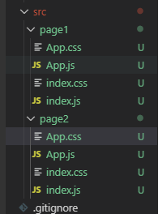

通过create-react-app创建的工程默认都是单页面的，而有时开发项目不得不使用多页面方式开发，本文将介绍如何将create-react-app创建的模板项目修改为多页面的开发方式。

<!-- more -->

## 使用工具版本
nodejs --> v8.16.1
npm --> 6.11.3
yarn --> 1.19.1
create-react-app --> 3.3.0

## 初始化项目
```
create-react-app react-multi-page
```
- 删除src目录下多余文件
App.css
App.js
~~App.test.js~~
index.css
index.js
~~logo.svg~~
~~serviceWorker.js~~
~~setupTests.js~~
- 修改index.js文件

```
import React from 'react';
import ReactDOM from 'react-dom';
import './index.css';
import App from './App';

ReactDOM.render(<App />, document.getElementById('root'));
```
- 修改app.js文件

```
import React from 'react';
import './App.css';

function App() {
  return (
    <div className="App">
      page1
    </div>
  );
}

export default App;

```
- 构建多页面项目结构
    —— 在src目录下创建page1、page2目录
    —— 将src之前保留的文件分别复制到page1、page2目录里面
    —— 目录结构如下：


## 弹出webpack配置

先git提交代码，不然没法弹出webpack配置
```
git add .
git commit -m "项目初始化"
yarn eject
```
当出现`Are you sure you want to eject? This action is permanent?`时输入`y`。

## 读取src下有的目录名称
进入`config/paths.js`中配置`appIndexJs`路径，默认是路径字符串，现在获取几个页面的字符串列表，将会配置在入口地址。
在`module.exports`之前添加如下代码
```
const glob = require('glob');
// 获取指定路径下的入口文件
function getEntries(globPath) {
  const files = glob.sync(globPath),
    entries = {};
  files.forEach(function(filepath) {
      const split = filepath.split('/');
      const name = split[split.length - 2];
      entries[name] = './' + filepath;
  });
  return entries;
}

const entries = getEntries('src/**/index.js');

function getIndexJs() {
  const indexJsList = [];
  Object.keys(entries).forEach((name) => {
    const indexjs = resolveModule(resolveApp, `src/${name}/index`)
    indexJsList.push({
      name,
      path: indexjs
    });
  })
  return indexJsList;
}
const indexJsList = getIndexJs()
```
然后更改`module.exports`内容
```
module.exports = {
  dotenv: resolveApp('.env'),
  appPath: resolveApp('.'),
  appBuild: resolveApp('build'),
  appPublic: resolveApp('public'),
  appHtml: resolveApp('public/index.html'),
  appIndexJs: indexJsList, // +++++++++++++
  appPackageJson: resolveApp('package.json'),
  appSrc: resolveApp('src'),
  appTsConfig: resolveApp('tsconfig.json'),
  appJsConfig: resolveApp('jsconfig.json'),
  yarnLockFile: resolveApp('yarn.lock'),
  testsSetup: resolveModule(resolveApp, 'src/setupTests'),
  proxySetup: resolveApp('src/setupProxy.js'),
  appNodeModules: resolveApp('node_modules'),
  publicUrl: getPublicUrl(resolveApp('package.json')),
  servedPath: getServedPath(resolveApp('package.json')),
  entries // +++++++++++++
};
```
上面有`+`号的部分为更改的内容。
## 配置webpack入口entry
在`return`配置之前加入如下代码。
```
// 配置入口
  const entry = {}
  paths.appIndexJs.forEach(e => {
    entry[e.name] = [
      isEnvDevelopment &&
        require.resolve('react-dev-utils/webpackHotDevClient'),
      e.path
    ].filter(Boolean)
  });
```
然后更改`return`中`entry`的值为`entry`。
## 更改出口文件的配置ouput
```
// 没更改之前的
// filename: isEnvProduction
// ? 'static/js/[name].[contenthash:8].js'
// : isEnvDevelopment && 'static/js/bundle.js',
...
// chunkFilename: isEnvProduction
// ? 'static/js/[name].[contenthash:8].chunk.js'
// : isEnvDevelopment && 'static/js/[name].chunk.js',

// 更改后的
filename: isEnvProduction
? 'static/js/[name]/[name].[contenthash:8].js'
: isEnvDevelopment && 'static/js/[name]/[name].bundle.js',
...
chunkFilename: isEnvProduction
? 'static/js/[name]/[name].[contenthash:8].chunk.js'
: isEnvDevelopment && 'static/js/[name]/[name].chunk.js',
```
## 更改HtmlWebpackPlugin配置

HtmlWebpackPlugin
这个plugin曝光率很高，他主要有两个作用

- 为html文件中引入的外部资源如script、link动态添加每次compile后的hash，防止引用缓存的外部文件问题
- 可以生成创建html入口文件，比如单页面可以生成一个html文件入口，配置N个html-webpack-plugin可以生成N个页面入口

现在删除之前的配置，然后加入一下的`Plugin`配置。
```
...Object.keys(paths.entries).map((name) => {
    return new HtmlWebpackPlugin(
      Object.assign(
        {},
        {
          inject: true,
          chunks: [name],
          template: paths.appHtml,
          filename: name + '.html',
        },
        isEnvProduction
          ? {
              minify: {
                removeComments: true,
                collapseWhitespace: true,
                removeRedundantAttributes: true,
                useShortDoctype: true,
                removeEmptyAttributes: true,
                removeStyleLinkTypeAttributes: true,
                keepClosingSlash: true,
                minifyJS: true,
                minifyCSS: true,
                minifyURLs: true,
              },
            }
          : undefined
      )
    )
}),
```
上面的代码是循环`entries`设置`HtmlWebpackPlugin`。
## 注释ManifestPlugin部分代码
```
// new ManifestPlugin({
//   fileName: 'asset-manifest.json',
//   publicPath: publicPath,
//   generate: (seed, files, entrypoints) => {
//     const manifestFiles = files.reduce((manifest, file) => {
//       manifest[file.name] = file.path;
//       return manifest;
//     }, seed);
//     const entrypointFiles = entrypoints.main.filter(
//       fileName => !fileName.endsWith('.map')
//     );

//     return {
//       files: manifestFiles,
//       entrypoints: entrypointFiles,
//     };
//   },
// }),
```
这是为了生成`manifest.json`文件的配置，这里不需要。
## 更改校验文件是否存在的代码
修改`scripts/build.js`和`scripts/start.js`文件的校验代码
```
// 原来的代码
// if (!checkRequiredFiles([paths.appHtml, paths.appIndexJs])) {
//   process.exit(1);
// }

// 修改后的代码
if (!checkRequiredFiles([paths.appHtml, ...paths.appIndexJs.map(e => e.path)])) {
  process.exit(1);
}
```
当然这串代码也可以注释掉，运行时不需要校验。
## 删除public下多余文件
现在项目已经能够正常运行，但是public下还有多余的代码可以删除。
其中只需要留下`index.html`作为模板文件，并进行修改。
```
<!DOCTYPE html>
<html lang="en">
  <head>
    <meta charset="utf-8" />
    <meta name="viewport" content="width=device-width, initial-scale=1" />
    <meta name="theme-color" content="#000000" />
    <meta
      name="description"
      content="Web site created using create-react-app"
    />
    <title>React App</title>
  </head>
  <body>
    <noscript>You need to enable JavaScript to run this app.</noscript>
    <div id="root"></div>
  </body>
</html>
```
## 总结
1. 添加页面的方法
如果需要添加页面，只需要复制page1和page2的目录结构，放在src目录下，注意不能同名。
2. 访问路径
```
http://localhost:3000/page1.html
http://localhost:3000/page2.html
```
3. 项目地址
当前配置我已经添加到了github，如果有相关配置没有配置好，可以直接下载使用
[https://github.com/iwowen/react-multi-template](https://github.com/iwowen/react-multi-template)


