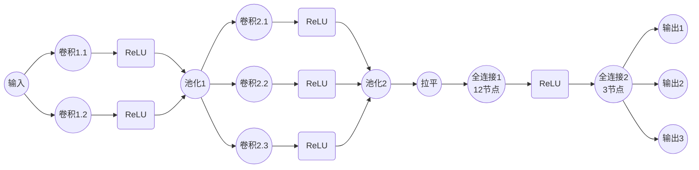
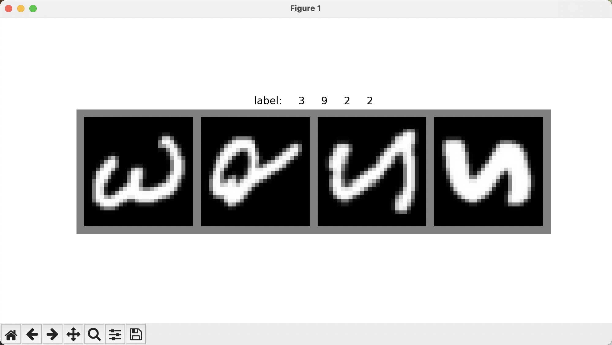

## 什么是 CNN

CNN（卷积神经网络）是一种专门用于图像识别的神经网络。它通过一系列的卷积层和池化层来提取图像的特征，然后通过全连接层来进行分类。CNN 在图像识别领域取得了巨大的成功，是深度学习中最重要的模型之一。



上面这个图展示了 CNN 的基本结构，其中：

- 输入层（Input Layer）：接收原始图像数据。
- 卷积层（Convolutional Layer）：通过卷积操作提取图像特征。
- 池化层（Pooling Layer）：通过池化操作减少特征图的尺寸。
- 全连接层（Fully Connected Layer）：作用是将卷积层提取的特征进行压缩，减少特征维度，并将其映射到输出层。
- 输出层（Output Layer）：输出最终的分类结果。
- 拉平层（Flatten Layer）：将多维的特征图转换为一维的特征向量，以便全连接层进行处理。
- 激活函数（Activation Function）：在每个卷积层和全连接层之后使用，增加网络的非线性表达能力。如果没有激活函数，CNN 将无法处理非线性问题。

## 训练一个 CNN 模型的步骤

### 数据预处理

通常来说，可以将输入数据转为 numpy 数组，然后转为 torch 的 tensor 类型。
一般对于不同类型的数据有不同的预处理方式，比如图像数据，文本数据，语音数据等。

- 图像数据可以使用`Pillow`或者`OpenCV`进行预处理。
- 文本数据可以使用`NLTK`或者`spaCy`进行预处理。
- 语音数据可以使用`scipy`或者`librosa`进行预处理。

接下来我将使用`totchvision`中的`CIFAR10`数据集来训练一个 CNN 模型。
`totchvision`数据输出范围为`0-1`，我们需要将其转换为`-1-1`的范围。

下面将使用`torchvision`提供的`EMNIST`数据集来训练一个 CNN 模型，使用`torch.utils.data.DataLoader`来加载数据，split 设置为`mnist`，表示只使用手写数字数据集。

```python
transform = transforms.Compose(
    [transforms.ToTensor(), transforms.Normalize((0.5,), (0.5,))]
)
# 训练数据
trainset = torchvision.datasets.EMNIST(
    root="./data", train=True, download=True, transform=transform, split="mnist"
)
trainloader = torch.utils.data.DataLoader(trainset, batch_size=4, shuffle=True)
# 测试数据
testset = torchvision.datasets.EMNIST(
    root="./data", train=False, download=True, transform=transform, split="mnist"
)
testloader = torch.utils.data.DataLoader(
    testset, batch_size=4, shuffle=False, num_workers=2
)
```

可以用 plt 展示一下效果：

```python
import matplotlib.pyplot as plt
import numpy as np

def imshow(img, labels):
    img = img / 2 + 0.5     # 反归一化
    npimg = img.numpy()
    plt.figure(figsize=(10, 5))
    plt.imshow(np.transpose(npimg, (1, 2, 0)))
    plt.title('label: ' + ' '.join('%5s' % labels[j].item() for j in range(len(labels))))
    plt.axis('off')
    plt.show()

# 获取一些随机训练图像
dataiter = iter(trainloader)
images, labels = next(dataiter)

# 显示图像和标签
imshow(torchvision.utils.make_grid(images), labels)
```



### 定义一个卷积模型

接下来我将定义一个简单的卷积神经网络模型，使用`torch.nn`来定义。
`trainloader`中每张图片的尺寸为`28*28`，所以输入的图片尺寸为`1*28*28`，输出为`10`个类别。

```python
# 定义网络
class Net(nn.Module):
    def __init__(self):
        super(Net, self).__init__()
        self.conv1 = nn.Conv2d(1, 6, 5)
        self.pool = nn.MaxPool2d(2, 2)
        self.conv2 = nn.Conv2d(6, 16, 5)
        self.fc1 = nn.Linear(16 * 4 * 4, 120)
        self.fc2 = nn.Linear(120, 84)
        self.fc3 = nn.Linear(84, 10)

    def forward(self, x):
        x = self.pool(F.relu(self.conv1(x)))
        x = self.pool(F.relu(self.conv2(x)))
        x = x.view(-1, 16 * 4 * 4)
        x = F.relu(self.fc1(x))
        x = F.relu(self.fc2(x))
        x = self.fc3(x)
        return x
```

让我们逐步解释一下:

1. 网络结构:

   - 两个卷积层 (conv1 和 conv2)
   - 两个池化层 (pool)
   - 三个全连接层 (fc1, fc2, fc3)

2. 初始化方法 (**init**):

   - conv1: 第一个卷积层，输入通道 1，输出通道 6，卷积核大小 5x5
   - pool: 最大池化层，窗口大小 2x2，步长 2
   - conv2: 第二个卷积层，输入通道 6，输出通道 16，卷积核大小 5x5
   - fc1: 第一个全连接层，输入 16*4*4=256，输出 120
   - fc2: 第二个全连接层，输入 120，输出 84
   - fc3: 最后一个全连接层，输入 84，输出 10（对应 10 个类别）

3. 前向传播方法 (forward):
   - 输入经过第一个卷积层，然后 ReLU 激活，再经过池化
   - 再经过第二个卷积层，ReLU 激活，池化
   - 将特征图展平
   - 通过三个全连接层，前两个使用 ReLU 激活

这个网络结构适合处理较小的图像（如 MNIST 数据集），可以有效地提取特征并进行分类。

### 定义损失函数和优化器

损失函数使用交叉熵损失函数，优化器使用随机梯度下降。

```python
import torch.optim as optim

net = Net()
criterion = nn.CrossEntropyLoss()
optimizer = optim.SGD(net.parameters(), lr=0.001, momentum=0.9)
```

让我们解释一下这些代码的作用：

1. `net = Net()`:
   这行代码创建了我们之前定义的神经网络模型的一个实例。

2. `criterion = nn.CrossEntropyLoss()`:
   这定义了损失函数。交叉熵损失函数通常用于多类分类问题，它衡量预测分布与真实分布之间的差异。

3. `optimizer = optim.SGD(net.parameters(), lr=0.001, momentum=0.9)`:
   这定义了优化器。我们使用随机梯度下降（SGD）优化器，它有以下参数：
   - `net.parameters()`: 指定要优化的参数，即网络中的所有可学习参数。
   - `lr=0.001`: 学习率，控制每次参数更新的步长。
   - `momentum=0.9`: 动量因子，有助于加速收敛并减少震荡。

这些组件共同构成了训练神经网络所需的基本要素：一个模型、一个损失函数来评估模型的性能，以及一个优化器来更新模型参数以最小化损失。

### 训练模型

接下来将实现训练过程：

```python
for epoch in range(2):  # 多次循环遍历数据集

    running_loss = 0.0  # 初始化损失
    for i, data in enumerate(trainloader, 0):
        # 获取输入
        inputs, labels = data

        # 梯度清零
        optimizer.zero_grad()

        # 前向传播
        outputs = net(inputs)
        loss = criterion(outputs, labels)

        # 反向传播
        loss.backward()
        optimizer.step()

        # 计算损失
        running_loss += loss.item()  # 累加是为了之后取平均

        if i % 2000 == 1999:  # 每2000个批次打印一次
            print(f"[{epoch + 1}, {i + 1}] loss: {running_loss / 2000:.3f}")
            running_loss = 0.0
```

这段代码实现了神经网络的训练过程。让我们逐步解析其流程：

1. 外层循环 `for epoch in range(2)`:

   - 这个循环控制整个训练数据集被遍历的次数（这里是 2 次）。每一次完整遍历称为一个 epoch。

2. 内层循环 `for i, data in enumerate(trainloader, 0)`:

   - 这个循环遍历训练数据加载器(trainloader)中的每一批数据。

3. 数据准备:

   - `inputs, labels = data`: 从每一批数据中解包出输入图像和对应的标签。

4. 梯度清零:

   - `optimizer.zero_grad()`: 在每次反向传播前清除之前累积的梯度，避免梯度累加。

5. 前向传播:

   - `outputs = net(inputs)`: 将输入数据传入网络，获得预测输出。
   - `loss = criterion(outputs, labels)`: 计算预测结果与真实标签之间的损失。

6. 反向传播:

   - `loss.backward()`: 计算损失对每个参数的梯度。
   - `optimizer.step()`: 根据计算得到的梯度更新网络参数。

7. 损失统计:

   - `running_loss += loss.item()`: 累加每批次的损失，用于后续计算平均损失。

8. 定期打印:
   - 每 2000 个批次，打印一次当前的平均损失，并重置 running_loss。

这个过程不断重复，通过最小化损失函数来优化网络参数，从而提高模型的性能。

打印结果：

```txt
[1, 2000] loss: 1.083
[1, 4000] loss: 0.180
[1, 6000] loss: 0.140
[1, 8000] loss: 0.100
[1, 10000] loss: 0.091
[1, 12000] loss: 0.071
[1, 14000] loss: 0.066
[2, 2000] loss: 0.057
[2, 4000] loss: 0.050
[2, 6000] loss: 0.048
[2, 8000] loss: 0.055
[2, 10000] loss: 0.052
[2, 12000] loss: 0.048
[2, 14000] loss: 0.053
```

可以看到损失在不断下降，模型在不断优化。

### 评估模型

```python
correct = 0
total = 0
with torch.no_grad():
    for data in testloader:
        images, labels = data
        outputs = net(images)
        _, predicted = torch.max(outputs.data, 1)
        total += labels.size(0)
        correct += (predicted == labels).sum().item()

print(
    f"Accuracy of the network on the 10000 test images: {100 * correct / total:.2f}%"
)
```

这段代码用于评估训练好的模型在测试集上的性能。以下是代码的主要步骤：

1. 初始化变量：

   - `correct`: 用于记录正确预测的样本数
   - `total`: 用于记录总样本数

2. 使用 `torch.no_grad()`:
   这个上下文管理器禁用了梯度计算，因为在评估阶段我们不需要计算梯度，这可以节省内存并加快计算速度。

3. 遍历测试数据集：
   使用 `for data in testloader` 遍历测试数据加载器中的所有批次。

4. 前向传播：

   - `outputs = net(images)`: 将图像输入网络，得到预测输出。
   - `_, predicted = torch.max(outputs.data, 1)`: 获取每个样本的预测类别（最大概率对应的类别）。

5. 统计正确预测：

   - `total += labels.size(0)`: 累加每个批次的样本数。
   - `correct += (predicted == labels).sum().item()`: 计算预测正确的样本数并累加。

6. 计算并打印准确率：
   最后，计算总体准确率并以百分比形式打印出来。

这个评估过程可以帮助我们了解模型在未见过的数据上的泛化能力。

### 保存模型

可以使用`torch.save`来保存模型：

```python
torch.save(net.state_dict(), "./model.pth")
```

然后使用`torch.load`来加载模型：

```python
net = Net()
net.load_state_dict(torch.load("./model.pth"))
```

## 总结

通过以上步骤，我们完成了一个简单的 CNN 模型的训练、评估和保存。这个过程包括数据加载、模型定义、损失函数和优化器的选择、训练过程的实现，以及模型保存和加载。

这个示例展示了如何使用 PyTorch 进行深度学习的基本流程，包括数据预处理、模型构建、训练和评估。通过这些步骤，我们可以训练出具有良好性能的神经网络模型。

:::details 完整代码
代码中使用`torchvision`中的`EMNIST`数据集来训练一个 CNN 模型，使用`gradio`来实现一个简单的手写数字识别界面。

<<< ./train.py
:::

## 参考

- [PyTorch 官方文档](https://pytorch.org/docs/stable/index.html)
- [PyTorch 图像分类器](https://pytorch123.com/SecondSection/training_a_classifier/)
