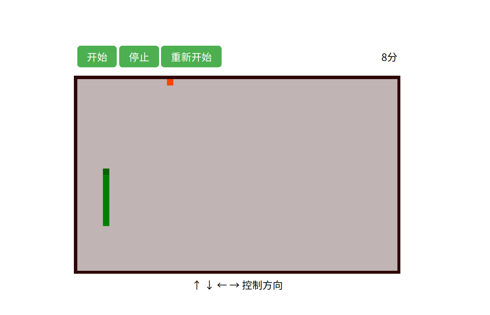

贪吃蛇是一款益智小游戏，通过点击上下左右四个按键控制蛇头移动。

- 项目地址：[snake](https://github.com/wenonly/demobar/tree/blog/src/%E5%B0%8F%E6%B8%B8%E6%88%8F/%E8%B4%AA%E5%90%83%E8%9B%87%E5%B0%8F%E6%B8%B8%E6%88%8F '贪吃蛇')
- demo 地址：<https://wenonly.github.io/demobar/#/xiaoyouxi/tanchishexiaoyouxi>

<!-- more -->

## 设计思路

主要是设计蛇的身体和移动方法。将蛇的身体设置成一个数组，数组里存放蛇身每一节的 xy 坐标。游戏开始后，蛇头(数组第 0 位)会随着时间不断地移动，也就是`x+1`或`x-1`或`y+1`或`y-1`，当蛇头移动了，身体的每一节 xy 将等于移动前它们的前一节，也就是说，第二节的位置将变成移动前蛇头的位置，依次变化就形成了蛇身的移动效果。当蛇吃到了食物的时候，则在数组里 push 蛇身移动前最后一节的 xy 值。

## 功能实现

### 1、通过 canvas 绘制画布

```html
<canvas
  id="canvas"
  width="500"
  height="300"
  style="border:5px solid #2f0606;"
></canvas>
```

```javascript
canvas = document.getElementById('canvas');
ctx = canvas.getContext('2d');
ctx.fillStyle = '#c0b4b4';
ctx.fillRect(0, 0, 500, 300);
```

画布的长宽是`500 * 300`

### 2、创建一条蛇

```javascript
function Snake(x, y) {
  this.body = [[x, y]]; // 蛇的身体
  this.direction = 'right'; // 初始方向
  this.time = null; // 定时器
  this.move = function () {};
  this.eat = function () {};
  this.stop = function () {};
}
```

创建了一个叫 Snake 的构造函数。其中，`xy`是蛇头的初始位置；`body`是蛇的身体，是一个二维数组；`direction`代表移动方向，有`right`、`left`、`top`、`bottom`四个参数；`time`是一个定时器；`move`是一个方法，控制蛇身的移动，这是整个贪吃蛇的核心；`eat`是吃的函数；`stop`停止移动。

可以直接`new`一个`Snake`对象。

```javascript
snake = new Snake(data.x, data.y);
```

`data.x`和`data.y`是初始位置。

### 3、让蛇动起来

这是贪吃蛇的核心，通过定时器让贪吃蛇动起来。先从蛇的最后一节移动，每一节等一它的前一节，当身体部分移动完了再通过`direction`参数判断蛇头该怎么移动。

```javascript
this.move = function () {
  var _this = this;
  this.time = setInterval(function () {
    var last = [].concat(_this.body[_this.body.length - 1]);
    for (var i = _this.body.length - 1; i >= 1; i--) {
      _this.body[i][0] = _this.body[i - 1][0];
      _this.body[i][1] = _this.body[i - 1][1];
    }
    switch (_this.direction) {
      case 'right':
        _this.body[0][0] += 1;
        break;
      case 'bottom':
        _this.body[0][1] -= 1;
        break;
      case 'left':
        _this.body[0][0] -= 1;
        break;
      case 'top':
        _this.body[0][1] += 1;
        break;
    }
    // 检查是否遇到食物
    if (_this.body[0][0] === food.x && _this.body[0][1] === food.y) {
      _this.eat(last);
    }
    // 检查是否遇到自己身体
    var index = _this.body.findIndex(function (e, i) {
      return i !== 0 && _this.body[0][0] === e[0] && _this.body[0][1] === e[1];
    });
    if (
      index !== -1 ||
      (_this.body[0][0] === last[0] && _this.body[0][1] === last[1])
    ) {
      alert('你撞到自己了');
      _this.stop();
    }
    // 检查是否撞墙
    if (
      _this.body[0][0] < 0 ||
      _this.body[0][0] > 49 ||
      _this.body[0][1] < 0 ||
      _this.body[0][1] > 29
    ) {
      alert('你撞墙了');
      _this.stop();
    }
  }, data.timeout);
};
```

### 4、通过上下左右键控制蛇的移动

通过`document.onkeydown`来监听键盘点击事件。

```javascript
function getKey() {
  document.onkeydown = function (event) {
    var e = event || window.event || arguments.callee.caller.arguments[0];

    if (e && e.keyCode == 38) {
      //下
      if (snake.direction !== 'top') snake.direction = 'bottom';
    }
    if (e && e.keyCode == 37) {
      //左
      if (snake.direction !== 'right') snake.direction = 'left';
    }

    if (e && e.keyCode == 39) {
      //右
      if (snake.direction !== 'left') snake.direction = 'right';
    }

    if (e && e.keyCode == 40) {
      //上
      if (snake.direction !== 'bottom') snake.direction = 'top';
    }
  };
}
```

`snake`是之前`new`的蛇对象。

### 5、创建一份食物，当蛇吃到食物会变长

```javascript
function Food() {
  this.x = Math.floor(Math.random() * 50);
  this.y = Math.floor(Math.random() * 30);
}
```

食物有`xy`轴坐标，通过`new Food()`来创建食物。

然后为蛇添加吃的函数功能

```javascript
this.eat = function (last) {
  this.body.push(last);
  score += 1;
  food = new Food();
};
```

`last`是蛇移动前的最后一节位置坐标`[x, y]`。每次蛇吃了食物之后会增长，然后创建新的食物。

### 6、将蛇和食物绘制在画布上

1. 将蛇绘制在画布上。

```javascript
for (var i = 0; i < snake.body.length; i++) {
  ctx.save();
  ctx.translate(snake.body[i][0] * data.size, snake.body[i][1] * data.size);
  if (i === 0) {
    ctx.fillStyle = 'DarkGreen';
  } else {
    ctx.fillStyle = 'green';
  }
  ctx.fillRect(0, 0, data.size, data.size);
  ctx.restore();
}
```

2. 将食物绘制在画布上

```javascript
ctx.save();
ctx.translate(food.x * data.size, food.y * data.size);
ctx.fillStyle = 'OrangeRed';
ctx.fillRect(0, 0, data.size, data.size);
ctx.restore();
```

画布可以通过`requestAnimationFrame`更新。

### 7、开始和停止

只需要调用`snake.move()`函数就能让蛇移动，这个过程会创建一个定时器`time`。

想让蛇停止只需要清除定时器。

```javascript
this.stop = function () {
  clearInterval(this.time);
};
```

调用`snake.stop()`就能让蛇停止移动。
