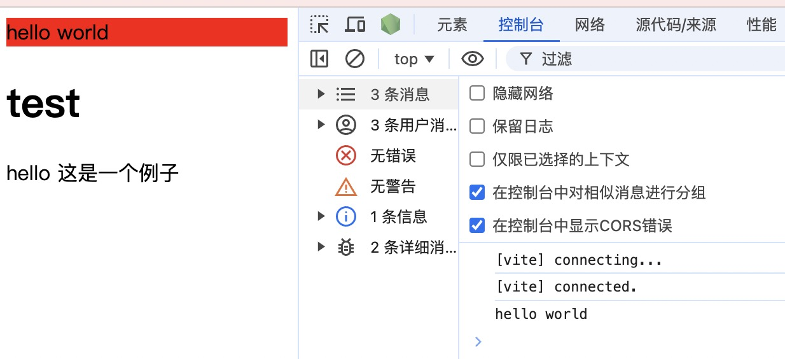

最近在使用 vitepress 生成文档，比较好奇 vitepress 是如何在 markdown 中解析 vue 代码的，于是看了一下 vitepress 源码中的实现。

## 简单说明

1. Vitepress 使用 vite 作为构建工具
2. 先使用`@mdit-vue/plugin-sfc`插件将 markdown 文本 转化为普通的 `vue sfc`
3. 然后使用`@vitejs/plugin-vue`插件将 `vue sfc` 处理为 普通的 js 模块。

## 简单配置

下面使用`vite`做了简单实现：

```javascript
// vite.config.js
const markdownIt = require("markdown-it");
const { sfcPlugin } = require("@mdit-vue/plugin-sfc");
const vuePlugin = require("@vitejs/plugin-vue");

const md = markdownIt({
  html: true,
}).use(sfcPlugin);

/** @type {import('vite').UserConfig} */
export default {
  plugins: [
    {
      name: "mdToVue",
      async transform(code, id) {
        if (id.endsWith(".md")) {
          const env = {};
          const result = md.render(code, env);
          const { sfcBlocks } = env;
          return [
            ...(sfcBlocks?.scripts.map((item) => item.content) ?? []),
            `<template><div>${result}</div></template>`,
            ...(sfcBlocks?.styles.map((item) => item.content) ?? []),
            ...(sfcBlocks?.customBlocks.map((item) => item.content) ?? []),
          ].join("\n");
        }
      },
    },
    vuePlugin({
      include: [/\.vue$/, /\.md$/],
    }),
  ],
};
```

## 测试代码
展示一个简单 markdown 文件的例子:

```markdown
<!-- test.md -->
<script setup>
const hello = "hello world";
console.log(hello);
</script>

<div class="block">{{ hello }}</div>

<style>
    .block {
        background: red;
    }
</style>

# test

hello 这是一个例子
```

```javascript
// index.js
import { createApp } from "vue";
import Test from "./test.md";

createApp(Test).mount("#root");
```

```html
<!-- 入口index.html -->
<!DOCTYPE html>
<html lang="en">
  <head>
    <meta charset="UTF-8" />
    <meta name="viewport" content="width=device-width, initial-scale=1.0" />
    <title>Document</title>
  </head>
  <body>
    <div id="root"></div>
    <script src="./index.js" type="module"></script>
  </body>
</html>
```

## 运行效果
运行后的效果：

可以看到 script、css、html 都被正确解析了。
