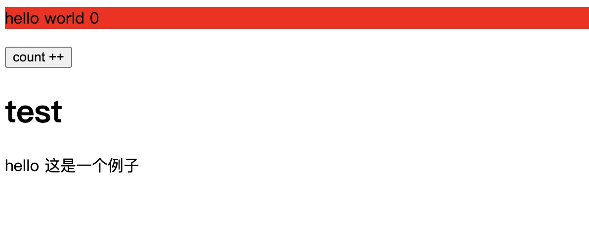

## 为什么使用 SSR

现在前端开发用的最多的方式就是客户度的`单页面应用程序（spa）`，开发的页面内容将通过打包工具（例如`webpack`）编译在`js`文件中，当浏览器请求`html`的时候，只会获取到一个不包含内容的`html`模板，页面内容将在之后通过`js`渲染到对应的`dom`位置。

单页面应用虽然开发部署方便，但也存在一些问题。例如：首次加载时间长、SEO（搜索引擎优化）问题。
于是有了`SSR`方案，简单的理解就是服务端先将开发的组件内容渲染为对应的`html`，然后浏览器请求的就是包含内容的`html`了，最后在浏览器端将静态的 HTML“激活”(hydrate) 为能够交互的客户端应用

## 简单实现

### 目录结构

```shell
├── package.json
├── server.js # node启动入口
├── src
│   ├── app.js # 创建应用的统一入口
│   ├── entry-client.js # 客户端入口
│   ├── entry-server.js # 服务端入口
│   └── test.vue
├── vite.config.js
```

### app 入口

当前示例使用的`vue`，首先定义 vue 组件和入口 `app.js`，这将作为客户端和服务端的统一入口。

```js
import { createSSRApp } from "vue";
import Test from "./test.vue";

export function createApp() {
  return createSSRApp(Test);
}
```

不在使用 vue 的客户端 api `createApp`，而是 `createSSRApp`。

### client 入口

客户端入口 `entry-client.js` 和普通的单页面应用入口编写方式一样，直接将 app.js 创建的 vue 实例渲染到 `#app` 上。

```js
import { createApp } from "./app";
createApp().mount("#root");
```

### server 入口

服务端入口 `entry-server.js` 则用作将 createSSRApp 创建的 app 实例渲染为 html。

```js
// 此文件运行在 Node.js 服务器上
import { createApp } from "./app";
// Vue 的服务端渲染 API 位于 `vue/server-renderer` 路径下
import { renderToString } from "vue/server-renderer";

export function render() {
  const app = createApp();
  return renderToString(app).then((html) => {
    return html;
  });
}
```

### node 启动入口

`server.js` 中内容是 vite 官方提供的示例，它的作用就是启动 http 服务，在浏览器访问的时候使用`entry-server.js`的 render 方法生成 html 字符串，并拼接到 html 模板中，最后返回给浏览器完整的应用 html。

```js
import fs from "node:fs";
import path from "node:path";
import { fileURLToPath } from "node:url";
import express from "express";
import { createServer as createViteServer } from "vite";

const __dirname = path.dirname(fileURLToPath(import.meta.url));

async function createServer() {
  const app = express();

  // 以中间件模式创建 Vite 应用，并将 appType 配置为 'custom'
  // 这将禁用 Vite 自身的 HTML 服务逻辑
  // 并让上级服务器接管控制
  const vite = await createViteServer({
    server: { middlewareMode: true },
    appType: "custom",
  });

  // 使用 vite 的 Connect 实例作为中间件
  // 如果你使用了自己的 express 路由（express.Router()），你应该使用 router.use
  // 当服务器重启（例如用户修改了 vite.config.js 后），
  // `vite.middlewares` 仍将保持相同的引用
  // （带有 Vite 和插件注入的新的内部中间件堆栈）。
  // 即使在重新启动后，以下内容仍然有效。
  app.use(vite.middlewares);

  app.use("*", async (req, res, next) => {
    const url = req.originalUrl;

    try {
      // 1. 读取 index.html
      let template = fs.readFileSync(
        path.resolve(__dirname, "index.html"),
        "utf-8"
      );

      // 2. 应用 Vite HTML 转换。这将会注入 Vite HMR 客户端，
      //    同时也会从 Vite 插件应用 HTML 转换。
      //    例如：@vitejs/plugin-react 中的 global preambles
      template = await vite.transformIndexHtml(url, template);

      // 3. 加载服务器入口。vite.ssrLoadModule 将自动转换
      //    你的 ESM 源码使之可以在 Node.js 中运行！无需打包
      //    并提供类似 HMR 的根据情况随时失效。
      const { render } = await vite.ssrLoadModule("/src/entry-server.js");

      // 4. 渲染应用的 HTML。这假设 entry-server.js 导出的 `render`
      //    函数调用了适当的 SSR 框架 API。
      //    例如 ReactDOMServer.renderToString()
      const appHtml = await render(url);

      // 5. 注入渲染后的应用程序 HTML 到模板中。
      const html = template.replace(`<!--ssr-outlet-->`, appHtml);

      // 6. 返回渲染后的 HTML。
      res.status(200).set({ "Content-Type": "text/html" }).end(html);
    } catch (e) {
      // 如果捕获到了一个错误，让 Vite 来修复该堆栈，这样它就可以映射回
      // 你的实际源码中。
      vite.ssrFixStacktrace(e);
      next(e);
    }
  });

  app.listen(5173);
}

createServer();
```

使用 `node server.js` 启动代码后，就能通过浏览器访问了。


## 生产环境构建

配置 `package.json`

```json
{
  "scripts": {
    "dev": "node server",
    "build:client": "vite build --outDir dist/client",
    "build:server": "vite build --outDir dist/server --ssr src/entry-server.js"
  }
}
```

编译生产环境代码后，就需要改动`server.js`中对应的代码入口，可以使用`process.env.NODE_ENV`环境变量区分开发环境还是生产环境。
需要调整的生产环境入口包括：

1. html 入口，改为 `dist/client/index.html`。
2. sever 入口，使用 `import('./dist/server/entry-server.js')` （该文件是 SSR 构建产物），而不是使用 `await vite.ssrLoadModule('/src/entry-server.js')`。
3. 提供静态文件服务用语访问 `dist/client`中的文件。
