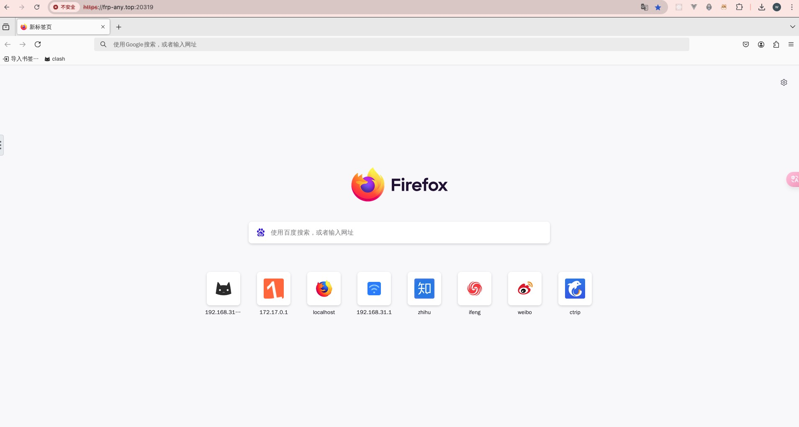
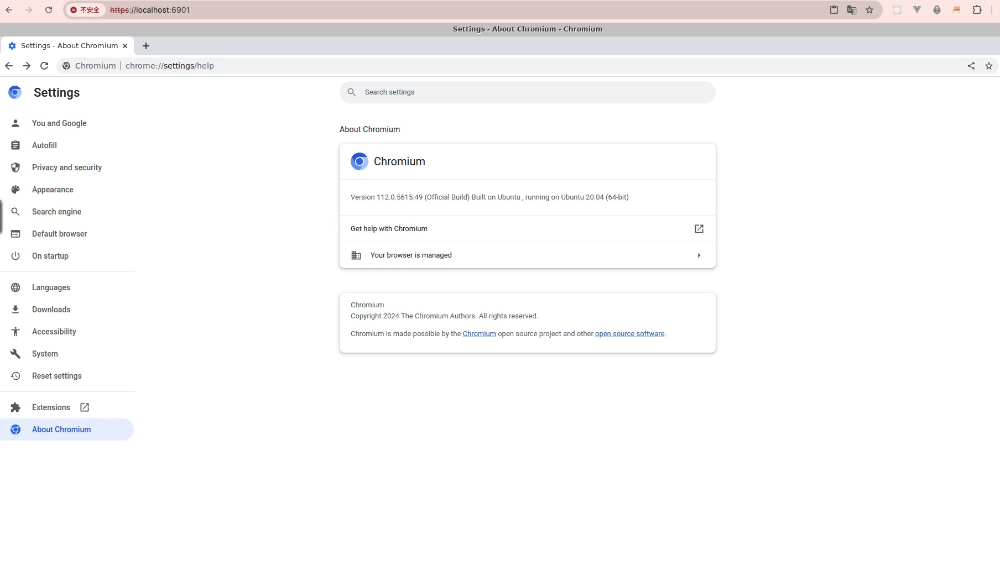

在研究 nas 的时候发现我的极空间中没有浏览器，无法远程访问我的本地 http 服务，所以需要一款在 docker 中部署的网页浏览器。其中有两款不错的 docker 镜像，分别是`jlesage/firefox`和`kasmweb/chromium`，他们都支持 arm 平台，可以很好的运行在`极空间`和`mac arm`中。

## 使用 jlesage/firefox

可以通过下面的命令快速部署到 docker 中：

```bash
docker run -d \
    --name=firefox \
    -p 5800:5800 \
    -v /docker/appdata/firefox:/config:rw \
    jlesage/firefox
```

然后在自己的浏览器上可以访问`http://your-host-ip:5800`，就能看到运行在 docker 中的 firefox 浏览器了。


## 使用 kasmweb/chromium

`kasmweb/chromium` 的使用方法也很简单，可以使用以下命令：

```bash
sudo docker run --rm -it --shm-size=512m -p 6901:6901 -e VNC_PW=password kasmweb/chromium:1.16.0
```

也是在浏览器中使用`http://your-host-ip:5800`，就可以查看 chromium 浏览器了。
不过还需要账号密码，分别是`kasm_user`和`password`，密码可以通过调整环境变量 VNC_PW 更改。



<!-- ## 编译特定版本的 kasmweb/chromium

Kasm 团队将很多镜像镜像进行了开源。[https://github.com/kasmtech/workspaces-images](https://github.com/kasmtech/workspaces-images)
可以拉取代码进行自定义编译，比如我就需要一个老版本的`chromium`用来进行网页的兼容性测试。
下面是自定义编译的步骤：

### 1.拉取镜像

```bash
git clone https://github.com/kasmtech/workspaces-images.git
```

### 2.调整安装chromium的脚本

脚本路径为`src/ubuntu/install/chromium/install_chromium.sh`。
调整这个脚本的内容，首先将下载chromium的源镜像调整

```bash
  # Chromium on Ubuntu 19.10 or newer uses snap to install which is not
  # currently compatible with docker containers. The new install will pull
  # deb files from archive.ubuntu.com for ubuntu 18.04 and install them.
  # This will work until 18.04 goes to an unsupported status.
  if [ ${ARCH} = 'amd64' ] ;
  then
    chrome_url="http://archive.ubuntu.com/ubuntu/pool/universe/c/chromium-browser/" # [!code --]
    chrome_url="https://mirrors.ustc.edu.cn/ubuntu-old-releases/ubuntu/pool/universe/c/chromium-browser/" # [!code ++]
  else
    chrome_url="http://ports.ubuntu.com/pool/universe/c/chromium-browser/" # [!code --]
    chrome_url="https://mirrors.ustc.edu.cn/ubuntu-old-releases/ubuntu/pool/universe/c/chromium-browser/" # [!code ++]
  fi
```

然后将下面这段代码进行调整，现在将版本设置为`77.0.3865.120`，这个版本不是随便写的，需要在镜像地址中存在才行。

```bash
  chromium_codecs_data=$(curl ${chrome_url}) # [!code --]
  chromium_codecs_data=$(grep "chromium-codecs-ffmpeg-extra_" <<< "${chromium_codecs_data}") # [!code --]
  chromium_codecs_data=$(grep "18\.04" <<< "${chromium_codecs_data}") # [!code --]
  chromium_codecs_data=$(grep "${ARCH}" <<< "${chromium_codecs_data}") # [!code --]
  chromium_codecs_data=$(sed -n 's/.*<a href="//p' <<< "${chromium_codecs_data}") # [!code --]
  chromium_codecs_data=$(sed -n 's/">.*//p' <<< "${chromium_codecs_data}") # [!code --]
  # 版本可以到具体镜像下去找，有哪些版本
  chromium_version="77.0.3865.120" # [!code ++]
  chromium_common_data=$(curl ${chrome_url}) # [!code ++]
  chromium_common_data=$(grep "${chromium_version}" <<< "${chromium_common_data}") # [!code ++]
  chromium_common_data=$(grep "${ARCH}" <<< "${chromium_common_data}") # [!code ++]
  chromium_common_data=$(sed -n 's/.*<a href="//p' <<< "${chromium_common_data}") # [!code ++]
  chromium_common_data=$(sed -n 's/">.*//p' <<< "${chromium_common_data}") # [!code ++]
  chromium_codecs_data=$(grep "chromium-codecs-ffmpeg-extra_" <<< "${chromium_common_data}") # [!code ++]
  echo "Chromium codec deb to download: ${chromium_codecs_data}"

  chromium_data=$(curl ${chrome_url}) # [!code --]
  chromium_data=$(grep "chromium-browser_" <<< "${chromium_data}") # [!code --]
  chromium_data=$(grep "18\.04" <<< "${chromium_data}") # [!code --]
  chromium_data=$(grep "${ARCH}" <<< "${chromium_data}") # [!code --]
  chromium_data=$(sed -n 's/.*<a href="//p' <<< "${chromium_data}") # [!code --]
  chromium_data=$(sed -n 's/">.*//p' <<< "${chromium_data}") # [!code --]
  chromium_data=$(grep "chromium-browser_" <<< "${chromium_common_data}") # [!code ++]
  echo "Chromium browser deb to download: ${chromium_data}"
```

### 3.拉取基础镜像

其实这一步应该是不需要的，但是我如果不先拉取基础镜像，在之后的编译过程中会失败。
```bash
docker pull kasmweb/core-ubuntu-focal:develop
```

### 4.编译镜像

```bash
sudo docker build --progress=plain -t kasm-chromium:77 -f dockerfile-kasm-chromium .
```

`--progress=plain`参数用于打印详细信息。

::: warning
有的时候需要在当前ubuntu容器中进行一些高权限操作，比如使用apt工具，就需要`root`权限，在`dockerfile-kasm-chromium`文件中添加以下内容再次编译实现。

```bash{2-5}
######### Customize Container Here ###########
RUN apt-get update \
    && apt-get install -y sudo \
    && echo 'kasm-user ALL=(ALL) NOPASSWD: ALL' >> /etc/sudoers \
    && rm -rf /var/lib/apt/list/*
```
::: -->
