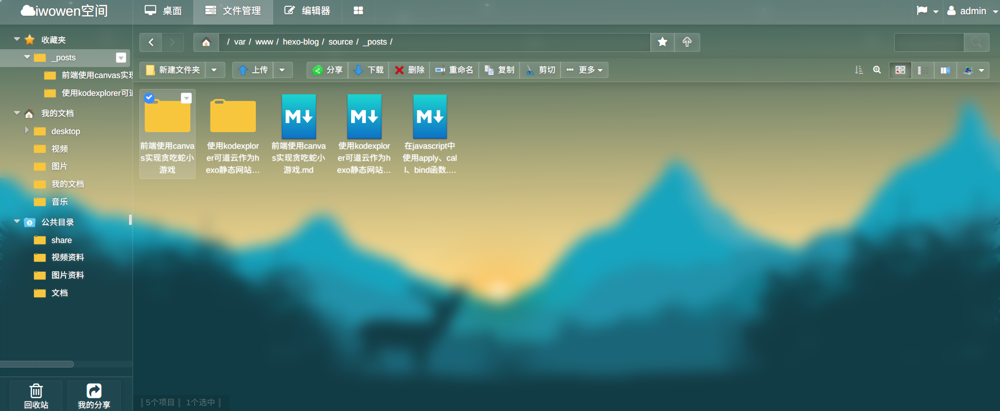

hexo是一个很方便的静态博客系统，但是硬伤方就是没有后台，每次编写了`markdown`文件之后都需要运行构建命令，非常麻烦。为了解决这个问题，hexo提供了一个专门的插件叫`hexo-admin`，能够在web下提供增删改查的功能。虽然很方便而且功能齐全，但是`hexo-admin`的管理界面却不够美观，为了能够使用更加美观的界面，我放弃了`hexo-admin`，转而选择了`kodexplorer`可道云。

<!-- more -->

需要注意的是，本文介绍的方法需要服务器环境，因为`kodexplorer`需要服务器环境，`hexo`的静态页面构建也需要服务器环境。

那么有服务器为什么不选择`wordpress`等cms管理系统呢？因为`hexo`的主题很好看，并且文章都是`markdown`文件，管理简单，我只需要编写markdown文件。

# 可道云介绍

`kodexplorer`可道云(原名芒果云) 是一款基于 PHP 开发的开源 WEB 网页版轻量级私有云网盘工具。准确的说它就是一款功能丰富的在线文件管理系统，它能很好的支持`markdown`文件的编写。

为什么我要选择`可道云`呢？
- 界面美观
- 有现成的`markdown`编辑器
- 有回收站功能，不怕误删



# 使用nginx部署hexo静态网站

首先使用`hexo`需要`nodejs`环境，只需要去官网下载安装即可，这里不详细讲解安装方法。在安装好`nodejs`环境后运行命令。
```
npm install hexo-cli -g
```
然后在想要部署`hexo`的目录中运行命令生成`hexo`项目。
```
hexo init <folder>
```
`hexo`很好用，这里不详细讲解`hexo`方法，可以在[hexo官网](https://hexo.io/)查看。
接下来需要安装`nginx`环境，我使用的`centos7`系统，可以通过`yum`命令安装。
```
yum install nginx
```
然后编辑`nginx`配置文件，需要将`hexo`项目中的`public`目录设定为网站目录。将`nginx`配置文件中的`root`设置为`public`目录。
```
...
server {
    listen       80 default_server;
    listen       [::]:80 default_server;
    server_name  _;
    root         /var/www/hexo-blog/public/;
}
...
```
重启`nginx`的服务。
```
service nginx restart
```
之后就可以通过ip访问`hexo`静态网站了，端口为80端口。

# 为nginx部署php环境，安装kodexplorer

1、首先需要安装`php`解释器
```
yum install php php-fpm -y
```
2、然后启动PHP-FPM进程并加入开机启动项
```
systemctl start php-fpm
systemctl enable php-fpm
```
3、启动之后，可以使用下面的命令查看 PHP-FPM 进程监听哪个端口
```
[root@instance-yer9go4c ~]# netstat -nlpt | grep php-fpm
tcp  0  0 127.0.0.1:9000   0.0.0.0:*   LISTEN 2200/php-fpm: maste
```
可以看出`php-fpm`占用的是9000端口。
4、现在配置`nginx`服务，进入`/etc/nginx/conf.d/`目录添加一个`php.conf`文件，内容如下。
```
server {
  listen 8000;
  server_name _;
  root /var/www/kodexplorer;
  index index.html index.php;
  location ~\.php$ {
    fastcgi_pass 127.0.0.1:9000;
    include fastcgi.conf;
  }
}

```
这里将`root`配置成`kodexplorer`程序的目录，监听`8000`端口，`kodexplorer`可以在[官网](https://kodcloud.com/)下载。
然后重启`nginx`服务。就能在服务器的`8000`端口访问网站了，需要设置管理员密码。

# 用supervisor设置hexo持续监听
`hexo`可以通过运行下面这条命令监听文件变化，并构建静态网页。
```
hexo g --watch
```
当我在`可道云`里面编辑`hexo`项目中的`markdown`文件时，`hexo`能随着文件保存而自动构建。
为了让监听的命令持续运行，我使用`supervisor`工具管理进程。首先安装`supervisor`。
```
yum install supervisor -y
```
然后在`/etc/supervisord.d/`中添加配置文件`blog.ini`，里面的内容如下
```
[program:blog]
command=hexo g --watch
directory=/var/www/hexo-blog
autostart=true
autorestart=true
```
启动`supervisor`服务。
```
supervisord -c /etc/supervisor.conf
```
之后就成功的通过`supervisor`管理`hexo`的监听进程了。
进入`可道云`编辑`markdown`文件后保存，静态网站就会自动更新。

注意：如果`可道云`没有当前目录的写权限，需要通过`chmod`命令修改目录的权限。