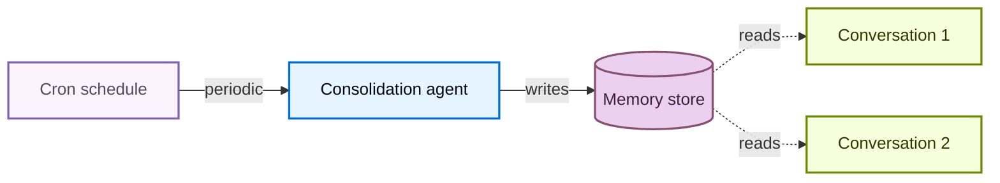

# 记忆

> 为 Deep Agents 构建的 Agent 添加持久记忆，让它们在跨对话中学习和改进

记忆让你的 Agent 能够在跨对话中学习和改进。Deep Agents 通过文件系统支持的记忆将记忆作为一等公民：Agent 以文件的形式读写记忆，你通过[后端](/tutorials/DeepAgents/虚拟文件系统后端)控制这些文件的存储位置。

::: tip 提示
本页涵盖**长期记忆**：跨对话持久化的记忆。关于短期记忆（单次会话中的对话历史和草稿文件），请参见[上下文工程](/tutorials/DeepAgents/上下文工程)指南。短期记忆作为 Agent [状态](https://docs.langchain.com/oss/javascript/langgraph/graph-api#state)的一部分自动管理。


:::

## 记忆的工作原理

1. **将 Agent 指向记忆文件。** 创建 Agent 时通过 `memory=` 传入文件路径。你也可以通过 `skills=` 传入[技能](/tutorials/DeepAgents/技能)来实现程序性记忆（告诉 Agent *如何*执行任务的可复用指令）。[后端](/tutorials/DeepAgents/虚拟文件系统后端)控制文件存储在哪里以及谁可以访问。
2. **Agent 读取记忆。** Agent 可以在启动时将记忆文件加载到系统提示中，或在对话期间按需读取。例如，[技能](/tutorials/DeepAgents/技能)使用按需加载：启动时只读取技能描述，只在匹配任务时才读取完整技能文件。这让上下文在需要某个能力之前保持精简。
3. **Agent 更新记忆（可选）。** 当 Agent 学到新信息时，可以使用内置的 `edit_file` 工具来更新记忆文件。更新可以在对话期间（默认）进行，也可以通过[后台整合](#后台整合)在对话之间的后台进行。更改会被持久化并在下次对话中可用。并非所有记忆都是可写的：开发者定义的[技能](/tutorials/DeepAgents/技能)和[组织策略](#组织级记忆)通常是只读的。详见[只读 vs 可写记忆](#只读-vs-可写记忆)。

两种最常见的模式是 [Agent 范围记忆](#agent-范围记忆)（所有用户共享）和[用户范围记忆](#用户范围记忆)（按用户隔离）。

## 范围记忆

Agent 记忆可以设置范围，使同一个记忆文件对使用该 Agent 的所有人都可访问，或者记忆文件可以针对每个用户独立。

### Agent 范围记忆

给 Agent 自己的持久身份，随时间演进。Agent 范围记忆在所有用户间共享，因此 Agent 通过每次对话积累自己的个性、积累的知识和学到的偏好。随着它与用户交互，它发展专业技能、完善方法并记住有效做法。当它有写权限时，还可以学习和更新[技能](/tutorials/DeepAgents/技能)。

关键是后端命名空间：将其设置为 `(assistant_id,)` 意味着该 Agent 的每次对话都读写同一个记忆文件。

::: tip 提示
访问 `rt.serverInfo` 需要 `deepagents>=1.9.0`。在旧版本中，请从 `getConfig().metadata.assistantId` 读取 assistant ID。
:::

```typescript
import { createDeepAgent, CompositeBackend, StateBackend, StoreBackend } from "deepagents";

const agent = createDeepAgent({
  memory: ["/memories/AGENTS.md"],
  skills: ["/skills/"],
  backend: new CompositeBackend(
    new StateBackend(),
    {
      "/memories/": new StoreBackend({
        namespace: (rt) => [rt.serverInfo.assistantId],  // [!code highlight]
      }),
      "/skills/": new StoreBackend({
        namespace: (rt) => [rt.serverInfo.assistantId],  // [!code highlight]
      }),
    },
  ),
});
```

::: details 完整示例：播种记忆并调用
用初始记忆填充存储，然后在两个线程中调用 Agent，观察它如何记住并更新所学内容。

```typescript
import { createDeepAgent, CompositeBackend, StateBackend, StoreBackend, createFileData } from "deepagents";
import { InMemoryStore } from "@langchain/langgraph";

const store = new InMemoryStore();  // Use platform store when deploying to LangSmith

// Seed the memory file
await store.put(
  ["my-agent"],
  "/memories/AGENTS.md",
  createFileData(`## Response style
- Keep responses concise
- Use code examples where possible
`),
);

// Seed a skill
await store.put(
  ["my-agent"],
  "/skills/langgraph-docs/SKILL.md",
  createFileData(`---
name: langgraph-docs
description: Fetch relevant LangGraph documentation to provide accurate guidance.
---

# langgraph-docs

Use the fetch_url tool to read https://docs.langchain.com/llms.txt, then fetch relevant pages.
`),
);

const agent = createDeepAgent({
  memory: ["/memories/AGENTS.md"],
  skills: ["/skills/"],
  backend: (rt) => new CompositeBackend(
    new StateBackend(rt),
    {
      "/memories/": new StoreBackend(rt, {
        namespace: (rt) => ["my-agent"],
      }),
      "/skills/": new StoreBackend(rt, {
        namespace: (rt) => ["my-agent"],
      }),
    },
  ),
  store,
});

// Thread 1: the agent learns a new preference and saves it to memory
const config1 = { configurable: { thread_id: crypto.randomUUID() } };
await agent.invoke({
  messages: [{ role: "user", content: "I prefer detailed explanations. Remember that." }],
}, config1);

// Thread 2: the agent reads memory and applies the preference
const config2 = { configurable: { thread_id: crypto.randomUUID() } };
await agent.invoke({
  messages: [{ role: "user", content: "Explain how transformers work." }],
}, config2);
```
:::

### 用户范围记忆

给每个用户自己的记忆文件。Agent 按用户记住偏好、上下文和历史，而核心 Agent 指令保持固定。如果存储在用户范围的后端中，用户还可以拥有按用户的[技能](/tutorials/DeepAgents/技能)。

命名空间使用 `(user_id,)`，因此每个用户获得记忆文件的独立副本。用户 A 的偏好永远不会泄露到用户 B 的对话中。

```typescript
import { createDeepAgent, CompositeBackend, StateBackend, StoreBackend } from "deepagents";

const agent = createDeepAgent({
  memory: ["/memories/preferences.md"],
  skills: ["/skills/"],
  backend: new CompositeBackend(
    new StateBackend(),
    {
      "/memories/": new StoreBackend({
        namespace: (rt) => [rt.serverInfo.user.identity],
      }),
      "/skills/": new StoreBackend({
        namespace: (rt) => [rt.serverInfo.user.identity],
      }),
    },
  ),
});
```

::: details 完整示例：跨用户的隔离记忆
为每个用户播种记忆，并以两个不同用户的身份调用 Agent。每个用户只能看到自己的偏好。

```typescript
import { createDeepAgent, CompositeBackend, StateBackend, StoreBackend, createFileData } from "deepagents";
import { InMemoryStore } from "@langchain/langgraph";

const store = new InMemoryStore();  // Use platform store when deploying to LangSmith

// Seed preferences for two users
await store.put(
  ["user-alice"],
  "/memories/preferences.md",
  createFileData(`## Preferences
- Likes concise bullet points
- Prefers Python examples
`),
);
await store.put(
  ["user-bob"],
  "/memories/preferences.md",
  createFileData(`## Preferences
- Likes detailed explanations
- Prefers TypeScript examples
`),
);

// Seed a skill for Alice
await store.put(
  ["user-alice"],
  "/skills/langgraph-docs/SKILL.md",
  createFileData(`---
name: langgraph-docs
description: Fetch relevant LangGraph documentation to provide accurate guidance.
---

# langgraph-docs

Use the fetch_url tool to read https://docs.langchain.com/llms.txt, then fetch relevant pages.
`),
);

const agent = createDeepAgent({
  memory: ["/memories/preferences.md"],
  skills: ["/skills/"],
  backend: (rt) => new CompositeBackend(
    new StateBackend(rt),
    {
      "/memories/": new StoreBackend(rt, {
        namespace: (rt) => [rt.serverInfo.user.identity],
      }),
      "/skills/": new StoreBackend(rt, {
        namespace: (rt) => [rt.serverInfo.user.identity],
      }),
    },
  ),
  store,
});

// When deployed, each authenticated request resolves
// `rt.serverInfo.user.identity` to the calling user, so Alice and Bob
// automatically see only their own preferences.
await agent.invoke(
  { messages: [{ role: "user", content: "How do I read a CSV file?" }] },
  { configurable: { thread_id: crypto.randomUUID() } },
);
```
:::

## 高级用法

在记忆路径和范围的基本配置选项之上，你还可以为记忆配置更高级的参数：

| 维度                 | 回答的问题               | 选项                                                                                                                                                |
| -------------------- | ----------------------- | --------------------------------------------------------------------------------------------------------------------------------------------------- |
| **持续时间**         | 持续多久？               | [短期](/tutorials/DeepAgents/上下文工程)（单次对话）或[长期](#范围记忆)（跨对话）                                                                     |
| **信息类型**         | 是什么类型的信息？       | [情景记忆](#情景记忆)（过往经历）、[程序性](/tutorials/DeepAgents/技能)（指令和技能）或[语义](https://docs.langchain.com/oss/javascript/concepts/memory#semantic-memory)（事实） |
| **范围**             | 谁可以查看和修改？       | [用户](#用户范围记忆)、[Agent](#agent-范围记忆)或[组织](#组织级记忆)                                                                                  |
| **更新策略**         | 何时写入记忆？           | 对话期间（默认）或[对话之间](#后台整合)                                                                                                               |
| **检索**             | 如何读取记忆？           | 加载到提示中（默认）或按需（如[技能](/tutorials/DeepAgents/技能)）                                                                                    |
| **Agent 权限**       | Agent 可以写入记忆吗？   | [读写](#只读-vs-可写记忆)（默认）或[只读](#只读-vs-可写记忆)（用于共享策略）                                                                            |

### 情景记忆

情景记忆存储过往经历的记录：发生了什么、按什么顺序、结果如何。与语义记忆（存储在 `AGENTS.md` 等文件中的事实和偏好）不同，情景记忆保留完整的对话上下文，因此 Agent 可以回忆*如何*解决了一个问题，而不仅仅是从中学到了*什么*。

Deep Agents 已经使用 [checkpointer](https://docs.langchain.com/oss/javascript/langgraph/checkpointers#checkpoints)，这是支持情景记忆的机制：每次对话都作为检查点线程持久化。

要使过去的对话可搜索，将线程搜索封装在工具中。`user_id` 从运行时上下文中获取，而非作为参数传入：

```typescript
import { Client } from "@langchain/langgraph-sdk";
import { tool } from "@langchain/core/tools";

const client = new Client({ apiUrl: "<DEPLOYMENT_URL>" });

const searchPastConversations = tool(
  async ({ query }, runtime) => {
    const userId = runtime.serverInfo.user.identity;  // [!code highlight]
    const threads = await client.threads.search({
      metadata: { userId },
      limit: 5,
    });
    const results = [];
    for (const thread of threads) {
      const history = await client.threads.getHistory(thread.threadId);
      results.push(history);
    }
    return JSON.stringify(results);
  },
  {
    name: "search_past_conversations",
    description: "Search past conversations for relevant context.",
  }
);
```

你可以通过调整元数据过滤器来按用户或组织限定线程搜索：

```typescript
// Search conversations for a specific user
const userThreads = await client.threads.search({
  metadata: { userId },
  limit: 5,
});

// Search conversations across an organization
const orgThreads = await client.threads.search({
  metadata: { orgId },
  limit: 5,
});
```

这对于执行复杂、多步任务的 Agent 很有用。例如，编程 Agent 可以回顾过去的调试会话并直接跳到可能的根本原因。

### 组织级记忆

组织级记忆遵循与用户范围记忆相同的模式，但使用组织范围的命名空间而非按用户的命名空间。用于应该在组织中所有用户和 Agent 中通用的策略或知识。

组织记忆通常是**只读**的，以防止通过共享状态进行提示注入。详见[只读 vs 可写记忆](#只读-vs-可写记忆)。

```typescript
import { createDeepAgent, CompositeBackend, StateBackend, StoreBackend } from "deepagents";

const agent = createDeepAgent({
  memory: [
    "/memories/preferences.md",
    "/policies/compliance.md",
  ],
  backend: new CompositeBackend(
    new StateBackend(),
    {
      "/memories/": new StoreBackend({
        namespace: (rt) => [rt.serverInfo.user.identity],
      }),
      "/policies/": new StoreBackend({
        namespace: (rt) => [rt.context.orgId],
      }),
    },
  ),
});
```

从应用代码中填充组织记忆：

```typescript
import { Client } from "@langchain/langgraph-sdk";
import { createFileData } from "deepagents";

const client = new Client({ apiUrl: "<DEPLOYMENT_URL>" });

await client.store.putItem(
  [orgId],
  "/compliance.md",
  createFileData(`## Compliance policies
- Never disclose internal pricing
- Always include disclaimers on financial advice
`),
);
```

使用[权限](/tutorials/DeepAgents/文件系统权限)来强制组织级记忆为只读，或使用[策略钩子](/tutorials/DeepAgents/虚拟文件系统后端)进行自定义验证逻辑。

### 后台整合

默认情况下，Agent 在对话期间写入记忆（热路径）。另一种选择是在对话**之间**作为后台任务处理记忆，有时称为**休眠时间计算**。一个独立的 Deep Agent 审查最近的对话、提取关键事实并与现有记忆合并。

| 方法                     | 优点                                       | 缺点                                                                       |
| ------------------------ | ------------------------------------------ | -------------------------------------------------------------------------- |
| **热路径**（对话期间）   | 记忆立即可用，对用户透明                   | 增加延迟，Agent 需要多任务处理                                             |
| **后台**（对话之间）     | 无用户感知延迟，可以跨多次对话综合         | 记忆到下次对话才可用，需要第二个 Agent                                      |

对于大多数应用，热路径就足够了。当你需要减少延迟或改善多次对话间的记忆质量时，添加后台整合。

推荐的模式是在主 Agent 旁边部署一个**整合 Agent** ——一个 Deep Agent，读取最近的对话历史、提取关键事实并合并到记忆存储中——并通过[定时任务](#定时任务)触发它。选择一个反映用户实际与 Agent 交互频率的节奏：一个有稳定日常流量的聊天产品可以每隔几小时整合一次，而一个每周使用几次的工具只需要每天或每周运行一次。整合频率远超用户对话频率只是在空转上浪费 token。

#### 整合 Agent

整合 Agent 读取最近的对话历史并将关键事实合并到记忆存储中。在 `langgraph.json` 中将它与主 Agent 一起注册：

```typescript src/consolidation-agent.ts
import { createDeepAgent } from "deepagents";
import { Client } from "@langchain/langgraph-sdk";
import { tool } from "@langchain/core/tools";

const sdkClient = new Client({ apiUrl: "<DEPLOYMENT_URL>" });

const searchRecentConversations = tool(
  async ({ query }, runtime) => {
    const userId = runtime.serverInfo.user.identity;  // [!code highlight]

    const since = new Date(Date.now() - 6 * 60 * 60 * 1000).toISOString();
    const threads = await sdkClient.threads.search({
      metadata: { userId },
      updatedAfter: since,
      limit: 20,
    });
    const conversations = [];
    for (const thread of threads) {
      const history = await sdkClient.threads.getHistory(thread.threadId);
      conversations.push(history.values.messages);
    }
    return JSON.stringify(conversations);
  },
  {
    name: "search_recent_conversations",
    description: "Search this user's conversations updated in the last 6 hours.",
  }
);

const agent = createDeepAgent({
  model: "google_genai:gemini-3.5-flash",
  systemPrompt: `Review recent conversations and update the user's memory file.
Merge new facts, remove outdated information, and keep it concise.`,
  tools: [searchRecentConversations],
});

export { agent };
```

```json langgraph.json
{
  "dependencies": ["."],
  "graphs": {
    "agent": "./src/agent.ts:agent",
    "consolidation_agent": "./src/consolidation-agent.ts:agent"
  },
  "env": ".env"
}
```

#### 定时任务

[定时任务（cron job）](https://docs.langchain.com/langsmith/cron-jobs)按固定计划运行整合 Agent。Agent 搜索最近的对话并将它们综合到记忆中。将计划与你的使用模式匹配，使整合运行大致追踪真实活动。



使用定时任务安排整合 Agent：

```typescript
import { Client } from "@langchain/langgraph-sdk";

const client = new Client({ apiUrl: "<DEPLOYMENT_URL>" });

const cronJob = await client.crons.create(
  "consolidation_agent",
  {
    schedule: "0 */6 * * *",
    input: { messages: [{ role: "user", content: "Consolidate recent memories." }] },
  },
);
```

::: tip 提示
所有定时任务计划都以 **UTC** 解释。关于管理和删除定时任务的详情，请参见[cron jobs](https://docs.langchain.com/langsmith/cron-jobs)。
:::

::: warning
定时任务间隔必须与整合 Agent 内的回溯窗口匹配。上面的例子每 6 小时运行（`0 */6 * * *`），而 Agent 的 `search_recent_conversations` 工具回溯 `timedelta(hours=6)`——保持这些同步。如果定时任务比回溯窗口运行得更频繁，你会重复处理相同的对话；如果运行得不那么频繁，你会丢失窗口外的记忆。
:::

关于使用后台进程部署 Agent 的更多信息，请参见[生产环境部署](/tutorials/DeepAgents/生产环境部署)。

### 只读 vs 可写记忆

默认情况下，Agent 既可以读也可以写记忆文件。对于共享状态（如组织策略或合规规则），你可能希望将记忆设为**只读**，这样 Agent 可以引用但不能修改它。这可以防止通过共享记忆进行提示注入，并确保只有你的应用代码控制文件中的内容。

| 权限                 | 用例                                                                                                                    | 工作原理                                                                                                                                                                                                                                                                    |
| -------------------- | ----------------------------------------------------------------------------------------------------------------------- | --------------------------------------------------------------------------------------------------------------------------------------------------------------------------------------------------------------------------------------------------------------------------- |
| **读写**（默认）     | 用户偏好、Agent 自我改进、学到的[技能](/tutorials/DeepAgents/技能)                                                      | Agent 通过 `edit_file` 工具更新文件                                                                                                                                                                                                                                         |
| **只读**             | 组织策略、合规规则、共享知识库、开发者定义的[技能](/tutorials/DeepAgents/技能)                                          | 通过应用代码或 [Store API](https://docs.langchain.com/langsmith/custom-store) 填充。使用[权限](/tutorials/DeepAgents/文件系统权限)拒绝写入特定路径，或使用[策略钩子](/tutorials/DeepAgents/虚拟文件系统后端)进行自定义验证逻辑。                             |

**安全注意事项：** 如果一个用户可以写入另一个用户读取的记忆，恶意用户可以向共享状态注入指令。为缓解此风险：

- **默认使用用户范围** `(user_id)`，除非你有特定原因需要共享
- 对共享策略使用**只读记忆**（通过应用代码填充，而非 Agent）
- 在 Agent 写入共享记忆之前添加**人机协作**验证。使用 [interrupt](https://docs.langchain.com/oss/javascript/langgraph/interrupts) 要求人工批准写入敏感路径。

要强制只读记忆，使用[权限](/tutorials/DeepAgents/文件系统权限)来声明式地拒绝写入特定路径。对于自定义验证逻辑（速率限制、审计日志、内容检查），使用[后端策略钩子](/tutorials/DeepAgents/虚拟文件系统后端)。

### 并发写入

多个线程可以并行写入记忆，但对**同一文件**的并发写入可能导致"最后写入获胜"冲突。对于用户范围记忆，这很少发生，因为用户通常一次只有一个活跃对话。对于 Agent 范围或组织范围记忆，考虑使用[后台整合](#后台整合)来串行化写入，或将记忆构建为按主题分隔的独立文件以减少争用。

实际上，如果写入因冲突而失败，LLM 通常足够聪明来重试或优雅恢复，因此单次写入丢失不是灾难性的。

### 同一部署中的多个 Agent

要在共享部署中给每个 Agent 自己的记忆，在命名空间中添加 `assistant_id`：

```typescript
new StoreBackend({
  namespace: (rt) => [
    rt.serverInfo.assistantId,  // [!code highlight]
    rt.serverInfo.user.identity,
  ],
})
```

如果你只需要按 Agent 隔离而不需要按用户限定，可以单独使用 `assistant_id`。

::: tip 提示
使用 [LangSmith 追踪](https://docs.langchain.com/langsmith/trace-with-langgraph)来审计 Agent 写入记忆的内容。每次文件写入在追踪中显示为工具调用。
:::

---

> 本文基于 [Deep Agents 官方文档](https://docs.langchain.com/oss/javascript/deepagents/memory) 翻译并二次创作。
