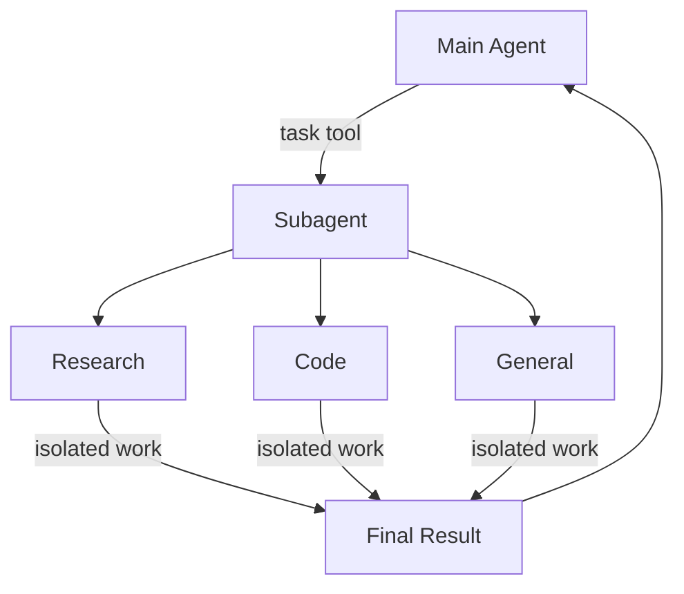

# 子 Agent

> 学习如何使用子 Agent 来委派任务并保持上下文清洁

一个 Deep Agent 可以创建子 Agent 来委派工作。你可以在 `subagents` 参数中指定自定义子 Agent。子 Agent 对于[上下文隔离](https://www.dbreunight.com/2025/06/26/how-to-fix-your-context.html#context-quarantine)（保持主 Agent 的上下文清洁）和提供专门的指令非常有用。

本页介绍的是**同步子 Agent**，即监督者会阻塞直到子 Agent 完成。对于长时间运行的任务、并行工作流，或需要中途引导和取消的场景，请参阅[异步子 Agent](https://docs.langchain.com/oss/javascript/deepagents/async-subagents)。



## 为什么要使用子 Agent？

子 Agent 解决的是**上下文膨胀问题**。当 Agent 使用具有大量输出的工具（如网络搜索、文件读取、数据库查询）时，上下文窗口会很快被中间结果填满。子 Agent 将这些详细工作隔离开来——主 Agent 只接收最终结果，而不是产生该结果的数十次工具调用。

**适合使用子 Agent 的场景：**

- 多步骤任务，否则会使主 Agent 的上下文变得混乱
- 需要自定义指令或工具的专业领域
- 需要不同模型能力的任务
- 当你希望主 Agent 专注于高层协调时

**不适合使用子 Agent 的场景：**

- 简单的、单步骤任务
- 当你需要保留中间上下文时
- 当开销大于收益时

## 配置

`subagents` 应该是一个字典列表或 [`CompiledSubAgent`](https://reference.langchain.com/javascript/deepagents/middleware/CompiledSubAgent) 对象列表。有两种类型：

### 默认子 Agent

除非你已经提供了一个名为 `general-purpose` 的同步子 Agent，否则 Deep Agents 会自动添加一个同步的 `general-purpose` 子 Agent。

`general-purpose` 子 Agent 默认拥有文件系统工具，可以通过额外的工具/中间件进行自定义。

- 要替换它，传入一个你自己的名为 `general-purpose` 的子 Agent。
- 要重命名或重新设置自动添加版本的提示词，在活动的 [Harness Profile](/tutorials/DeepAgents/Harness Profile) 上设置 `general_purpose_subagent=GeneralPurposeSubagentProfile(...)`。
- 要禁用它，请参阅下方的[不使用子 Agent 运行](#不使用子-agent-运行)。

### 不使用子 Agent 运行

要运行一个不带 `task` 工具的 Agent，需要做两件事：

1. 在活动的 [Harness Profile](/tutorials/DeepAgents/Harness Profile) 上设置 `general_purpose_subagent=GeneralPurposeSubagentProfile(enabled=False)`。
2. 在 `create_deep_agent` 上不通过 `subagents=` 传入任何同步子 Agent。

Deep Agents 仅在至少存在一个同步子 Agent 时才会附加 [`SubAgentMiddleware`](https://reference.langchain.com/javascript/deepagents/middleware/createSubAgentMiddleware)（以及 `task` 工具）。既没有默认子 Agent 也没有调用方提供的子 Agent 时，Agent 将在不委派的情况下运行。

异步子 Agent 不受影响——它们通过自己的中间件和工具流转，详见[异步子 Agent](https://docs.langchain.com/oss/javascript/deepagents/async-subagents)。

::: tip 提示
不要在这里尝试使用 `excluded_middleware`——`SubAgentMiddleware` 是必需的脚手架，列出它会抛出 `ValueError`。`general_purpose_subagent.enabled = False` 是受支持的方式。
:::

## 自定义子 Agent

你可以通过 `subagents` 参数定义具有特定工具的专门子 Agent。例如，用作代码审查员、网络研究员或测试运行器。

对于大多数用例，建议使用[子 Agent 字典](#子-agent字典方式)来定义子 Agent。对于复杂的工作流，使用 [`CompiledSubAgent`](#compiledsubagent)。

### 子 Agent（字典方式）

将子 Agent 定义为匹配 [`SubAgent`](https://reference.langchain.com/javascript/deepagents/middleware/SubAgent) 规范的字典，包含以下字段：

| 字段             | 类型                                           | 说明                                                                                                                                                                                                                                                                                                                                                                                                |
| ---------------- | ---------------------------------------------- | --------------------------------------------------------------------------------------------------------------------------------------------------------------------------------------------------------------------------------------------------------------------------------------------------------------------------------------------------------------------------------------------------- |
| `name`           | `string`                                       | 必填。子 Agent 的唯一标识符。主 Agent 在调用 `task()` 工具时使用此名称。子 Agent 名称会成为 `AIMessage` 的元数据和流式传输的元数据，有助于区分不同 Agent。                                                                                                                                                                                                                                            |
| `description`    | `string`                                       | 必填。描述此子 Agent 的功能。要具体且以行动为导向。主 Agent 使用此描述来决定何时委派。                                                                                                                                                                                                                                                                                                                |
| `systemPrompt`   | `string`                                       | 必填。子 Agent 的指令。自定义子 Agent 必须定义自己的指令。包含工具使用指南和输出格式要求。不继承自主 Agent。                                                                                                                                                                                                                                                                                              |
| `tools`          | `StructuredTool[]`                             | 可选。子 Agent 可以使用的工具。保持最小化，仅包含必要的工具。默认继承自主 Agent。指定后，完全覆盖继承的工具。                                                                                                                                                                                                                                                                                              |
| `model`          | `LanguageModelLike \| string`                  | 可选。覆盖主 Agent 的模型。省略则使用主 Agent 的模型。默认继承自主 Agent。你可以传入模型标识符字符串（如 `'openai:gpt-5.5'`，使用 `'provider:model'` 格式）或 LangChain 聊天模型对象（`await initChatModel("gpt-5.5")` 或 `new ChatOpenAI({ model: "gpt-5.5" })`）。                                                                                                                                                      |
| `middleware`     | `AgentMiddleware[]`                            | 可选。用于自定义行为、日志记录或速率限制的额外中间件。不继承自主 Agent。追加到[默认子 Agent 栈](/tutorials/DeepAgents/自定义配置)。                                                                                                                                                                                                                                                                                 |
| `interruptOn`    | `Record<string, boolean \| InterruptOnConfig>` | 可选。为特定工具配置[人机协作](/tutorials/DeepAgents/人机协作)。选项：`True`、`False`，或带 `allowed_decisions` 的 `InterruptOnConfig`。需要 checkpointer。默认继承自主 Agent。子 Agent 值覆盖默认值。                                                                                                                                                                                                                      |
| `skills`         | `string[]`                                     | 可选。[技能](/tutorials/DeepAgents/技能)源路径。指定后，子 Agent 将从这些目录加载技能（如 `["/skills/research/", "/skills/web-search/"]`）。这使得子 Agent 可以拥有与主 Agent 不同的技能集。不继承自主 Agent。只有通用子 Agent 继承主 Agent 的技能。当子 Agent 拥有技能时，它会运行自己独立的 [`SkillsMiddleware`](https://reference.langchain.com/javascript/deepagents/middleware/createSkillsMiddleware) 实例。技能状态完全隔离——子 Agent 加载的技能对父级不可见，反之亦然。 |
| `responseFormat` | `ResponseFormat`                               | 可选。子 Agent 的[结构化输出](https://docs.langchain.com/oss/javascript/langchain/structured-output) schema。设置后，父级以 JSON 而非自由格式文本接收子 Agent 的结果。接受 Zod schema、JSON schema 对象、`toolStrategy(...)` 或 `providerStrategy(...)`。参见[结构化输出](#结构化输出)。                                                                                                                                                         |
| `permissions`    | `FilesystemPermission[]`                       | 可选。子 Agent 的[文件系统权限规则](/tutorials/DeepAgents/文件系统权限)。设置后，**完全替换**父 Agent 的权限。默认继承自主 Agent。                                                                                                                                                                                                                                                                                |

### CompiledSubAgent

对于复杂的工作流，使用预构建的 LangGraph 图作为 [`CompiledSubAgent`](https://reference.langchain.com/javascript/deepagents/middleware/CompiledSubAgent)：

| 字段          | 类型       | 说明                                                                                                                                               |
| ------------- | ---------- | -------------------------------------------------------------------------------------------------------------------------------------------------- |
| `name`        | `str`      | 必填。子 Agent 的唯一标识符。子 Agent 名称会成为 `AIMessage` 的元数据和流式传输的元数据，有助于区分不同 Agent。                                      |
| `description` | `str`      | 必填。此子 Agent 的功能描述。                                                                                                                      |
| `runnable`    | `Runnable` | 必填。已编译的 LangGraph 图（必须先调用 `.compile()`）。                                                                                            |

## 使用子 Agent

::: code-group

```ts [Google]
import { tool } from "langchain";
import { TavilySearch } from "@langchain/tavily";
import { createDeepAgent, type SubAgent } from "deepagents";
import { z } from "zod";

const internetSearch = tool(
  async ({
    query,
    maxResults = 5,
    topic = "general",
    includeRawContent = false,
  }: {
    query: string;
    maxResults?: number;
    topic?: "general" | "news" | "finance";
    includeRawContent?: boolean;
  }) => {
    const tavilySearch = new TavilySearch({
      maxResults,
      tavilyApiKey: process.env.TAVILY_API_KEY,
      includeRawContent,
      topic,
    });
    return await tavilySearch._call({ query });
  },
  {
    name: "internet_search",
    description: "Run a web search",
    schema: z.object({
      query: z.string().describe("The search query"),
      maxResults: z.number().optional().default(5),
      topic: z
        .enum(["general", "news", "finance"])
        .optional()
        .default("general"),
      includeRawContent: z.boolean().optional().default(false),
    }),
  },
);

const researchSubagent: SubAgent = {
  name: "research-agent",
  description: "Used to research more in depth questions",
  systemPrompt: "You are a great researcher",
  tools: [internetSearch],
  model: "google-genai:gemini-3.5-flash", // Optional override, defaults to main agent model
};
const subagents = [researchSubagent];

const agent = createDeepAgent({
  model: "google_genai:gemini-3.5-flash",
  subagents,
});
```

```ts [OpenAI]
import { tool } from "langchain";
import { TavilySearch } from "@langchain/tavily";
import { createDeepAgent, type SubAgent } from "deepagents";
import { z } from "zod";

const internetSearch = tool(
  async ({
    query,
    maxResults = 5,
    topic = "general",
    includeRawContent = false,
  }: {
    query: string;
    maxResults?: number;
    topic?: "general" | "news" | "finance";
    includeRawContent?: boolean;
  }) => {
    const tavilySearch = new TavilySearch({
      maxResults,
      tavilyApiKey: process.env.TAVILY_API_KEY,
      includeRawContent,
      topic,
    });
    return await tavilySearch._call({ query });
  },
  {
    name: "internet_search",
    description: "Run a web search",
    schema: z.object({
      query: z.string().describe("The search query"),
      maxResults: z.number().optional().default(5),
      topic: z
        .enum(["general", "news", "finance"])
        .optional()
        .default("general"),
      includeRawContent: z.boolean().optional().default(false),
    }),
  },
);

const researchSubagent: SubAgent = {
  name: "research-agent",
  description: "Used to research more in depth questions",
  systemPrompt: "You are a great researcher",
  tools: [internetSearch],
  model: "openai:gpt-5.4", // Optional override, defaults to main agent model
};
const subagents = [researchSubagent];

const agent = createDeepAgent({
  model: "google_genai:gemini-3.5-flash",
  subagents,
});
```

```ts [Anthropic]
import { tool } from "langchain";
import { TavilySearch } from "@langchain/tavily";
import { createDeepAgent, type SubAgent } from "deepagents";
import { z } from "zod";

const internetSearch = tool(
  async ({
    query,
    maxResults = 5,
    topic = "general",
    includeRawContent = false,
  }: {
    query: string;
    maxResults?: number;
    topic?: "general" | "news" | "finance";
    includeRawContent?: boolean;
  }) => {
    const tavilySearch = new TavilySearch({
      maxResults,
      tavilyApiKey: process.env.TAVILY_API_KEY,
      includeRawContent,
      topic,
    });
    return await tavilySearch._call({ query });
  },
  {
    name: "internet_search",
    description: "Run a web search",
    schema: z.object({
      query: z.string().describe("The search query"),
      maxResults: z.number().optional().default(5),
      topic: z
        .enum(["general", "news", "finance"])
        .optional()
        .default("general"),
      includeRawContent: z.boolean().optional().default(false),
    }),
  },
);

const researchSubagent: SubAgent = {
  name: "research-agent",
  description: "Used to research more in depth questions",
  systemPrompt: "You are a great researcher",
  tools: [internetSearch],
  model: "anthropic:claude-sonnet-4-6", // Optional override, defaults to main agent model
};
const subagents = [researchSubagent];

const agent = createDeepAgent({
  model: "google_genai:gemini-3.5-flash",
  subagents,
});
```

```ts [OpenRouter]
import { tool } from "langchain";
import { TavilySearch } from "@langchain/tavily";
import { createDeepAgent, type SubAgent } from "deepagents";
import { z } from "zod";

const internetSearch = tool(
  async ({
    query,
    maxResults = 5,
    topic = "general",
    includeRawContent = false,
  }: {
    query: string;
    maxResults?: number;
    topic?: "general" | "news" | "finance";
    includeRawContent?: boolean;
  }) => {
    const tavilySearch = new TavilySearch({
      maxResults,
      tavilyApiKey: process.env.TAVILY_API_KEY,
      includeRawContent,
      topic,
    });
    return await tavilySearch._call({ query });
  },
  {
    name: "internet_search",
    description: "Run a web search",
    schema: z.object({
      query: z.string().describe("The search query"),
      maxResults: z.number().optional().default(5),
      topic: z
        .enum(["general", "news", "finance"])
        .optional()
        .default("general"),
      includeRawContent: z.boolean().optional().default(false),
    }),
  },
);

const researchSubagent: SubAgent = {
  name: "research-agent",
  description: "Used to research more in depth questions",
  systemPrompt: "You are a great researcher",
  tools: [internetSearch],
  model: "openrouter:anthropic/claude-sonnet-4-6", // Optional override, defaults to main agent model
};
const subagents = [researchSubagent];

const agent = createDeepAgent({
  model: "google_genai:gemini-3.5-flash",
  subagents,
});
```

```ts [Fireworks]
import { tool } from "langchain";
import { TavilySearch } from "@langchain/tavily";
import { createDeepAgent, type SubAgent } from "deepagents";
import { z } from "zod";

const internetSearch = tool(
  async ({
    query,
    maxResults = 5,
    topic = "general",
    includeRawContent = false,
  }: {
    query: string;
    maxResults?: number;
    topic?: "general" | "news" | "finance";
    includeRawContent?: boolean;
  }) => {
    const tavilySearch = new TavilySearch({
      maxResults,
      tavilyApiKey: process.env.TAVILY_API_KEY,
      includeRawContent,
      topic,
    });
    return await tavilySearch._call({ query });
  },
  {
    name: "internet_search",
    description: "Run a web search",
    schema: z.object({
      query: z.string().describe("The search query"),
      maxResults: z.number().optional().default(5),
      topic: z
        .enum(["general", "news", "finance"])
        .optional()
        .default("general"),
      includeRawContent: z.boolean().optional().default(false),
    }),
  },
);

const researchSubagent: SubAgent = {
  name: "research-agent",
  description: "Used to research more in depth questions",
  systemPrompt: "You are a great researcher",
  tools: [internetSearch],
  model: "fireworks:accounts/fireworks/models/qwen3p5-397b-a17b", // Optional override, defaults to main agent model
};
const subagents = [researchSubagent];

const agent = createDeepAgent({
  model: "google_genai:gemini-3.5-flash",
  subagents,
});
```

```ts [Baseten]
import { tool } from "langchain";
import { TavilySearch } from "@langchain/tavily";
import { createDeepAgent, type SubAgent } from "deepagents";
import { z } from "zod";

const internetSearch = tool(
  async ({
    query,
    maxResults = 5,
    topic = "general",
    includeRawContent = false,
  }: {
    query: string;
    maxResults?: number;
    topic?: "general" | "news" | "finance";
    includeRawContent?: boolean;
  }) => {
    const tavilySearch = new TavilySearch({
      maxResults,
      tavilyApiKey: process.env.TAVILY_API_KEY,
      includeRawContent,
      topic,
    });
    return await tavilySearch._call({ query });
  },
  {
    name: "internet_search",
    description: "Run a web search",
    schema: z.object({
      query: z.string().describe("The search query"),
      maxResults: z.number().optional().default(5),
      topic: z
        .enum(["general", "news", "finance"])
        .optional()
        .default("general"),
      includeRawContent: z.boolean().optional().default(false),
    }),
  },
);

const researchSubagent: SubAgent = {
  name: "research-agent",
  description: "Used to research more in depth questions",
  systemPrompt: "You are a great researcher",
  tools: [internetSearch],
  model: "baseten:zai-org/GLM-5.2", // Optional override, defaults to main agent model
};
const subagents = [researchSubagent];

const agent = createDeepAgent({
  model: "google_genai:gemini-3.5-flash",
  subagents,
});
```

```ts [Ollama]
import { tool } from "langchain";
import { TavilySearch } from "@langchain/tavily";
import { createDeepAgent, type SubAgent } from "deepagents";
import { z } from "zod";

const internetSearch = tool(
  async ({
    query,
    maxResults = 5,
    topic = "general",
    includeRawContent = false,
  }: {
    query: string;
    maxResults?: number;
    topic?: "general" | "news" | "finance";
    includeRawContent?: boolean;
  }) => {
    const tavilySearch = new TavilySearch({
      maxResults,
      tavilyApiKey: process.env.TAVILY_API_KEY,
      includeRawContent,
      topic,
    });
    return await tavilySearch._call({ query });
  },
  {
    name: "internet_search",
    description: "Run a web search",
    schema: z.object({
      query: z.string().describe("The search query"),
      maxResults: z.number().optional().default(5),
      topic: z
        .enum(["general", "news", "finance"])
        .optional()
        .default("general"),
      includeRawContent: z.boolean().optional().default(false),
    }),
  },
);

const researchSubagent: SubAgent = {
  name: "research-agent",
  description: "Used to research more in depth questions",
  systemPrompt: "You are a great researcher",
  tools: [internetSearch],
  model: "ollama:devstral-2", // Optional override, defaults to main agent model
};
const subagents = [researchSubagent];

const agent = createDeepAgent({
  model: "google_genai:gemini-3.5-flash",
  subagents,
});
```

:::

## 使用 CompiledSubAgent

对于更复杂的用例，你可以使用 [`CompiledSubAgent`](https://reference.langchain.com/javascript/deepagents/middleware/CompiledSubAgent) 为自定义子 Agent 提供预构建的图。
你可以使用 LangChain 的 [`create_agent`](https://reference.langchain.com/javascript/langchain/index/createAgent) 创建自定义子 Agent，或使用[图 API](https://docs.langchain.com/oss/javascript/langgraph/graph-api) 制作自定义 LangGraph 图。

如果你创建的是自定义 LangGraph 图，请确保图中有一个[名为 `"messages"` 的状态键](https://docs.langchain.com/oss/javascript/langgraph/quickstart#2-define-state)：

```typescript
import { createDeepAgent, CompiledSubAgent } from "deepagents";
import { createAgent } from "langchain";

// Create a custom agent graph
const customGraph = createAgent({
  model: yourModel,
  tools: specializedTools,
  prompt: "You are a specialized agent for data analysis...",
});

// Use it as a custom subagent
const customSubagent: CompiledSubAgent = {
  name: "data-analyzer",
  description: "Specialized agent for complex data analysis tasks",
  runnable: customGraph,
};

const subagents = [customSubagent];

const agent = createDeepAgent({
  model: "google_genai:gemini-3.5-flash",
  tools: [internetSearch],
  systemPrompt: researchInstructions,
  subagents: subagents,
});
```

## 流式传输

Deep Agents 支持从协调者和每个委派子 Agent 流式传输更新。

使用 [`streamEvents`](/tutorials/DeepAgents/事件流) 获取类型化的投影——为子 Agent、消息、工具调用和值分别提供独立迭代器——这样你可以独立消费每一种。

### 流式传输子 Agent 进度

最简单的模式是迭代 `stream.subagents` 来跟踪每个委派任务的启动、运行和完成。每个子 Agent 句柄暴露 `.name`、`.messages`、`.tool_calls` 和 `.output`。

::: code-group

```ts [Google]
import { createDeepAgent } from "deepagents";

const agent = createDeepAgent({
  model: "google-genai:gemini-3.5-flash",
  systemPrompt:
    "You are a project coordinator with no research knowledge. " +
    "For every user request, you must call the task() tool with " +
    "subagent_type set to research-agent. Never answer research " +
    "questions yourself.",
  subagents: [
    {
      name: "research-agent",
      description:
        "Delegate research to this subagent. Give one topic at a time.",
      systemPrompt: "You are a great researcher. Return a brief summary.",
    },
  ],
});

async function streamSubagentProgress() {
  const stream = await agent.streamEvents(
    {
      messages: [
        {
          role: "user",
          content: "Research one recent advance in quantum computing.",
        },
      ],
    },
    { version: "v3" },
  );

  const coordinatorMessages: string[] = [];
  const subagentHandles: { name: string }[] = [];

  await Promise.all([
    (async () => {
      for await (const message of stream.messages) {
        console.log("[coordinator]", await message.text);
        coordinatorMessages.push(await message.text);
      }
    })(),
    (async () => {
      for await (const subagent of stream.subagents) {
        console.log(`[${subagent.name}] started`);
        subagentHandles.push({ name: subagent.name });
        for await (const message of subagent.messages) {
          console.log(`[${subagent.name}]`, await message.text);
        }
      }
    })(),
  ]);

  return { coordinatorMessages, subagentHandles };
}
```

```ts [OpenAI]
import { createDeepAgent } from "deepagents";

const agent = createDeepAgent({
  model: "openai:gpt-5.4",
  systemPrompt:
    "You are a project coordinator with no research knowledge. " +
    "For every user request, you must call the task() tool with " +
    "subagent_type set to research-agent. Never answer research " +
    "questions yourself.",
  subagents: [
    {
      name: "research-agent",
      description:
        "Delegate research to this subagent. Give one topic at a time.",
      systemPrompt: "You are a great researcher. Return a brief summary.",
    },
  ],
});

async function streamSubagentProgress() {
  const stream = await agent.streamEvents(
    {
      messages: [
        {
          role: "user",
          content: "Research one recent advance in quantum computing.",
        },
      ],
    },
    { version: "v3" },
  );

  const coordinatorMessages: string[] = [];
  const subagentHandles: { name: string }[] = [];

  await Promise.all([
    (async () => {
      for await (const message of stream.messages) {
        console.log("[coordinator]", await message.text);
        coordinatorMessages.push(await message.text);
      }
    })(),
    (async () => {
      for await (const subagent of stream.subagents) {
        console.log(`[${subagent.name}] started`);
        subagentHandles.push({ name: subagent.name });
        for await (const message of subagent.messages) {
          console.log(`[${subagent.name}]`, await message.text);
        }
      }
    })(),
  ]);

  return { coordinatorMessages, subagentHandles };
}
```

```ts [Anthropic]
import { createDeepAgent } from "deepagents";

const agent = createDeepAgent({
  model: "anthropic:claude-sonnet-4-6",
  systemPrompt:
    "You are a project coordinator with no research knowledge. " +
    "For every user request, you must call the task() tool with " +
    "subagent_type set to research-agent. Never answer research " +
    "questions yourself.",
  subagents: [
    {
      name: "research-agent",
      description:
        "Delegate research to this subagent. Give one topic at a time.",
      systemPrompt: "You are a great researcher. Return a brief summary.",
    },
  ],
});

async function streamSubagentProgress() {
  const stream = await agent.streamEvents(
    {
      messages: [
        {
          role: "user",
          content: "Research one recent advance in quantum computing.",
        },
      ],
    },
    { version: "v3" },
  );

  const coordinatorMessages: string[] = [];
  const subagentHandles: { name: string }[] = [];

  await Promise.all([
    (async () => {
      for await (const message of stream.messages) {
        console.log("[coordinator]", await message.text);
        coordinatorMessages.push(await message.text);
      }
    })(),
    (async () => {
      for await (const subagent of stream.subagents) {
        console.log(`[${subagent.name}] started`);
        subagentHandles.push({ name: subagent.name });
        for await (const message of subagent.messages) {
          console.log(`[${subagent.name}]`, await message.text);
        }
      }
    })(),
  ]);

  return { coordinatorMessages, subagentHandles };
}
```

```ts [OpenRouter]
import { createDeepAgent } from "deepagents";

const agent = createDeepAgent({
  model: "openrouter:anthropic/claude-sonnet-4-6",
  systemPrompt:
    "You are a project coordinator with no research knowledge. " +
    "For every user request, you must call the task() tool with " +
    "subagent_type set to research-agent. Never answer research " +
    "questions yourself.",
  subagents: [
    {
      name: "research-agent",
      description:
        "Delegate research to this subagent. Give one topic at a time.",
      systemPrompt: "You are a great researcher. Return a brief summary.",
    },
  ],
});

async function streamSubagentProgress() {
  const stream = await agent.streamEvents(
    {
      messages: [
        {
          role: "user",
          content: "Research one recent advance in quantum computing.",
        },
      ],
    },
    { version: "v3" },
  );

  const coordinatorMessages: string[] = [];
  const subagentHandles: { name: string }[] = [];

  await Promise.all([
    (async () => {
      for await (const message of stream.messages) {
        console.log("[coordinator]", await message.text);
        coordinatorMessages.push(await message.text);
      }
    })(),
    (async () => {
      for await (const subagent of stream.subagents) {
        console.log(`[${subagent.name}] started`);
        subagentHandles.push({ name: subagent.name });
        for await (const message of subagent.messages) {
          console.log(`[${subagent.name}]`, await message.text);
        }
      }
    })(),
  ]);

  return { coordinatorMessages, subagentHandles };
}
```

```ts [Fireworks]
import { createDeepAgent } from "deepagents";

const agent = createDeepAgent({
  model: "fireworks:accounts/fireworks/models/qwen3p5-397b-a17b",
  systemPrompt:
    "You are a project coordinator with no research knowledge. " +
    "For every user request, you must call the task() tool with " +
    "subagent_type set to research-agent. Never answer research " +
    "questions yourself.",
  subagents: [
    {
      name: "research-agent",
      description:
        "Delegate research to this subagent. Give one topic at a time.",
      systemPrompt: "You are a great researcher. Return a brief summary.",
    },
  ],
});

async function streamSubagentProgress() {
  const stream = await agent.streamEvents(
    {
      messages: [
        {
          role: "user",
          content: "Research one recent advance in quantum computing.",
        },
      ],
    },
    { version: "v3" },
  );

  const coordinatorMessages: string[] = [];
  const subagentHandles: { name: string }[] = [];

  await Promise.all([
    (async () => {
      for await (const message of stream.messages) {
        console.log("[coordinator]", await message.text);
        coordinatorMessages.push(await message.text);
      }
    })(),
    (async () => {
      for await (const subagent of stream.subagents) {
        console.log(`[${subagent.name}] started`);
        subagentHandles.push({ name: subagent.name });
        for await (const message of subagent.messages) {
          console.log(`[${subagent.name}]`, await message.text);
        }
      }
    })(),
  ]);

  return { coordinatorMessages, subagentHandles };
}
```

```ts [Baseten]
import { createDeepAgent } from "deepagents";

const agent = createDeepAgent({
  model: "baseten:zai-org/GLM-5.2",
  systemPrompt:
    "You are a project coordinator with no research knowledge. " +
    "For every user request, you must call the task() tool with " +
    "subagent_type set to research-agent. Never answer research " +
    "questions yourself.",
  subagents: [
    {
      name: "research-agent",
      description:
        "Delegate research to this subagent. Give one topic at a time.",
      systemPrompt: "You are a great researcher. Return a brief summary.",
    },
  ],
});

async function streamSubagentProgress() {
  const stream = await agent.streamEvents(
    {
      messages: [
        {
          role: "user",
          content: "Research one recent advance in quantum computing.",
        },
      ],
    },
    { version: "v3" },
  );

  const coordinatorMessages: string[] = [];
  const subagentHandles: { name: string }[] = [];

  await Promise.all([
    (async () => {
      for await (const message of stream.messages) {
        console.log("[coordinator]", await message.text);
        coordinatorMessages.push(await message.text);
      }
    })(),
    (async () => {
      for await (const subagent of stream.subagents) {
        console.log(`[${subagent.name}] started`);
        subagentHandles.push({ name: subagent.name });
        for await (const message of subagent.messages) {
          console.log(`[${subagent.name}]`, await message.text);
        }
      }
    })(),
  ]);

  return { coordinatorMessages, subagentHandles };
}
```

```ts [Ollama]
import { createDeepAgent } from "deepagents";

const agent = createDeepAgent({
  model: "ollama:devstral-2",
  systemPrompt:
    "You are a project coordinator with no research knowledge. " +
    "For every user request, you must call the task() tool with " +
    "subagent_type set to research-agent. Never answer research " +
    "questions yourself.",
  subagents: [
    {
      name: "research-agent",
      description:
        "Delegate research to this subagent. Give one topic at a time.",
      systemPrompt: "You are a great researcher. Return a brief summary.",
    },
  ],
});

async function streamSubagentProgress() {
  const stream = await agent.streamEvents(
    {
      messages: [
        {
          role: "user",
          content: "Research one recent advance in quantum computing.",
        },
      ],
    },
    { version: "v3" },
  );

  const coordinatorMessages: string[] = [];
  const subagentHandles: { name: string }[] = [];

  await Promise.all([
    (async () => {
      for await (const message of stream.messages) {
        console.log("[coordinator]", await message.text);
        coordinatorMessages.push(await message.text);
      }
    })(),
    (async () => {
      for await (const subagent of stream.subagents) {
        console.log(`[${subagent.name}] started`);
        subagentHandles.push({ name: subagent.name });
        for await (const message of subagent.messages) {
          console.log(`[${subagent.name}]`, await message.text);
        }
      }
    })(),
  ]);

  return { coordinatorMessages, subagentHandles };
}
```

:::

### LangSmith 追踪

当你的 Deep Agent 运行时，子 Agent 或协调者执行的所有运行都会在元数据中的 `lc_agent_name` 键下记录 Agent 名称——例如 `{'lc_agent_name': 'research-agent'}`。这让你可以在 LangSmith 中识别和过滤特定子 Agent 的运行。


::: tip 提示
在 [LangSmith](https://smith.langchain.com?utm_source=docs\&utm_medium=cta\&utm_campaign=langsmith-signup\&utm_content=oss-deepagents-subagents) 中打开运行，将协调者追踪与每个子 Agent 运行进行比较。按照[可观测性快速入门](https://docs.langchain.com/langsmith/observability-quickstart)进行设置。我们还建议你设置 [LangSmith Engine](https://docs.langchain.com/langsmith/engine)，它会监控你的追踪、检测问题并提出修复建议。
:::

## 在 LangSmith 中按子 Agent 过滤

由于每个子 Agent 的 `name` 都会写入其产生的每次运行的 `lc_agent_name` 元数据键，你可以使用 LangSmith 的元数据过滤来隔离特定子 Agent 的所有运行——这对于调试、监控或随时间比较子 Agent 行为非常有用。

### 在 LangSmith UI 中过滤

1. 在 [LangSmith](https://smith.langchain.com?utm_source=docs\&utm_medium=cta\&utm_campaign=langsmith-signup\&utm_content=oss-deepagents-subagents) 中打开你的追踪项目。
2. 在追踪项目页面上切换到 **Runs** 视图以查看单个 span。
3. 点击 **Add filter** 并选择 **Metadata**。
4. 将 **Key** 设置为 `lc_agent_name`，**Value** 设置为子 Agent 名称（例如 `research-agent`）。

这只会显示该子 Agent 产生的运行。你可以将过滤器保存为命名视图以便复用。有关过滤选项的完整参考，请参阅[过滤追踪](https://docs.langchain.com/langsmith/filter-traces-in-application)。

### 使用 SDK 编程过滤

在 LangSmith 过滤查询语言中使用 `has` 比较器，按元数据键值对匹配运行：

```python
from langsmith import Client

client = Client()

runs = client.list_runs(
    project_name="<your-project>",
    filter='has(metadata, \'{"lc_agent_name": "research-agent"}\')',
)

for run in runs:
    print(run.name, run.start_time, run.status)
```

要获取来自*任何*命名子 Agent 的运行（排除主 Agent），过滤出所有具有 `lc_agent_name` 键的运行：

```python
runs = client.list_runs(
    project_name="<your-project>",
    filter="has(metadata, 'lc_agent_name')",
)
```

有关完整的过滤查询语言参考，请参阅[追踪查询语法](https://docs.langchain.com/langsmith/trace-query-syntax)。

## 结构化输出

子 Agent 支持[结构化输出](https://docs.langchain.com/oss/javascript/langchain/structured-output)，因此父 Agent 可以接收到可预测、可解析的 JSON，而非自由格式文本。

::: tip 提示
子 Agent 的结构化输出需要 `deepagents>=1.8.4`。
:::

在子 Agent 配置中传入 `responseFormat`。子 Agent 完成后，其结构化响应会被 JSON 序列化，并作为 `ToolMessage` 内容返回给父 Agent。schema 接受 `createAgent` 支持的任何类型：Zod schema、JSON schema 对象、`toolStrategy(...)` 或 `providerStrategy(...)`。

```typescript
import { z } from "zod";
import { createDeepAgent } from "deepagents";

const ResearchFindings = z.object({
  summary: z.string().describe("Summary of findings"),
  confidence: z.number().describe("Confidence score from 0 to 1"),
  sources: z.array(z.string()).describe("List of source URLs"),
});

const researchSubagent = {
  name: "researcher",
  description: "Researches topics and returns structured findings",
  systemPrompt: "Research the given topic thoroughly. Return your findings.",
  tools: [webSearch],
  responseFormat: ResearchFindings,
};

const agent = createDeepAgent({
  model: "claude-sonnet-4-6",
  subagents: [researchSubagent],
});

const result = await agent.invoke({
  messages: [{ role: "user", content: "Research recent advances in quantum computing" }],
});

// The parent's ToolMessage contains JSON-serialized structured data:
// '{"summary": "...", "confidence": 0.87, "sources": ["https://..."]}'
```

没有 `response_format` 时，父级会按原样接收子 Agent 的最后一条消息文本。使用后，父级始终获得与 schema 匹配的有效 JSON，这在父级需要以编程方式处理结果或将其传递给下游工具时非常有用。

有关 schema 类型和策略（工具调用 vs. 原生 Provider）的完整详情，请参阅[结构化输出](https://docs.langchain.com/oss/javascript/langchain/structured-output)。

## 通用子 Agent

除了任何用户定义的子 Agent 外，每个 Deep Agent 始终可以访问 `general-purpose` 子 Agent。此子 Agent：

- 使用自己的[默认系统提示词（应用 Profile 叠加）](/tutorials/DeepAgents/自定义配置)
- 拥有对所有相同工具的访问权限
- 使用相同的模型（除非被覆盖）
- 从主 Agent 继承技能（当配置了技能时）

### 覆盖通用子 Agent

在 `subagents` 列表中包含一个 `name: "general-purpose"` 的子 Agent 即可替换默认版本。使用此方法为通用子 Agent 配置不同的模型、工具或系统提示词：

```typescript
import { createDeepAgent } from "deepagents";

// Main agent uses Gemini; general-purpose subagent uses GPT
const agent = await createDeepAgent({
  model: "google_genai:gemini-3.5-flash",
  tools: [internetSearch],
  subagents: [
    {
      name: "general-purpose",
      description: "General-purpose agent for research and multi-step tasks",
      systemPrompt: "You are a general-purpose assistant.",
      tools: [internetSearch],
      model: "openai:gpt-5.5",  // Different model for delegated tasks
    },
  ],
});
```

当你提供名为 general-purpose 的子 Agent 时，不会添加默认的通用子 Agent。你的规格完全替换它。

要完全移除内置的通用子 Agent 而非替换它，请将活动的 Harness Profile 中通用子 Agent 的 `enabled` 标志设置为 `False`。

### 何时使用

通用子 Agent 非常适合不需要专门行为的上下文隔离。主 Agent 可以将复杂的多步骤任务委派给此子 Agent，并获得简洁的结果，而不会因中间工具调用而产生上下文膨胀。

::: details 示例
与其让主 Agent 进行 10 次网络搜索并用结果填满其上下文，不如委派给通用子 Agent：`task(name="general-purpose", task="Research quantum computing trends")`。子 Agent 在内部执行所有搜索，并仅返回摘要。
:::

### 技能继承

当使用 `create_deep_agent` 配置[技能](/tutorials/DeepAgents/技能)时：

- **通用子 Agent**：自动从主 Agent 继承技能
- **自定义子 Agent**：默认不继承技能——使用 `skills` 参数为其配置自己的技能

::: tip 提示
只有配置了技能的子 Agent 才会获得 `SkillsMiddleware` 实例——没有 `skills` 参数的自定义子 Agent 不会获得。当存在时，技能状态在两个方向上都完全隔离：父级的技能对子级不可见，子级的技能也不会传播回父级。
:::

```typescript
import { createDeepAgent, SubAgent } from "deepagents";

// Research subagent with its own skills
const researchSubagent: SubAgent = {
  name: "researcher",
  description: "Research assistant with specialized skills",
  systemPrompt: "You are a researcher.",
  tools: [webSearch],
  skills: ["/skills/research/", "/skills/web-search/"],  // Subagent-specific skills
};

const agent = createDeepAgent({
  model: "google_genai:gemini-3.5-flash",
  skills: ["/skills/main/"],  // Main agent and GP subagent get these
  subagents: [researchSubagent],  // Gets only /skills/research/ and /skills/web-search/
});
```

## 最佳实践

### 编写清晰的描述

主 Agent 使用描述来决定调用哪个子 Agent。要具体：

**好：** `"Analyzes financial data and generates investment insights with confidence scores"`

**坏：** `"Does finance stuff"`

### 保持系统提示词详细

包含关于如何使用工具和格式化输出的具体指导：

```typescript
const researchSubagent = {
  name: "research-agent",
  description: "Conducts in-depth research using web search and synthesizes findings",
  systemPrompt: `You are a thorough researcher. Your job is to:

  1. Break down the research question into searchable queries
  2. Use internet_search to find relevant information
  3. Synthesize findings into a comprehensive but concise summary
  4. Cite sources when making claims

  Output format:
  - Summary (2-3 paragraphs)
  - Key findings (bullet points)
  - Sources (with URLs)

  Keep your response under 500 words to maintain clean context.`,
  tools: [internetSearch],
};
```

### 最小化工具集

只给子 Agent 它们需要的工具。这可以提升专注度和安全性：

```typescript
// ✅ Good: Focused tool set
const emailAgent = {
  name: "email-sender",
  tools: [sendEmail, validateEmail],  // Only email-related
};

// ❌ Bad: Too many tools
const emailAgentBad = {
  name: "email-sender",
  tools: [sendEmail, webSearch, databaseQuery, fileUpload],  // Unfocused
};
```

### 按任务选择模型

不同的模型在不同的任务上表现出色：

```typescript
const subagents = [
  {
    name: "contract-reviewer",
    description: "Reviews legal documents and contracts",
    systemPrompt: "You are an expert legal reviewer...",
    tools: [readDocument, analyzeContract],
    model: "google_genai:gemini-3.5-flash",  // Large context for long documents
  },
  {
    name: "financial-analyst",
    description: "Analyzes financial data and market trends",
    systemPrompt: "You are an expert financial analyst...",
    tools: [getStockPrice, analyzeFundamentals],
    model: "gpt-5.5",  // Better for numerical analysis
  },
];
```

### 返回简洁的结果

指示子 Agent 返回摘要，而非原始数据：

```typescript
const dataAnalyst = {
  systemPrompt: `Analyze the data and return:
  1. Key insights (3-5 bullet points)
  2. Overall confidence score
  3. Recommended next actions

  Do NOT include:
  - Raw data
  - Intermediate calculations
  - Detailed tool outputs

  Keep response under 300 words.`,
};
```

## 常见模式

### 多个专门子 Agent

为不同领域创建专门的子 Agent：

```typescript
import { createDeepAgent } from "deepagents";

const subagents = [
  {
    name: "data-collector",
    description: "Gathers raw data from various sources",
    systemPrompt: "Collect comprehensive data on the topic",
    tools: [webSearch, apiCall, databaseQuery],
  },
  {
    name: "data-analyzer",
    description: "Analyzes collected data for insights",
    systemPrompt: "Analyze data and extract key insights",
    tools: [statisticalAnalysis],
  },
  {
    name: "report-writer",
    description: "Writes polished reports from analysis",
    systemPrompt: "Create professional reports from insights",
    tools: [formatDocument],
  },
];

const agent = createDeepAgent({
  model: "google_genai:gemini-3.5-flash",
  systemPrompt: "You coordinate data analysis and reporting. Use subagents for specialized tasks.",
  subagents: subagents,
});
```

**工作流程：**

1. 主 Agent 创建高层计划
2. 将数据收集委派给 data-collector
3. 将结果传递给 data-analyzer
4. 将洞察发送给 report-writer
5. 汇编最终输出

每个子 Agent 都在仅关注自身任务的清洁上下文中工作。

## 上下文管理

当你使用[运行时上下文](https://docs.langchain.com/oss/javascript/langchain/runtime)调用父 Agent 时，该上下文会自动传播到所有子 Agent。每个子 Agent 运行都会接收到你在父级 `invoke` / `ainvoke` 调用中传入的相同运行时上下文。

这意味着在任何子 Agent 内运行的工具都可以访问你提供给父级的相同上下文值：

```typescript
import { createDeepAgent } from "deepagents";
import { tool } from "langchain";
import type { ToolRuntime } from "@langchain/core/tools";
import { z } from "zod";

const contextSchema = z.object({
  userId: z.string(),
  sessionId: z.string(),
});

const getUserData = tool(
  async (input, runtime: ToolRuntime<unknown, typeof contextSchema>) => {
    const userId = runtime.context?.userId;
    return `Data for user ${userId}: ${input.query}`;
  },
  {
    name: "get_user_data",
    description: "Fetch data for the current user",
    schema: z.object({ query: z.string() }),
  }
);

const researchSubagent = {
  name: "researcher",
  description: "Conducts research for the current user",
  systemPrompt: "You are a research assistant.",
  tools: [getUserData],
};

const agent = createDeepAgent({
  model: "google_genai:gemini-3.5-flash",
  subagents: [researchSubagent],
  contextSchema,
});

// Context flows to the researcher subagent and its tools automatically
const result = await agent.invoke(
  { messages: [new HumanMessage("Look up my recent activity")] },
  { context: { userId: "user-123", sessionId: "abc" } },
);
```

### 每个子 Agent 的上下文

所有子 Agent 接收相同的父级上下文。要传递特定于某个子 Agent 的配置，请在扁平的 `context` 映射中使用**命名空间键**（以子 Agent 名称作为前缀，例如 `researcher:max_depth`），**或者**将这些设置建模为上下文类型中的独立字段：

```typescript
import { tool } from "langchain";
import type { ToolRuntime } from "@langchain/core/tools";
import { z } from "zod";

const contextSchema = z.object({
  userId: z.string(),
  researcherMaxDepth: z.number().optional(),
  factCheckerStrictMode: z.boolean().optional(),
});

const result = await agent.invoke(
  { messages: [new HumanMessage("Research this and verify the claims")] },
  {
    context: {
      userId: "user-123",                        // shared by all agents
      "researcher:maxDepth": 3,                  // only for researcher
      "fact-checker:strictMode": true,           // only for fact-checker
    },
  },
);

const verifyClaim = tool(
  async (input, runtime: ToolRuntime<unknown, typeof contextSchema>) => {
    const strictMode = runtime.context?.factCheckerStrictMode ?? false;
    if (strictMode) {
      return strictVerification(input.claim);
    }
    return basicVerification(input.claim);
  },
  {
    name: "verify_claim",
    description: "Verify a factual claim",
    schema: z.object({ claim: z.string() }),
  }
);
```

### 识别哪个子 Agent 调用了工具

当同一工具在父级和多个子 Agent 之间共享时，你可以使用 `lc_agent_name` 元数据（与[流式传输](#流式传输)中使用的相同值）来确定哪个 Agent 发起了调用：

```typescript
import { tool } from "langchain";
import type { ToolRuntime } from "@langchain/core/tools";

const sharedLookup = tool(
  async (input, runtime: ToolRuntime) => {
    const agentName = runtime.config?.metadata?.lc_agent_name;
    if (agentName === "fact-checker") {
      return strictLookup(input.query);
    }
    return generalLookup(input.query);
  },
  {
    name: "shared_lookup",
    description: "Look up information from various sources",
    schema: z.object({ query: z.string() }),
  }
);
```

你可以组合两种模式——从 `runtime.context` 读取 Agent 特定设置，从 `runtime.config` 元数据读取 `lc_agent_name` 来分支工具行为。

```typescript
const flexibleSearch = tool(
  async (input, runtime: ToolRuntime<unknown, typeof contextSchema>) => {
    const agentName = runtime.config?.metadata?.lc_agent_name ?? "unknown";
    const ctx = runtime.context;
    const maxResults =
      agentName === "researcher" ? ctx?.researcherMaxDepth ?? 5 : 5;
    const includeRaw = false;

    return performSearch(input.query, { maxResults, includeRaw });
  },
  {
    name: "flexible_search",
    description: "Search with agent-specific settings",
    schema: z.object({ query: z.string() }),
  }
);
```

## 故障排查

### 子 Agent 未被调用

**问题**：主 Agent 尝试自己完成工作而不是委派。

**解决方案**：

1. **使描述更具体：**

   ```typescript
   // ✅ Good
   { name: "research-specialist", description: "Conducts in-depth research on specific topics using web search. Use when you need detailed information that requires multiple searches." }

   // ❌ Bad
   { name: "helper", description: "helps with stuff" }
   ```

2. **指示主 Agent 委派：**

   ```typescript
   const agent = createDeepAgent({
     systemPrompt: `...your instructions...

     IMPORTANT: For complex tasks, delegate to your subagents using the task() tool.
     This keeps your context clean and improves results.`,
     subagents: [...]
   });
   ```

### 上下文仍然膨胀

**问题**：尽管使用了子 Agent，上下文还是被填满了。

**解决方案**：

1. **指示子 Agent 返回简洁结果：**

   ```typescript
   systemPrompt: `...

   IMPORTANT: Return only the essential summary.
   Do NOT include raw data, intermediate search results, or detailed tool outputs.
   Your response should be under 500 words.`
   ```

2. **将大文件写入文件系统：**

   ```typescript
   systemPrompt: `When you gather large amounts of data:
   1. Save raw data to /data/raw_results.txt
   2. Process and analyze the data
   3. Return only the analysis summary

   This keeps context clean.`
   ```

### 选错了子 Agent

**问题**：主 Agent 为任务调用了不合适的子 Agent。

**解决方案**：在描述中清晰地区分子 Agent：

```typescript
const subagents = [
  {
    name: "quick-researcher",
    description: "For simple, quick research questions that need 1-2 searches. Use when you need basic facts or definitions.",
  },
  {
    name: "deep-researcher",
    description: "For complex, in-depth research requiring multiple searches, synthesis, and analysis. Use for comprehensive reports.",
  }
];
```

---

> 本文基于 [Deep Agents 官方文档](https://docs.langchain.com/oss/javascript/deepagents/subagents) 翻译并二次创作。
