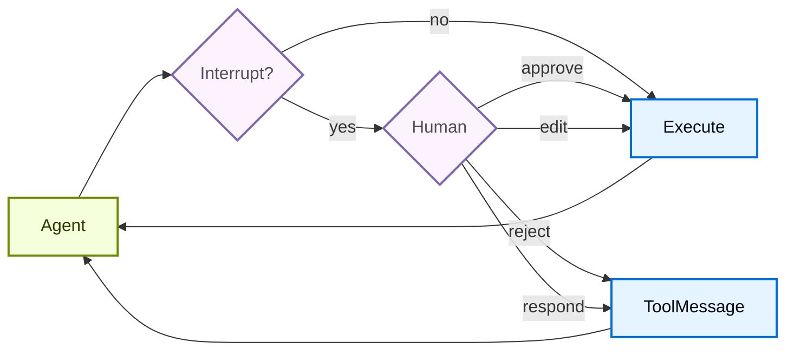

# 人机协作

> 学习如何为敏感工具操作配置人工审批机制

有些工具操作比较敏感，在执行之前需要人工确认。Deep Agents 通过 LangGraph 的中断（interrupt）能力支持人机协作（Human-in-the-loop）工作流。你可以使用 `interrupt_on` 参数来配置哪些工具需要审批。当设置了 `interrupt_on` 时，`HumanInTheLoopMiddleware` 会自动添加到[默认中间件栈](/tutorials/DeepAgents/自定义配置)中。如果某次运行在工具返回结果之前被取消或中断，同一栈中的 [`PatchToolCallsMiddleware`](https://reference.langchain.com/javascript/deepagents/middleware/createPatchToolCallsMiddleware) 会自动修复消息历史。



## 基本配置

`interrupt_on` 参数接受一个字典，将工具名称映射到中断配置。每个工具可以配置为：

- **`True`**：启用中断，使用默认行为（允许 approve、edit、reject、respond）
- **`False`**：对该工具禁用中断
- **`InterruptOnConfig`**：自定义配置。通过设置 `allowed_decisions` 来控制审查选项。

```ts
import { tool } from "langchain";
import { createDeepAgent } from "deepagents";
import { MemorySaver } from "@langchain/langgraph";
import { z } from "zod";

const removeFile = tool(
  async ({ path }: { path: string }) => {
    return `Deleted ${path}`;
  },
  {
    name: "remove_file",
    description: "Delete a file from the filesystem.",
    schema: z.object({
      path: z.string(),
    }),
  },
);

const fetchFile = tool(
  async ({ path }: { path: string }) => {
    return `Contents of ${path}`;
  },
  {
    name: "fetch_file",
    description: "Read a file from the filesystem.",
    schema: z.object({
      path: z.string(),
    }),
  },
);

const notifyEmail = tool(
  async ({
    to,
    subject,
    body,
  }: {
    to: string;
    subject: string;
    body: string;
  }) => {
    return `Sent email to ${to}`;
  },
  {
    name: "notify_email",
    description: "Send an email.",
    schema: z.object({
      to: z.string(),
      subject: z.string(),
      body: z.string(),
    }),
  },
);

// Checkpointer is REQUIRED for human-in-the-loop
const checkpointer = new MemorySaver();

const agent = createDeepAgent({
  model: "google_genai:gemini-3.5-flash",
  tools: [removeFile, fetchFile, notifyEmail],
  interruptOn: {
    remove_file: true, // Default: approve, edit, reject, respond
    fetch_file: false, // No interrupts needed
    notify_email: { allowedDecisions: ["approve", "reject"] }, // No editing
  },
  checkpointer, // Required!
});
```

## 决策类型

`allowed_decisions` 列表控制人工审查工具调用时可以采取的操作：

- **`"approve"`**：使用 Agent 提出的原始参数执行工具
- **`"edit"`**：在执行前修改工具参数
- **`"reject"`**：完全跳过该工具调用，并将拒绝反馈返回给 Agent
- **`"respond"`**：将人工的消息直接作为工具结果返回，跳过执行——适用于"询问用户"类型的工具

当人工拒绝某个操作时使用 `reject`。当人工充当工具本身时（例如回答 `ask_user` 提示），才使用 `respond`。不要用 `respond` 来拒绝有副作用的工具，因为其消息可能被模型当作成功的工具结果来处理。

你可以为每个工具自定义可用的决策：

```typescript
const interruptOn = {
  // Sensitive operations: allow all options
  delete_file: { allowedDecisions: ["approve", "edit", "reject"] },

  // Moderate risk: approval or rejection only
  write_file: { allowedDecisions: ["approve", "reject"] },

  // Must approve (no rejection allowed)
  critical_operation: { allowedDecisions: ["approve"] },
};
```

## 处理中断

当中断被触发时，Agent 会暂停执行并返回控制权。你需要在结果中检查中断并相应地处理。如果用户拒绝了某个操作，请包含一个明确的 `message`，告诉 Agent 该工具未被执行以及接下来该怎么做。

```typescript
import { v7 as uuid7 } from "uuid";
import { Command } from "@langchain/langgraph";

// Create config with thread_id for state persistence
const config = { configurable: { thread_id: uuid7() } };

// Invoke the agent
let result = await agent.invoke({
  messages: [{ role: "user", content: "Delete the file temp.txt" }],
}, config);

// Check if execution was interrupted
if (result.__interrupt__) {
  // Extract interrupt information
  const interrupts = result.__interrupt__[0].value;
  const actionRequests = interrupts.actionRequests;
  const reviewConfigs = interrupts.reviewConfigs;

  // Create a lookup map from tool name to review config
  const configMap = Object.fromEntries(
    reviewConfigs.map((cfg) => [cfg.actionName, cfg])
  );

  // Display the pending actions to the user
  for (const action of actionRequests) {
    const reviewConfig = configMap[action.name];
    console.log(`Tool: ${action.name}`);
    console.log(`Arguments: ${JSON.stringify(action.args)}`);
    console.log(`Allowed decisions: ${reviewConfig.allowedDecisions}`);
  }

  // Get user decisions (one per actionRequest, in order)
  const decisions = [
    {
      type: "reject",
      message: "User rejected deleting temp.txt. Do not retry deletion.",
    }
  ];

  // Resume execution with decisions
  result = await agent.invoke(
    new Command({ resume: { decisions } }),
    config  // Must use the same config!
  );
}

// Process final result
console.log(result.messages[result.messages.length - 1].content);
```

## 多工具调用

当 Agent 调用多个需要审批的工具时，所有中断会批量合并为一个中断。你必须按顺序为每个调用提供决策。

```typescript
const config = { configurable: { thread_id: uuid7() } };

let result = await agent.invoke({
  messages: [{
    role: "user",
    content: "Delete temp.txt and send an email to admin@example.com"
  }]
}, config);

if (result.__interrupt__) {
  const interrupts = result.__interrupt__[0].value;
  const actionRequests = interrupts.actionRequests;

  // Two tools need approval
  console.assert(actionRequests.length === 2);

  // Provide decisions in the same order as actionRequests
  const decisions = [
    { type: "approve" },  // First tool: delete_file
    {
      type: "reject",
      message: "User rejected this action. Do not retry this tool call.",
    }  // Second tool: send_email
  ];

  result = await agent.invoke(
    new Command({ resume: { decisions } }),
    config
  );
}
```

## 拒绝消息

当审查者返回 `reject` 决策时，Deep Agents 会跳过工具调用并将拒绝反馈发送回 Agent。如果省略 `message`，默认反馈会告诉模型该工具未被执行，并且除非用户要求，否则不要重试相同的工具调用。

对于敏感或有副作用的工具，请在决策中传入领域特定的 `message`。明确说明 Agent 应该放弃该操作、追问后续问题，还是尝试更安全的替代方案。

```typescript
const decisions = [
  {
    type: "reject",
    message: "User rejected deleting this file. Do not retry deletion. Ask which file to archive instead.",
  },
];
```

## 编辑工具参数

当 `"edit"` 在允许的决策中时，你可以在执行前修改工具参数：

```typescript
if (result.__interrupt__) {
  const interrupts = result.__interrupt__[0].value;
  const actionRequest = interrupts.actionRequests[0];

  // Original args from the agent
  console.log(actionRequest.args);  // { to: "everyone@company.com", ... }

  // User decides to edit the recipient
  const decisions = [{
    type: "edit",
    editedAction: {
      name: actionRequest.name,  // Must include the tool name
      args: { to: "team@company.com", subject: "...", body: "..." }
    }
  }];

  result = await agent.invoke(
    new Command({ resume: { decisions } }),
    config
  );
}
```

## 子 Agent 中断

使用子 Agent 时，你可以在[工具调用上](#工具调用上的中断)和[工具调用内部](#工具调用内部的中断)使用中断。

### 工具调用上的中断

每个子 Agent 可以有自己的 `interrupt_on` 配置，覆盖主 Agent 的设置：

```typescript
const agent = createDeepAgent({
  tools: [deleteFile, readFile],
  interruptOn: {
    delete_file: true,
    read_file: false,
  },
  subagents: [{
    name: "file-manager",
    description: "Manages file operations",
    systemPrompt: "You are a file management assistant.",
    tools: [deleteFile, readFile],
    interruptOn: {
      // Override: require approval for reads in this subagent
      delete_file: true,
      read_file: true,  // Different from main agent!
    }
  }],
  checkpointer
});
```

当子 Agent 触发中断时，处理方式相同——检查结果中的 `interrupts` 并使用 `Command` 恢复执行。

### 工具调用内部的中断

子 Agent 的工具可以直接调用 `interrupt()` 来暂停执行并等待审批：

```typescript
import { createAgent, tool } from "langchain";
import { ChatOpenAI } from "@langchain/openai";
import { HumanMessage } from "@langchain/core/messages";
import { MemorySaver, Command, interrupt } from "@langchain/langgraph";
import { createDeepAgent } from "deepagents";
import { z } from "zod";

const requestApproval = tool(
  async ({ actionDescription }: { actionDescription: string }) => {
    const approval = interrupt({
      type: "approval_request",
      action: actionDescription,
      message: `Please approve or reject: ${actionDescription}`,
    }) as { approved?: boolean; reason?: string };

    if (approval.approved) {
      return `Action '${actionDescription}' was APPROVED. Proceeding...`;
    } else {
      return `Action '${actionDescription}' was REJECTED. Reason: ${
        approval.reason || "No reason provided"
      }`;
    }
  },
  {
    name: "request_approval",
    description: "Request human approval before proceeding with an action.",
    schema: z.object({
      actionDescription: z
        .string()
        .describe("The action that requires approval"),
    }),
  }
);

async function main() {
  const checkpointer = new MemorySaver();
  const model = new ChatOpenAI({
    model: "gpt-4o-mini",
    maxTokens: 4096,
  });

  const compiledSubagent = createAgent({
    model: model,
    tools: [requestApproval],
    name: "approval-agent",
  });

  const parentAgent = await createDeepAgent({
    checkpointer: checkpointer,
    subagents: [
      {
        name: "approval-agent",
        description: "An agent that can request approvals",
        runnable: compiledSubagent as any,
      },
    ],
  });

  const threadId = "test_interrupt_directly";
  const config = { configurable: { thread_id: threadId } };

  console.log("Invoking agent - sub-agent will use request_approval tool...");

  let result = await parentAgent.invoke(
    {
      messages: [
        new HumanMessage({
          content:
            "Use the task tool to launch the approval-agent sub-agent. " +
            "Tell it to use the request_approval tool to request approval for 'deploying to production'.",
        }),
      ],
    },
    config
  );

  if (result.__interrupt__) {
    const interruptValue = result.__interrupt__[0].value as {
      type?: string;
      action?: string;
      message?: string;
    };
    console.log("\nInterrupt received!");
    console.log(`  Type: ${interruptValue.type}`);
    console.log(`  Action: ${interruptValue.action}`);
    console.log(`  Message: ${interruptValue.message}`);

    console.log("\nResuming with Command(resume={'approved': true})...");
    const result2 = await parentAgent.invoke(
      new Command({ resume: { approved: true } }),
      config
    );

    if (!result2.__interrupt__) {
      console.log("\nExecution completed!");
      // Find the tool response
      const toolMsgs = result2.messages?.filter((m) => m.type === "tool") || [];
      if (toolMsgs.length > 0) {
        const lastToolMsg = toolMsgs[toolMsgs.length - 1];
        console.log(`  Tool result: ${lastToolMsg.content}`);
      }
    } else {
      console.log("\nAnother interrupt occurred");
    }
  } else {
    console.log(
      "\n  No interrupt - the model may not have called request_approval"
    );
  }
}

main().catch(console.error);
```

运行后会产生以下输出：

```text
Invoking agent - sub-agent will use request_approval tool...

Interrupt received!
  Type: approval_request
  Action: deploying to production
  Message: Please approve or reject: deploying to production

Resuming with Command(resume={'approved': true})...

Execution completed!
  Tool result: Approval for "deploying to production" has been granted. You can proceed with the deployment.
```

---

> 本文基于 [Deep Agents 官方文档](https://docs.langchain.com/oss/javascript/deepagents/human-in-the-loop) 翻译并二次创作。
