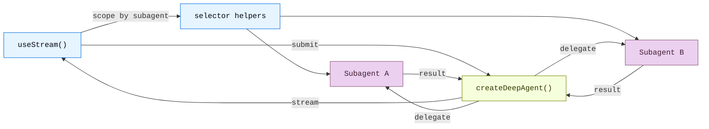

# 前端概览

> 构建可视化界面，实时展示子 Agent 流、任务进度和沙箱，专为 Deep Agents 打造

让我们来构建前端——把 Deep Agent 的工作流程以可视化的方式实时呈现出来。这套模式将向你展示如何渲染子 Agent 的进度、任务规划、流式内容，以及由沙箱驱动的类 IDE 体验。所有这些，都基于 `createDeepAgent` 创建的 Agent。

当 UI 能够把"委派"这个动作变得可见时，Deep Agent 的价值才能真正发挥出来。与其只展示一个不透明的助手气泡，LangChain SDK 会暴露协调者（coordinator）、子 Agent 发现（subagent discovery）、自定义状态以及沙箱产物，让用户可以清楚地检视一个长时间运行的任务是如何被拆解和完成的。

::: tip 提示
这些模式使用的是 v1 前端 SDK 包。如果你使用的是更早的版本，请参考各框架的迁移指南：[React](https://github.com/langchain-ai/langgraphjs/blob/main/libs/sdk-react/docs/v1-migration.md)、[Vue](https://github.com/langchain-ai/langgraphjs/blob/main/libs/sdk-vue/docs/v1-migration.md)、[Svelte](https://github.com/langchain-ai/langgraphjs/blob/main/libs/sdk-svelte/docs/v1-migration.md)、[Angular](https://github.com/langchain-ai/langgraphjs/blob/main/libs/sdk-angular/docs/v1-migration.md)。
:::

## 架构

Deep Agents 采用协调者-工作者（coordinator-worker）架构。主 Agent 负责规划任务并委派给专门的子 Agent，每个子 Agent 在隔离环境中独立运行。在前端方面，v1 stream handle 将协调者消息暴露在根流上，同时通过子 Agent 发现快照（discovery snapshots）让你能够构建针对单个子 Agent 的作用域视图。



```ts
import { createDeepAgent } from "deepagents";

const agent = createDeepAgent({
  tools: [getWeather],
  systemPrompt: "You are a helpful assistant",
  subagents: [
    {
      name: "researcher",
      description: "Research assistant",
    },
  ],
});
```

在前端，使用 [`useStream`](https://reference.langchain.com/javascript/langchain-react/index/useStream) 连接 Agent，方式与 `createAgent` 完全一样。传入一个[类型参数](https://docs.langchain.com/oss/javascript/langchain/frontend/overview) 以获得类型安全的流状态。Deep Agent 模式会用到 `stream.subagents`、诸如 `useMessages(stream, subagent)` 的选择器辅助函数，以及 `stream.values.todos` 这样的自定义状态值来渲染子 Agent 专属的 UI。

```ts
import { useStream } from "@langchain/react";

function App() {
  const stream = useStream<typeof agent>({
    apiUrl: "http://localhost:2024",
    assistantId: "agent",
  });

  // Deep agent state beyond messages
  const todos = stream.values?.todos;
  const subagents = [...stream.subagents.values()];
}
```

## SDK 暴露了什么

Deep Agent 的 UI 通常需要的不仅仅是最终答案。前端 SDK 为你提供了运行过程中用户关心的各个部分的结构化投影：

| 投影（Projection）    | 用途                                                                                                        |
| --------------------- | ----------------------------------------------------------------------------------------------------------- |
| `stream.messages`     | 协调者的对话内容和最终综合结果。                                                                             |
| `stream.subagents`    | 专家工作者的实时发现，包括状态和任务元数据。                                                                 |
| `stream.values`       | 共享状态，如 todos、计划、报告章节、沙箱元数据，或你的 Agent 写入的任何自定义键。                            |
| Tool-call state       | 将文件系统、搜索、浏览器或领域工具渲染为带有进度和结果的卡片。                                               |
| Interrupts            | 暂停委派的工作以等待用户审批或补充输入，同时不丢失运行状态。                                                  |

有了这些，你就可以构建出更接近 IDE、任务看板或工作流监控器的界面，而不只是一个普通的聊天记录。

## 模式

- [**子 Agent 流式**](/tutorials/DeepAgents/子 Agent 流式（前端）) — 展示专家子 Agent 的流式内容、进度追踪和可折叠卡片。
- [**Todo 列表**](/tutorials/DeepAgents/Todo 列表（前端）) — 从 Agent 状态同步的实时 Todo 列表，追踪 Agent 进度。
- [**沙箱**](/tutorials/DeepAgents/沙箱（前端）) — 构建类 IDE 界面，包含文件浏览器、代码查看器和 Diff 面板，由沙箱驱动。

## 相关模式

[LangChain 前端模式](https://docs.langchain.com/oss/javascript/langchain/frontend/overview)（包括 Markdown 消息、工具调用和人机协作）同样适用于 Deep Agent。Deep Agents 构建在相同的 LangGraph 运行时之上，因此 `useStream` 提供了相同的核心 API。

如果需要更底层的图可视化，请参考 [LangGraph 前端模式](https://docs.langchain.com/oss/javascript/langgraph/frontend/overview)，其中展示了如何将图节点和状态键直接映射到 UI 组件。

---

> 本文基于 [Deep Agents 官方文档](https://docs.langchain.com/oss/javascript/deepagents/frontend/overview) 翻译并二次创作。
