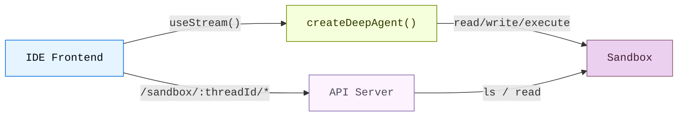
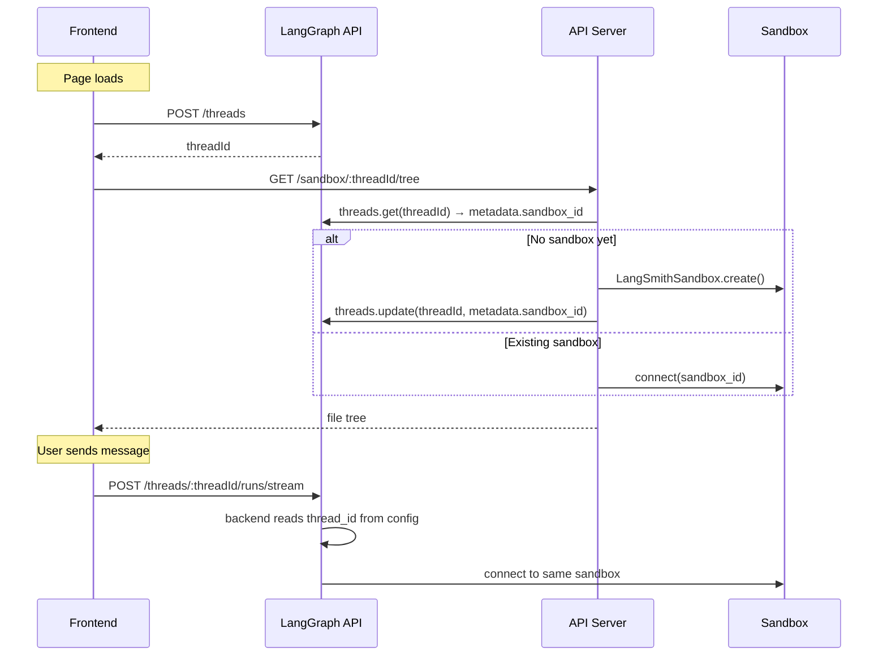

# 沙箱（前端）

> 为编码 Agent 构建类 IDE 的界面，由沙箱环境驱动

编码 Agent 需要的不仅仅是一个聊天窗口。它需要文件浏览器、代码查看器、Diff 面板——一种 IDE 式的体验。这个模式将 Deep Agent 连接到[沙箱](/tutorials/DeepAgents/沙箱)，让它在隔离环境中读取、写入和执行代码，然后通过自定义 API 服务器将沙箱文件系统暴露给前端，使界面能够在 Agent 工作时实时显示文件变化。

本页涵盖**三面板 UI**（文件树、代码查看器和聊天）以及将沙箱文件系统暴露给前端的**自定义 API 路由**。关于沙箱提供商、生命周期管理、种子文件、密钥管理、部署和生产环境的 `useStream` 配置，请参阅[生产环境部署](/tutorials/DeepAgents/生产环境部署)。

## 架构

这个设置包含三个部分：

1. **带沙箱后端的 Deep Agent**：Agent 自动从沙箱获得文件系统工具（`read_file`、`write_file`、`edit_file`、`execute`）

2. **自定义 API 服务器**：通过 `langgraph.json` 的 `http.app` 字段暴露的 Hono 应用，提供前端可调用的文件浏览端点

3. **三面板前端**：文件树、代码/Diff 查看器和聊天面板，随 Agent 的操作实时同步文件



## 沙箱生命周期

在接入前端之前，先确定沙箱存活多长时间以及谁共享它。关于线程作用域（thread-scoped）与助手作用域（assistant-scoped）沙箱、异步 [graph factory](https://docs.langchain.com/langsmith/graph-rebuild) 设置、TTL 行为和 SDK 调用示例，请参阅[生产环境部署](/tutorials/DeepAgents/生产环境部署)中的沙箱生命周期部分。

本指南默认使用**线程作用域沙箱**。前端和自定义 API 服务器都从 LangGraph [thread](https://docs.langchain.com/langsmith/use-threads) ID 解析沙箱。这样可以使对话保持隔离，并在你[持久化 thread ID](#thread-creation) 时让页面刷新重新连接到同一个环境。



对于[多租户](/tutorials/DeepAgents/生产环境部署)应用，在后端工厂中按用户或助手来限定沙箱作用域。对于没有 LangGraph thread 的演示，可以在 API URL 中传入客户端生成的会话 ID。该会话 ID 不会在浏览器会话之间持久化。

## 连接 Agent 和 API 服务器

按照[沙箱](/tutorials/DeepAgents/沙箱)和[执行环境](/tutorials/DeepAgents/生产环境部署)中的说明，为 Deep Agent 配置沙箱后端。Agent 会自动获得文件系统工具和 `execute` 工具，不需要额外的工具配置。

在构建这个 UI 时，在生产环境设置的基础上增加了一个要求：一个运行在 Agent 图之外的**自定义 API 服务器**，因此 Agent 后端和你的文件浏览路由必须为每个 thread 解析**同一个沙箱**。将沙箱 ID 存储在 thread 元数据中，并在两者之间共享一个查找函数。

### 从 thread 元数据解析沙箱

在共享模块中定义 `getOrCreateSandboxForThread`。Agent 图工厂和自定义 API 路由都导入它：

```ts
// src/api/utils.ts
import { Client } from "@langchain/langgraph-sdk";
import { LangSmithSandbox } from "deepagents";
import { SandboxClient } from "langsmith/sandbox";

export async function getOrCreateSandboxForThread(threadId: string) {
  const client = new Client({ apiUrl: "http://localhost:2024" });
  const thread = await client.threads.get(threadId);
  const sandboxId = thread.metadata?.sandbox_id;

  if (sandboxId) {
    const existing = await new SandboxClient().getSandbox(sandboxId);
    if (existing.status === "ready") {
      return new LangSmithSandbox({ sandbox: existing });
    }
  }

  const sandbox = await LangSmithSandbox.create({ templateName: "my-template" });
  await seedSandbox(sandbox);  // See File transfers below
  await client.threads.update(threadId, { metadata: { sandbox_id: sandbox.id } });
  return sandbox;
}
```

将 Agent 配置为异步 [graph factory](https://docs.langchain.com/langsmith/graph-rebuild)，从运行配置中读取 `thread_id`，并将解析出的后端传给 `createDeepAgent`：

```ts
// src/agents/deep-agent-ide.ts
import { createDeepAgent } from "deepagents";
import type { LangGraphRunnableConfig } from "@langchain/langgraph";

import { getOrCreateSandboxForThread } from "../api/utils.js";

export async function agent(config: LangGraphRunnableConfig) {
  const threadId = config.configurable?.thread_id;
  if (!threadId) throw new Error("No thread_id — agent must run on a thread");

  const backend = await getOrCreateSandboxForThread(threadId);

  return createDeepAgent({
    model: "google_genai:gemini-3.5-flash",
    backend,
    systemPrompt: "You are an expert developer working on a project in /app.",
  });
}
```

::: tip 提示
与[生产环境部署](/tutorials/DeepAgents/生产环境部署)中的示例类似，Agent 是一个在每次运行时调用的异步图工厂。将沙箱 ID 存储在 thread 元数据中，这样自定义 `http.app` 路由就可以调用同一个 `getOrCreateSandboxForThread` 辅助函数。当 LangGraph SDK 是唯一入口点时，生产环境部署中使用的是提供商标签查找。
:::

### 种子项目文件

在 Agent 运行之前，使用 `uploadFiles` / `upload_files` 上传初始文件。关于种子模式、提供商示例以及将[记忆](/tutorials/DeepAgents/记忆)或[技能](/tutorials/DeepAgents/技能)同步到沙箱中，请参阅[文件传输](/tutorials/DeepAgents/生产环境部署)。对于 LangSmith 沙箱，创建容器时从[沙箱快照](https://docs.langchain.com/langsmith/sandbox-snapshots)传入 `templateName`。

::: tip 提示
上传 `package.json` 后运行 `sandbox.execute("cd /app && npm install")`，这样在第一次 Agent 回合之前依赖就已就绪。
:::

## 添加文件浏览 API

Agent 可以读写文件，但前端也需要直接访问来浏览沙箱文件系统。添加一个自定义 [Hono](https://hono.dev) API 服务器，并通过 `langgraph.json` 中的 `http.app` 字段暴露它。

### 创建 API 服务器

沙箱 API 端点使用 thread ID 作为 URL 路径参数。这确保前端始终访问当前对话的正确沙箱，使用与 Agent 后端相同的 `getOrCreateSandboxForThread` 函数：

```ts
// src/api/app.ts
import { Hono } from "hono";
import { getOrCreateSandboxForThread } from "./utils.js";

export const app = new Hono();

app.get("/sandbox/:threadId/tree", async (c) => {
  const threadId = c.req.param("threadId");
  const rootPath = c.req.query("filePath") || "/app";

  const sandbox = await getOrCreateSandboxForThread(threadId);
  const result = await sandbox.execute(
    `find '${rootPath}' -printf '%y\\t%s\\t%p\\n' 2>/dev/null | sort -t$'\\t' -k3`,
  );

  const entries = result.output
    .trim()
    .split("\n")
    .filter(Boolean)
    .map((line) => {
      const [typeChar, sizeStr, fullPath] = line.split("\t");
      return {
        name: fullPath.split("/").pop(),
        type: typeChar === "d" ? "directory" : "file",
        path: fullPath,
        size: parseInt(sizeStr, 10) || 0,
      };
    });

  return c.json({ path: rootPath, entries, sandboxId: sandbox.id });
});

app.get("/sandbox/:threadId/file", async (c) => {
  const threadId = c.req.param("threadId");
  const filePath = c.req.query("filePath");
  if (!filePath) return c.json({ error: "filePath is required" }, 400);

  const sandbox = await getOrCreateSandboxForThread(threadId);
  const results = await sandbox.downloadFiles([filePath]);
  const file = results[0];
  if (file.error) return c.json({ error: file.error }, 404);

  const content = new TextDecoder().decode(file.content!);
  return c.json({ path: filePath, content });
});
```

::: tip 提示
Agent 后端和 API 服务器都调用同一个 `getOrCreateSandboxForThread` 函数，这确保它们始终为给定 thread 解析到同一个沙箱。thread 元数据中的沙箱 ID 是唯一的数据源——不需要内存缓存。
:::

### 配置 `langgraph.json`

同时注册 Agent 图和 API 服务器。`http.app` 字段告诉 LangGraph 平台在默认路由旁边提供你的自定义路由。完整的 `langgraph.json` 选项请参阅[应用结构](https://docs.langchain.com/oss/javascript/langgraph/application-structure)和[生产环境部署](/tutorials/DeepAgents/生产环境部署)。

```json
{
  "node_version": "22",
  "graphs": {
    "deep_agent_ide": "./src/agents/deep-agent-ide.ts:agent"
  },
  "env": ".env",
  "http": {
    "app": "./src/api/app.ts:app"
  }
}
```

你的自定义路由可以在与 LangGraph API 相同的主机上访问。使用 `langgraph dev` 进行本地开发时，地址是 `http://localhost:2024`。

::: tip 提示
`http.app` 中定义的自定义路由优先于默认的 LangGraph 路由。这意味着你可以在需要时覆盖内置端点，但注意不要意外覆盖 `/threads` 或 `/runs` 等路由。
:::

## 构建前端

前端有三个面板：文件树侧边栏、代码/Diff 查看器和聊天面板。它使用 [`useStream`](https://reference.langchain.com/javascript/langchain-react/index/useStream) 处理 Agent 对话，使用自定义 API 端点进行文件浏览。

对于生产环境部署，请将 `apiUrl` 指向你的 [LangSmith Deployment](https://docs.langchain.com/langsmith/deployment)，并在每次运行时传入稳定的 `thread_id`。关于这些设置以及使用 `thread_id` 和运行时 `context` [调用 Agent](/tutorials/DeepAgents/生产环境部署)，请参阅[生产环境部署](/tutorials/DeepAgents/生产环境部署)中的前端部分。

### Thread 创建

页面加载时创建一个 LangGraph thread，并将它的 ID 持久化到 `sessionStorage` 中，这样页面刷新就能重新连接到同一个沙箱：

```tsx
const THREAD_KEY = "sandbox-thread-id";

function IDEPreview() {
  const [threadId, setThreadId] = useState<string | null>(
    () => sessionStorage.getItem(THREAD_KEY),
  );

  const updateThreadId = useCallback((id: string | null) => {
    setThreadId(id);
    if (id) sessionStorage.setItem(THREAD_KEY, id);
    else sessionStorage.removeItem(THREAD_KEY);
  }, []);

  const stream = useStream<typeof myAgent>({
    apiUrl: AGENT_URL,
    assistantId: "deep_agent_ide",
    threadId,
    onThreadId: updateThreadId,
  });

  // Create thread on first mount
  useEffect(() => {
    if (threadId) return;
    stream.client.threads.create().then((t) => updateThreadId(t.thread_id));
  }, [stream.client, threadId, updateThreadId]);

  // Pass threadId to sandbox file hooks
  const { tree, files } = useSandboxFiles(threadId);
  // ...
}
```

"新建 thread"按钮清除存储的 ID，这样下次挂载时会创建新的 thread（和沙箱）：

```tsx
function handleNewThread() {
  updateThreadId(null);
}
```

### 文件状态管理

追踪沙箱文件系统的两个快照：原始状态（Agent 运行之前）和当前状态（实时更新）。thread ID 包含在 API URL 中，确保请求始终命中正确的沙箱：

```ts
const AGENT_URL = "http://localhost:2024";

async function fetchTree(threadId: string): Promise<FileEntry[]> {
  const res = await fetch(
    `${AGENT_URL}/sandbox/${encodeURIComponent(threadId)}/tree?filePath=/app`,
  );
  const data = await res.json();
  return data.entries.filter((e: FileEntry) => !e.path.includes("node_modules"));
}

async function fetchFile(threadId: string, path: string): Promise<string | null> {
  const res = await fetch(
    `${AGENT_URL}/sandbox/${encodeURIComponent(threadId)}/file?filePath=${encodeURIComponent(path)}`,
  );
  const data = await res.json();
  return data.content ?? null;
}
```

### 实时文件同步

IDE 体验的关键在于**在 Agent 工作时**更新文件，而不是等它完成。监视流中的消息，寻找来自文件修改工具的 `ToolMessage` 实例。当 `write_file` 或 `edit_file` 工具调用完成时，刷新该特定文件。当 `execute` 完成时，刷新所有内容（因为 shell 命令可能修改任何文件）：

::: code-group

```tsx [React]
import { useStream } from "@langchain/react";
import { ToolMessage, AIMessage } from "langchain";

const FILE_MUTATING_TOOLS = new Set(["write_file", "edit_file", "execute"]);

export function IDEPreview() {
  const stream = useStream<typeof myAgent>({
    apiUrl: AGENT_URL,
    assistantId: "deep_agent_ide",
  });

  const processedIds = useRef(new Set<string>());

  useEffect(() => {
    // Build a map of file-mutating tool calls from AI messages
    const toolCallMap = new Map();
    for (const msg of stream.messages) {
      if (!AIMessage.isInstance(msg)) continue;
      for (const tc of msg.tool_calls ?? []) {
        if (tc.id && FILE_MUTATING_TOOLS.has(tc.name)) {
          toolCallMap.set(tc.id, { name: tc.name, args: tc.args });
        }
      }
    }

    // When a ToolMessage appears for a file-mutating tool, refresh
    for (const msg of stream.messages) {
      if (!ToolMessage.isInstance(msg)) continue;
      const id = msg.id ?? msg.tool_call_id;
      if (!id || processedIds.current.has(id)) continue;

      const call = toolCallMap.get(msg.tool_call_id);
      if (!call) continue;
      processedIds.current.add(id);

      if (call.name === "write_file" || call.name === "edit_file") {
        refreshSingleFile(call.args.path ?? call.args.file_path);
      } else if (call.name === "execute") {
        refreshTreeAndFiles();
      }
    }
  }, [stream.messages]);
}
```

```vue [Vue]
<script setup lang="ts">
import { useStream } from "@langchain/vue";
import { ToolMessage, AIMessage } from "langchain";
import { watch } from "vue";

const FILE_MUTATING_TOOLS = new Set(["write_file", "edit_file", "execute"]);
const processedIds = new Set<string>();

const stream = useStream<typeof myAgent>({
  apiUrl: AGENT_URL,
  assistantId: "deep_agent_ide",
});

watch(
  () => stream.messages.value,
  (messages) => {
    const toolCallMap = new Map();
    for (const msg of messages) {
      if (AIMessage.isInstance(msg)) {
        for (const tc of msg.tool_calls ?? []) {
          if (tc.id && FILE_MUTATING_TOOLS.has(tc.name)) {
            toolCallMap.set(tc.id, { name: tc.name, args: tc.args });
          }
        }
      }
    }

    for (const msg of messages) {
      if (!ToolMessage.isInstance(msg)) continue;
      const id = msg.id ?? msg.tool_call_id;
      if (!id || processedIds.has(id)) continue;

      const call = toolCallMap.get(msg.tool_call_id);
      if (!call) continue;
      processedIds.add(id);

      if (call.name === "write_file" || call.name === "edit_file") {
        refreshSingleFile(call.args.path ?? call.args.file_path);
      } else if (call.name === "execute") {
        refreshTreeAndFiles();
      }
    }
  },
  { deep: true },
);
</script>
```

```svelte [Svelte]
<script lang="ts">
  import { useStream } from "@langchain/svelte";
  import { ToolMessage, AIMessage } from "langchain";

  const FILE_MUTATING_TOOLS = new Set(["write_file", "edit_file", "execute"]);
  const processedIds = new Set<string>();

  const stream = useStream<typeof myAgent>({
    apiUrl: AGENT_URL,
    assistantId: "deep_agent_ide",
  });

  $effect(() => {
    const msgs = stream.messages;
    const toolCallMap = new Map();
    for (const msg of msgs) {
      if (AIMessage.isInstance(msg)) {
        for (const tc of msg.tool_calls ?? []) {
          if (tc.id && FILE_MUTATING_TOOLS.has(tc.name)) {
            toolCallMap.set(tc.id, { name: tc.name, args: tc.args });
          }
        }
      }
    }

    for (const msg of msgs) {
      if (!ToolMessage.isInstance(msg)) continue;
      const id = msg.id ?? msg.tool_call_id;
      if (!id || processedIds.has(id)) continue;

      const call = toolCallMap.get(msg.tool_call_id);
      if (!call) continue;
      processedIds.add(id);

      if (call.name === "write_file" || call.name === "edit_file") {
        refreshSingleFile(call.args.path ?? call.args.file_path);
      } else if (call.name === "execute") {
        refreshTreeAndFiles();
      }
    }
  });
</script>
```

```ts [Angular]
import { Component, effect } from "@angular/core";
import { injectStream } from "@langchain/angular";
import { ToolMessage, AIMessage } from "langchain";

const FILE_MUTATING_TOOLS = new Set(["write_file", "edit_file", "execute"]);

@Component({
  selector: "app-ide-preview",
  template: `<!-- ... -->`,
})
export class IdePreviewComponent {
  stream = injectStream<typeof myAgent>({
    apiUrl: AGENT_URL,
    assistantId: "deep_agent_ide",
  });

  private processedIds = new Set<string>();

  constructor() {
    effect(() => {
      const messages = this.stream.messages();
      const toolCallMap = new Map();
      for (const msg of messages) {
        if (AIMessage.isInstance(msg)) {
          for (const tc of (msg as AIMessage).tool_calls ?? []) {
            if (tc.id && FILE_MUTATING_TOOLS.has(tc.name)) {
              toolCallMap.set(tc.id, { name: tc.name, args: tc.args });
            }
          }
        }
      }

      for (const msg of messages) {
        if (!ToolMessage.isInstance(msg)) continue;
        const id = (msg as ToolMessage).id ?? (msg as ToolMessage).tool_call_id;
        if (!id || this.processedIds.has(id)) continue;

        const call = toolCallMap.get((msg as ToolMessage).tool_call_id);
        if (!call) continue;
        this.processedIds.add(id);

        if (call.name === "write_file" || call.name === "edit_file") {
          this.refreshSingleFile(call.args.path ?? call.args.file_path);
        } else if (call.name === "execute") {
          this.refreshTreeAndFiles();
        }
      }
    });
  }
}
```

:::

### 检测文件变化

在每次 Agent 运行之前，快照当前文件内容。文件刷新后，与快照比较来识别哪些文件发生了变化：

```ts
function detectChanges(current: FileSnapshot, original: FileSnapshot): Set<string> {
  const changed = new Set<string>();
  for (const [path, content] of Object.entries(current)) {
    if (original[path] !== content) changed.add(path);
  }
  for (const path of Object.keys(original)) {
    if (!(path in current)) changed.add(path);
  }
  return changed;
}
```

当用户选择一个已变化的文件时，默认显示 Diff 视图，这样他们可以立即看到 Agent 修改了什么。

### 展示 Diff

使用适合你框架的 Diff 库来渲染统一 Diff：

| 框架    | 库                                                                         | 组件                                                           |
| ------- | -------------------------------------------------------------------------- | -------------------------------------------------------------- |
| React   | [`@pierre/diffs`](https://diffs.com)                                       | `<FileDiff>` with `parseDiffFromFile`                          |
| Vue     | [`@git-diff-view/vue`](https://github.com/MrWangJustToDo/git-diff-view)    | `<DiffView>` with `generateDiffFile` from `@git-diff-view/file` |
| Svelte  | [`@git-diff-view/svelte`](https://github.com/MrWangJustToDo/git-diff-view) | `<DiffView>` with `generateDiffFile` from `@git-diff-view/file` |
| Angular | [`ngx-diff`](https://github.com/rars/ngx-diff)                             | `<ngx-unified-diff>` with `[before]` and `[after]`             |

使用 `@pierre/diffs`（React）的示例：

```tsx
import { FileDiff } from "@pierre/diffs/react";
import { parseDiffFromFile } from "@pierre/diffs";

function DiffPanel({ original, current, fileName }) {
  const diff = parseDiffFromFile(
    { name: fileName, contents: original },
    { name: fileName, contents: current },
  );

  return (
    <FileDiff
      fileDiff={diff}
      options={{ theme: "github-dark", diffStyle: "unified", diffIndicators: "bars" }}
    />
  );
}
```

### 变更文件摘要

展示所有已修改文件的摘要，包含行级别的增删计数。这给用户一个快速了解 Agent 影响范围的概览——类似于 `git status`：

```tsx
function ChangedFilesSummary({ changedFiles, files, originalFiles, onSelect }) {
  const stats = [...changedFiles].map((path) => {
    const oldLines = (originalFiles[path] ?? "").split("\n");
    const newLines = (files[path] ?? "").split("\n");
    // Compute additions/deletions by comparing lines
    return { path, additions, deletions };
  });

  return (
    <div>
      <h3>{stats.length} Files Changed</h3>
      {stats.map((file) => (
        <button key={file.path} onClick={() => onSelect(file.path)}>
          {file.path}
          <span className="text-green-400">+{file.additions}</span>
          <span className="text-red-400">-{file.deletions}</span>
        </button>
      ))}
    </div>
  );
}
```

## 使用场景

在以下场景中，沙箱是正确的选择：

- **编码 Agent**：需要创建、修改和运行代码的 Agent，需要超越聊天的可视化界面
- **代码审查工作流**：Agent 提出修改建议，用户在接受之前审查 Diff
- **教程或学习应用**：AI 助手帮助用户逐步构建项目，并在上下文中展示变化
- **原型设计工具**：用户用自然语言描述功能，实时观看 Agent 实现

## 最佳实践

前端相关：

- **将 `threadId` 持久化到 `sessionStorage`**，这样页面刷新会重新连接到同一个 thread 和沙箱，而不是创建新的。
- **在每个相关工具调用时同步文件**，不要只在运行结束时同步。监视 `write_file`、`edit_file` 和 `execute` 工具消息并立即刷新。
- **对已变化的文件默认使用 Diff 视图**。当用户点击一个被 Agent 修改过的文件时，首先展示 Diff——那才是他们关心的内容。
- **对只读操作显示紧凑的工具结果**。不要在聊天中倾倒 `read_file` 的完整输出，而是显示一行摘要如 `Read router.js L1-42`。将完整输出展示保留给修改类工具。
- **从文件树中过滤 `node_modules`**。没有人想浏览数千个依赖文件。获取树时将它们过滤掉。

后端和沙箱相关：

- **生产应用使用线程作用域沙箱**。请参阅[生产环境部署](/tutorials/DeepAgents/生产环境部署)中的沙箱生命周期部分。
- **在 Agent 后端和 API 服务器之间共享沙箱解析逻辑**，通过 thread 元数据，这样两者解析同一个环境，无需内存缓存。
- **用真实项目作为沙箱种子**。请参阅[文件传输](/tutorials/DeepAgents/生产环境部署)。
- **将密钥放在沙箱之外**。使用[沙箱认证代理](/tutorials/DeepAgents/生产环境部署)而不是环境变量或文件上传来管理 API 密钥。
- **上线前添加防护措施**。为自主编码 Agent 配置[速率限制](/tutorials/DeepAgents/生产环境部署)、[错误处理](/tutorials/DeepAgents/生产环境部署)和[数据隐私](/tutorials/DeepAgents/生产环境部署)中间件。

## 相关

- [**生产环境部署**](/tutorials/DeepAgents/生产环境部署) — 使用持久沙箱、认证、防护措施和生产环境 `useStream` 设置部署 Agent。
- [**沙箱**](/tutorials/DeepAgents/沙箱) — 沙箱提供商、安全模型和文件传输 API。
- [**前端概览**](/tutorials/DeepAgents/前端概览) — 其他 Deep Agent UI 模式：子 Agent 流式、Todo 列表和自定义状态。
- [**Application structure**](https://docs.langchain.com/oss/javascript/langgraph/application-structure) — 完整的 `langgraph.json` 参考，包括自定义 `http.app` 路由。

---

> 本文基于 [Deep Agents 官方文档](https://docs.langchain.com/oss/javascript/deepagents/frontend/sandbox) 翻译并二次创作。
