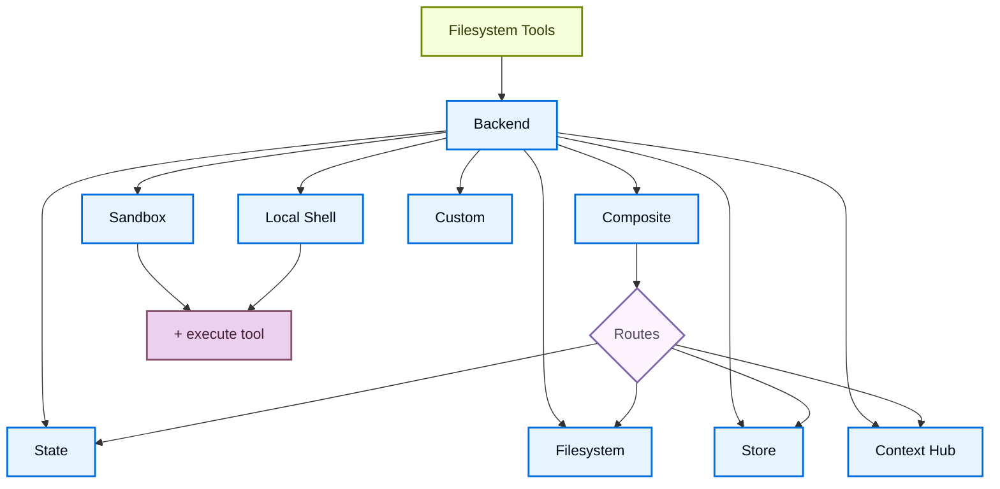

# 虚拟文件系统后端

> 为 Deep Agents 选择和配置文件系统后端。你可以指定路由到不同后端的路径，实现虚拟文件系统，并执行策略。

Deep Agents 通过 `ls`、`read_file`、`write_file`、`edit_file`、`glob` 和 `grep` 等工具向 Agent 暴露一个文件系统界面。这些工具通过一个可插拔的后端来运行。`read_file` 工具原生支持所有后端中的图片文件（`.png`、`.jpg`、`.jpeg`、`.gif`、`.webp`），将它们作为多模态内容块返回。

`read_file` 工具原生支持所有后端中的二进制文件（图片、PDF、音频、视频），返回一个带有类型化 `content` 和 `mimeType` 的 `ReadResult`。

沙箱和 [`LocalShellBackend`](https://reference.langchain.com/javascript/deepagents/backends/LocalShellBackend) 还提供了一个 `execute` 工具。

本页将介绍如何：

- [选择后端](#选择后端)
- [将不同路径路由到不同后端](#路由到不同后端)
- [实现自定义后端](#自定义后端)
- 在文件系统访问上[设置权限](#权限)
- [添加策略钩子](#添加策略钩子)
- [处理二进制和多模态文件](#多模态和二进制文件)
- [遵循后端协议](#协议参考)
- [将现有后端更新到 v2](#将现有后端更新到-v2)

::: tip 提示
当你在 [LangSmith Deployment](https://docs.langchain.com/langsmith/deployment) 上部署时，store 会自动配置。使用 [LangSmith](https://docs.langchain.com/langsmith/observability) 追踪来调试文件路径、权限拒绝和跨线程存储问题。请按照 [可观测性快速入门](https://docs.langchain.com/langsmith/observability-quickstart) 进行设置。

我们建议你还设置 [LangSmith Engine](https://docs.langchain.com/langsmith/engine)，它会监控你的追踪记录、检测问题并提出修复建议。
:::

## 快速开始

以下是一些可以直接与你的 Deep Agent 配合使用的预置文件系统后端：

| 内置后端                                                       | 描述                                                                                                                                                                                                                                                                                                                                                                                                                                                                                                |
| -------------------------------------------------------------- | --------------------------------------------------------------------------------------------------------------------------------------------------------------------------------------------------------------------------------------------------------------------------------------------------------------------------------------------------------------------------------------------------------------------------------------------------------------------------------------------------- |
| [默认](#statebackend)                                          | `agent = create_deep_agent(model="google_genai:gemini-3.5-flash")` <br /> 线程作用域。Agent 的默认文件系统后端存储在 `langgraph` state 中。文件通过 checkpointer 在同一线程内的多轮对话中持久化，但不会跨线程共享。                                                                                                                                                                                                                                                                                     |
| [本地文件系统持久化](#filesystembackend-本地磁盘)              | `agent = create_deep_agent(model="google_genai:gemini-3.5-flash", backend=FilesystemBackend(root_dir="/Users/nh/Desktop/"))` <br />让 Deep Agent 访问你本地机器的文件系统。你可以指定 Agent 可访问的根目录。注意，提供的 `root_dir` 必须是绝对路径。通常应包装在 [CompositeBackend](#compositebackend-路由器) 中，以将内部 Agent 数据（卸载的工具结果、对话历史）与你的项目文件分开。                                                                                                          |
| [持久化存储（LangGraph store）](#storebackend-langgraph-store) | `agent = create_deep_agent(model="google_genai:gemini-3.5-flash", backend=StoreBackend())` <br />让 Agent 访问*跨线程持久化*的长期存储。非常适合存储适用于 Agent 多次执行的长期记忆或指令。                                                                                                                                                                                                                                                                                                              |
| [Context Hub](#contexthubbackend)                              | `agent = create_deep_agent(model="google_genai:gemini-3.5-flash", backend=ContextHubBackend("my-agent"))` <br />将文件持久存储在 LangSmith Hub 仓库中，无需单独配置 LangGraph store。                                                                                                                                                                                                                                                                                                                  |
| [沙箱](/tutorials/DeepAgents/沙箱)                             | `agent = create_deep_agent(model="google_genai:gemini-3.5-flash", backend=sandbox)` <br />在隔离环境中执行代码。沙箱提供文件系统工具以及用于运行 shell 命令的 `execute` 工具。可从 LangSmith、AgentCore、Daytona、Deno、E2B、Modal、Runloop 或本地 VFS 中选择。                                                                                                                                                                                                                              |
| [本地 shell](#localshellbackend-本地-shell)                    | `agent = create_deep_agent(model="google_genai:gemini-3.5-flash", backend=LocalShellBackend(root_dir=".", env={"PATH": "/usr/bin:/bin"}))` <br />直接在主机上进行文件系统操作和 shell 执行。没有隔离——仅在受控的开发环境中使用。请参阅下方的[安全注意事项](#localshellbackend-本地-shell)。                                                                                                                                                                                                 |
| [组合后端](#compositebackend-路由器)                           | 默认线程作用域，`/memories/` 跨线程持久化。Composite 后端提供最大的灵活性。你可以在文件系统中指定不同的路由指向不同的后端。请参阅下方的 Composite 路由了解可直接复制的示例。                                                                                                                                                                                                                                                                                                                          |



## 内置后端

### StateBackend

```ts
import { createDeepAgent, StateBackend } from "deepagents";

// By default we provide a StateBackend
const agent = createDeepAgent();

// Under the hood, it looks like
const agent2 = createDeepAgent({
  backend: new StateBackend(),
});
```

**工作原理：**

- 通过 [`StateBackend`](https://reference.langchain.com/javascript/deepagents/backends/StateBackend) 将文件存储在当前线程的 LangGraph agent state 中。
- 通过 checkpoint 在同一线程的多个 Agent 轮次间持久化。文件不会跨线程共享。

::: warning
设计为在 graph 内部使用。在 graph 运行之外调用后端方法（例如 `state_backend.upload_files(...)`）不会生效，直到 graph 执行时才会应用。
:::

**最适合：**

- 作为 Agent 写入中间结果的草稿本。
- 自动驱逐大型工具输出，Agent 随后可以逐段读回。

请注意，此后端在 supervisor agent 和子 Agent 之间共享，子 Agent 写入的任何文件都将保留在 LangGraph agent state 中，即使该子 Agent 的执行已经完成。这些文件将继续对 supervisor agent 和其他子 Agent 可用。

### FilesystemBackend（本地磁盘）

[`FilesystemBackend`](https://reference.langchain.com/javascript/deepagents/backends/FilesystemBackend) 在可配置的根目录下读取和写入真实文件。

::: warning
此后端授予 Agent 直接的文件系统读写权限。请谨慎使用，且仅在适当的环境中使用。

**适当的使用场景：**

- 本地开发 CLI（编程助手、开发工具）
- CI/CD 流水线（请参阅下方的安全注意事项）

**不适当的使用场景：**

- Web 服务器或 HTTP API——请改用 `StateBackend`、`StoreBackend` 或[沙箱后端](/tutorials/DeepAgents/沙箱)

**安全风险：**

- Agent 可以读取任何可访问的文件，包括密钥（API 密钥、凭据、`.env` 文件）
- 结合网络工具，密钥可能通过 SSRF 攻击被泄露
- 文件修改是永久且不可逆的

**推荐的防护措施：**

1. 启用[人机协作（HITL）中间件](/tutorials/DeepAgents/人机协作)来审查敏感操作。
2. 从可访问的文件系统路径中排除密钥（特别是在 CI/CD 中）。
3. 在需要文件系统交互的生产环境中使用[沙箱后端](/tutorials/DeepAgents/沙箱)。
4. **始终**使用 `virtual_mode=True` 配合 `root_dir` 来启用基于路径的访问限制（阻止 `..`、`~` 和根目录之外的绝对路径）。

   注意，默认值（`virtual_mode=False`）即使设置了 `root_dir` 也不提供任何安全保障。
:::

::: code-group
```ts [Google]
import { createDeepAgent, FilesystemBackend } from "deepagents";

const agent = createDeepAgent({
  model: "google-genai:gemini-3.5-flash",
  backend: new FilesystemBackend({ rootDir: ".", virtualMode: true }),
});
```

```ts [OpenAI]
import { createDeepAgent, FilesystemBackend } from "deepagents";

const agent = createDeepAgent({
  model: "openai:gpt-5.4",
  backend: new FilesystemBackend({ rootDir: ".", virtualMode: true }),
});
```

```ts [Anthropic]
import { createDeepAgent, FilesystemBackend } from "deepagents";

const agent = createDeepAgent({
  model: "anthropic:claude-sonnet-4-6",
  backend: new FilesystemBackend({ rootDir: ".", virtualMode: true }),
});
```

```ts [OpenRouter]
import { createDeepAgent, FilesystemBackend } from "deepagents";

const agent = createDeepAgent({
  model: "openrouter:anthropic/claude-sonnet-4-6",
  backend: new FilesystemBackend({ rootDir: ".", virtualMode: true }),
});
```

```ts [Fireworks]
import { createDeepAgent, FilesystemBackend } from "deepagents";

const agent = createDeepAgent({
  model: "fireworks:accounts/fireworks/models/qwen3p5-397b-a17b",
  backend: new FilesystemBackend({ rootDir: ".", virtualMode: true }),
});
```

```ts [Baseten]
import { createDeepAgent, FilesystemBackend } from "deepagents";

const agent = createDeepAgent({
  model: "baseten:zai-org/GLM-5.2",
  backend: new FilesystemBackend({ rootDir: ".", virtualMode: true }),
});
```

```ts [Ollama]
import { createDeepAgent, FilesystemBackend } from "deepagents";

const agent = createDeepAgent({
  model: "ollama:devstral-2",
  backend: new FilesystemBackend({ rootDir: ".", virtualMode: true }),
});
```
:::

**工作原理：**

- 在可配置的 `root_dir` 下读取/写入真实文件。
- 你可以选择设置 `virtual_mode=True` 来沙箱化并规范化 `root_dir` 下的路径。
- 使用安全的路径解析，尽可能防止不安全的符号链接遍历，可以使用 ripgrep 进行快速的 `grep`。

**最适合：**

- 你机器上的本地项目
- CI 沙箱
- 挂载的持久化卷

::: tip 提示
**在大多数使用场景中，将 `FilesystemBackend` 包装在 `CompositeBackend` 中。** Deep Agents 会自动将内部数据写入后端，包括卸载的大型工具结果（在 `/large_tool_results/` 下）和对话历史（在 `/conversation_history/` 下）。当你单独使用 `FilesystemBackend` 时，这些内部文件会以真实磁盘文件的形式写入到 `root_dir` 下，将 Agent 产生的数据与你的项目文件混在一起。

使用 `CompositeBackend` 将你的项目目录路由到 `FilesystemBackend`，同时将内部路径保留在临时的 `StateBackend` 存储中：

```typescript
import { createDeepAgent, CompositeBackend, FilesystemBackend, StateBackend } from "deepagents";

const agent = createDeepAgent({
  backend: new CompositeBackend(
    new StateBackend(),
    {
      "/workspace/": new FilesystemBackend({ rootDir: "/path/to/project", virtualMode: true }),
    },
  ),
});
```

这样，Agent 在 `/workspace/` 下的读写操作会去到真实磁盘，而卸载的工具结果和其他内部数据保留在临时 state 中。请参阅[路由到不同后端](#路由到不同后端)了解更多路由模式。
:::

### LocalShellBackend（本地 shell）

::: warning
此后端授予 Agent 直接的文件系统读写权限**以及**在你主机上无限制的 shell 执行权限。请极其谨慎地使用，且仅在适当的环境中使用。

**适当的使用场景：**

- 本地开发 CLI（编程助手、开发工具）
- 你信任 Agent 代码的个人开发环境
- 具有适当密钥管理的 CI/CD 流水线

**不适当的使用场景：**

- 生产环境（如 Web 服务器、API、多租户系统）
- 处理不受信任的用户输入或执行不受信任的代码

**安全风险：**

- Agent 可以使用你的用户权限执行**任意 shell 命令**
- Agent 可以读取任何可访问的文件，包括密钥（API 密钥、凭据、`.env` 文件）
- 密钥可能被暴露
- 文件修改和命令执行是**永久且不可逆的**
- 命令直接在你的主机系统上运行
- 命令可以消耗无限的 CPU、内存、磁盘

**推荐的防护措施：**

1. 启用[人机协作（HITL）中间件](/tutorials/DeepAgents/人机协作)来审查和批准操作。**强烈推荐**。
2. 仅在专用开发环境中运行。切勿在共享或生产系统上使用。
3. 在需要 shell 执行的生产环境中使用[沙箱后端](/tutorials/DeepAgents/沙箱)。

**注意：** 启用 shell 访问时，`virtual_mode=True` 不提供任何安全保障，因为命令可以访问系统上的任何路径。
:::

::: code-group
```ts [Google]
import { createDeepAgent, LocalShellBackend } from "deepagents";

const backend = new LocalShellBackend({ workingDirectory: "." });

const agent = createDeepAgent({
  model: "google-genai:gemini-3.5-flash",
  backend,
});
```

```ts [OpenAI]
import { createDeepAgent, LocalShellBackend } from "deepagents";

const backend = new LocalShellBackend({ workingDirectory: "." });

const agent = createDeepAgent({
  model: "openai:gpt-5.4",
  backend,
});
```

```ts [Anthropic]
import { createDeepAgent, LocalShellBackend } from "deepagents";

const backend = new LocalShellBackend({ workingDirectory: "." });

const agent = createDeepAgent({
  model: "anthropic:claude-sonnet-4-6",
  backend,
});
```

```ts [OpenRouter]
import { createDeepAgent, LocalShellBackend } from "deepagents";

const backend = new LocalShellBackend({ workingDirectory: "." });

const agent = createDeepAgent({
  model: "openrouter:anthropic/claude-sonnet-4-6",
  backend,
});
```

```ts [Fireworks]
import { createDeepAgent, LocalShellBackend } from "deepagents";

const backend = new LocalShellBackend({ workingDirectory: "." });

const agent = createDeepAgent({
  model: "fireworks:accounts/fireworks/models/qwen3p5-397b-a17b",
  backend,
});
```

```ts [Baseten]
import { createDeepAgent, LocalShellBackend } from "deepagents";

const backend = new LocalShellBackend({ workingDirectory: "." });

const agent = createDeepAgent({
  model: "baseten:zai-org/GLM-5.2",
  backend,
});
```

```ts [Ollama]
import { createDeepAgent, LocalShellBackend } from "deepagents";

const backend = new LocalShellBackend({ workingDirectory: "." });

const agent = createDeepAgent({
  model: "ollama:devstral-2",
  backend,
});
```
:::

**工作原理：**

- 扩展 `FilesystemBackend`，添加 `execute` 工具用于在主机上运行 shell 命令。
- 命令通过 `subprocess.run(shell=True)` 直接在你的机器上运行，没有沙箱。
- 支持 `timeout`（默认 120 秒）、`max_output_bytes`（默认 100,000）、`env` 和 `inherit_env` 用于环境变量。
- Shell 命令使用 `root_dir` 作为工作目录，但可以访问系统上的任何路径。

**最适合：**

- 本地编程助手和开发工具
- 开发过程中当你信任 Agent 时的快速迭代

### StoreBackend（LangGraph store）

::: code-group
```ts [Google]
import { createDeepAgent, StoreBackend } from "deepagents";
import { InMemoryStore } from "@langchain/langgraph";

const store = new InMemoryStore(); // Good for local dev; omit for LangSmith Deployment

const agent = createDeepAgent({
  model: "google-genai:gemini-3.5-flash",
  backend: new StoreBackend({
    namespace: (rt) => [rt.serverInfo.user.identity],
  }),
  store,
});
```

```ts [OpenAI]
import { createDeepAgent, StoreBackend } from "deepagents";
import { InMemoryStore } from "@langchain/langgraph";

const store = new InMemoryStore(); // Good for local dev; omit for LangSmith Deployment

const agent = createDeepAgent({
  model: "openai:gpt-5.4",
  backend: new StoreBackend({
    namespace: (rt) => [rt.serverInfo.user.identity],
  }),
  store,
});
```

```ts [Anthropic]
import { createDeepAgent, StoreBackend } from "deepagents";
import { InMemoryStore } from "@langchain/langgraph";

const store = new InMemoryStore(); // Good for local dev; omit for LangSmith Deployment

const agent = createDeepAgent({
  model: "anthropic:claude-sonnet-4-6",
  backend: new StoreBackend({
    namespace: (rt) => [rt.serverInfo.user.identity],
  }),
  store,
});
```

```ts [OpenRouter]
import { createDeepAgent, StoreBackend } from "deepagents";
import { InMemoryStore } from "@langchain/langgraph";

const store = new InMemoryStore(); // Good for local dev; omit for LangSmith Deployment

const agent = createDeepAgent({
  model: "openrouter:anthropic/claude-sonnet-4-6",
  backend: new StoreBackend({
    namespace: (rt) => [rt.serverInfo.user.identity],
  }),
  store,
});
```

```ts [Fireworks]
import { createDeepAgent, StoreBackend } from "deepagents";
import { InMemoryStore } from "@langchain/langgraph";

const store = new InMemoryStore(); // Good for local dev; omit for LangSmith Deployment

const agent = createDeepAgent({
  model: "fireworks:accounts/fireworks/models/qwen3p5-397b-a17b",
  backend: new StoreBackend({
    namespace: (rt) => [rt.serverInfo.user.identity],
  }),
  store,
});
```

```ts [Baseten]
import { createDeepAgent, StoreBackend } from "deepagents";
import { InMemoryStore } from "@langchain/langgraph";

const store = new InMemoryStore(); // Good for local dev; omit for LangSmith Deployment

const agent = createDeepAgent({
  model: "baseten:zai-org/GLM-5.2",
  backend: new StoreBackend({
    namespace: (rt) => [rt.serverInfo.user.identity],
  }),
  store,
});
```

```ts [Ollama]
import { createDeepAgent, StoreBackend } from "deepagents";
import { InMemoryStore } from "@langchain/langgraph";

const store = new InMemoryStore(); // Good for local dev; omit for LangSmith Deployment

const agent = createDeepAgent({
  model: "ollama:devstral-2",
  backend: new StoreBackend({
    namespace: (rt) => [rt.serverInfo.user.identity],
  }),
  store,
});
```
:::

> 当部署到 [LangSmith Deployment](https://docs.langchain.com/langsmith/deployment) 时，请省略 `store` 参数。平台会自动为你的 Agent 配置 store。

::: tip 提示
`namespace` 参数控制数据隔离。对于多用户部署，始终设置 [namespace 工厂](#namespace-工厂) 来按用户或租户隔离数据。
:::

**工作原理：**

- [`StoreBackend`](https://reference.langchain.com/javascript/deepagents/backends/StoreBackend) 将文件存储在运行时提供的 LangGraph [`BaseStore`](https://reference.langchain.com/javascript/langchain-core/stores/BaseStore) 中，实现跨线程的持久化存储。

**最适合：**

- 当你已经使用配置好的 LangGraph store 运行时（例如 Redis、Postgres 或 [`BaseStore`](https://reference.langchain.com/javascript/langchain-core/stores/BaseStore) 背后的云实现）。
- 当你通过 [LangSmith Deployment](https://docs.langchain.com/langsmith/deployment) 部署 Agent 时（会自动为你的 Agent 配置 store）。

#### Namespace 工厂

Namespace 工厂控制 `StoreBackend` 在哪里读取和写入数据。它接收一个 LangGraph [`Runtime`](https://reference.langchain.com/javascript/langchain/index/Runtime) 并返回一个字符串元组，用作 store 的 namespace。使用 namespace 工厂来隔离用户、租户或助手之间的数据。

在构造 `StoreBackend` 时将 namespace 工厂传递给 `namespace` 参数：

```python
NamespaceFactory = Callable[[Runtime], tuple[str, ...]]
```

`Runtime` 提供：

- `rt.context`——通过 LangGraph 的 [context schema](https://langchain-ai.github.io/langgraph/concepts/runtime/) 传递的用户上下文（例如 `user_id`）
- `rt.serverInfo`——在 LangGraph Server 上运行时的服务器特定元数据（助手 ID、graph ID、已认证用户）
- `rt.executionInfo`——执行身份信息（线程 ID、运行 ID、checkpoint ID）

> `Runtime` 参数在 `deepagents>=1.9.1` 中可用。早期的 1.9.x 版本传递的是 `BackendContext`——请参阅下方的[从 `BackendContext` 迁移](#从-backendcontext-迁移)。`rt.serverInfo` 和 `rt.executionInfo` 需要 `deepagents>=1.9.0`。

**常见的 namespace 模式：**

```typescript
import { StoreBackend } from "deepagents";

// Per-user: each user gets their own isolated storage
const backend = new StoreBackend({
  namespace: (rt) => [rt.serverInfo.user.identity],  // [!code highlight]
});

// Per-assistant: all users of the same assistant share storage
const backend = new StoreBackend({
  namespace: (rt) => [rt.serverInfo.assistantId],  // [!code highlight]
});

// Per-thread: storage scoped to a single conversation
const backend = new StoreBackend({
  namespace: (rt) => [rt.executionInfo.threadId],  // [!code highlight]
});
```

你可以组合多个组件来创建更具体的作用域——例如 `(user_id, thread_id)` 用于按用户按会话隔离，或者追加类似 `"filesystem"` 的后缀，以便在相同作用域使用多个 store namespace 时消除歧义。

Namespace 组件只能包含字母数字字符、连字符、下划线、点、`@`、`+`、冒号和波浪号。通配符（`*`、`?`）会被拒绝以防止 glob 注入。

::: warning
`namespace` 参数在 v1.9.0 中将变为**必需**。对于新代码，请始终显式设置。
:::

> 当未提供 namespace 工厂时，旧版默认使用 LangGraph 配置元数据中的 `assistant_id`。这意味着同一个[助手](https://docs.langchain.com/langsmith/assistants)的所有用户共享相同的存储。对于多用户的[生产环境部署](/tutorials/DeepAgents/生产环境部署)，请始终提供 namespace 工厂。

### ContextHubBackend

> **开始之前：** `ContextHubBackend` 需要在 LangSmith 中设置一个 Context Hub 仓库。如果你不熟悉 Agent 仓库和技能仓库，请先阅读 [Context Hub 概念](https://docs.langchain.com/langsmith/context-engineering-concepts)页面。

`ContextHubBackend` 将你的 Agent 文件系统存储在 LangSmith Context Hub 仓库中。它可以使用独立仓库或链接到技能仓库的 Agent 仓库。

**仓库结构：** 在 Context Hub 中，*Agent 仓库*保存 Agent 的顶层指令和配置（例如 `AGENTS.md`、`tools.json`）。它可以链接到一个或多个*技能仓库*，每个技能仓库打包为一个可复用的能力（例如带有邮件格式化或代码审查指令的 `SKILL.md`）。当你传入 `ContextHubBackend("my-agent")` 时，后端将 Agent 仓库挂载到文件系统根目录；链接的技能仓库显示为 `/skills/` 下的子目录。

这意味着你的 Agent 上下文有意分散在多个仓库中：每个 Agent 一个仓库，每个技能一个单独的仓库。这种分离使技能能够独立地进行版本控制、共享和跨多个 Agent 复用。如果这感觉很分散，请参阅[链接仓库](https://docs.langchain.com/langsmith/context-engineering-concepts#linked-repos)了解其设计理念。

使用 `owner/name` 或 `name` 格式的仓库标识符来构造它。

> 使用 `ContextHubBackend` 之前请设置 `LANGSMITH_API_KEY`。

**工作原理：**

- 首次使用时延迟拉取 Hub 仓库树，然后从内存缓存中提供读取服务。
- 将写入和编辑持久化为 Hub 提交，并在成功提交后更新缓存。
- 使用乐观的 parent-commit 写入（`parent_commit`）：每次推送都指向最新的已知 commit hash。

**行为和限制：**

- 如果仓库不存在，首次拉取视为空；首次成功的写入可以创建仓库。
- 如果另一个写入者先推进了仓库，你过期的 parent-commit 写入可能会失败。冲突时请重新拉取并重试。
- `upload_files()` 接受 UTF-8 文本。非 UTF-8 文件会按路径以 `invalid_path` 拒绝。

**最适合：**

- LangSmith 原生的持久化文件系统，无需单独配置 LangGraph `BaseStore`。
- 受益于 Hub 提交历史来跟踪文件变更的工作流。

### CompositeBackend（路由器）

::: code-group
```ts [Google]
import {
  createDeepAgent,
  CompositeBackend,
  StateBackend,
  StoreBackend,
} from "deepagents";
import { InMemoryStore } from "@langchain/langgraph";

const store = new InMemoryStore();

const agent = createDeepAgent({
  model: "google-genai:gemini-3.5-flash",
  backend: new CompositeBackend(new StateBackend(), {
    "/memories/": new StoreBackend({
      namespace: () => ["memories"],
    }),
  }),
  store,
});
```

```ts [OpenAI]
import {
  createDeepAgent,
  CompositeBackend,
  StateBackend,
  StoreBackend,
} from "deepagents";
import { InMemoryStore } from "@langchain/langgraph";

const store = new InMemoryStore();

const agent = createDeepAgent({
  model: "openai:gpt-5.4",
  backend: new CompositeBackend(new StateBackend(), {
    "/memories/": new StoreBackend({
      namespace: () => ["memories"],
    }),
  }),
  store,
});
```

```ts [Anthropic]
import {
  createDeepAgent,
  CompositeBackend,
  StateBackend,
  StoreBackend,
} from "deepagents";
import { InMemoryStore } from "@langchain/langgraph";

const store = new InMemoryStore();

const agent = createDeepAgent({
  model: "anthropic:claude-sonnet-4-6",
  backend: new CompositeBackend(new StateBackend(), {
    "/memories/": new StoreBackend({
      namespace: () => ["memories"],
    }),
  }),
  store,
});
```

```ts [OpenRouter]
import {
  createDeepAgent,
  CompositeBackend,
  StateBackend,
  StoreBackend,
} from "deepagents";
import { InMemoryStore } from "@langchain/langgraph";

const store = new InMemoryStore();

const agent = createDeepAgent({
  model: "openrouter:anthropic/claude-sonnet-4-6",
  backend: new CompositeBackend(new StateBackend(), {
    "/memories/": new StoreBackend({
      namespace: () => ["memories"],
    }),
  }),
  store,
});
```

```ts [Fireworks]
import {
  createDeepAgent,
  CompositeBackend,
  StateBackend,
  StoreBackend,
} from "deepagents";
import { InMemoryStore } from "@langchain/langgraph";

const store = new InMemoryStore();

const agent = createDeepAgent({
  model: "fireworks:accounts/fireworks/models/qwen3p5-397b-a17b",
  backend: new CompositeBackend(new StateBackend(), {
    "/memories/": new StoreBackend({
      namespace: () => ["memories"],
    }),
  }),
  store,
});
```

```ts [Baseten]
import {
  createDeepAgent,
  CompositeBackend,
  StateBackend,
  StoreBackend,
} from "deepagents";
import { InMemoryStore } from "@langchain/langgraph";

const store = new InMemoryStore();

const agent = createDeepAgent({
  model: "baseten:zai-org/GLM-5.2",
  backend: new CompositeBackend(new StateBackend(), {
    "/memories/": new StoreBackend({
      namespace: () => ["memories"],
    }),
  }),
  store,
});
```

```ts [Ollama]
import {
  createDeepAgent,
  CompositeBackend,
  StateBackend,
  StoreBackend,
} from "deepagents";
import { InMemoryStore } from "@langchain/langgraph";

const store = new InMemoryStore();

const agent = createDeepAgent({
  model: "ollama:devstral-2",
  backend: new CompositeBackend(new StateBackend(), {
    "/memories/": new StoreBackend({
      namespace: () => ["memories"],
    }),
  }),
  store,
});
```
:::

**工作原理：**

- [`CompositeBackend`](https://reference.langchain.com/javascript/deepagents/backends/CompositeBackend) 根据路径前缀将文件操作路由到不同后端。
- 在列表和搜索结果中保留原始路径前缀。

**最适合：**

- 当你想同时为 Agent 提供线程作用域存储和跨线程存储时，`CompositeBackend` 允许你同时提供 `StateBackend` 和 `StoreBackend`
- 当你有多个信息源并希望将它们作为单一文件系统提供给 Agent 时
  - 例如你在某个 Store 中将长期记忆存储在 `/memories/` 下，同时还有一个自定义后端，其文档可通过 `/docs/` 访问

## 选择后端

- 将后端实例传递给 `createDeepAgent({ backend: ... })`。文件系统中间件将其用于所有工具操作。
- 后端必须实现 `AnyBackendProtocol`（`BackendProtocolV1` 或 `BackendProtocolV2`）——例如 `new StateBackend()`、`new FilesystemBackend({ rootDir: "." })`、`new StoreBackend()`。
- 如果省略，默认为 `new StateBackend()`。

> 在 1.9.0 版本之前，仅支持 `BackendProtocol`（现在是 `BackendProtocolV1`）。V1 后端会在运行时通过 `adaptBackendProtocol()` 自动适配为 V2。继续使用现有的 V1 后端不需要更改代码。要更新到 v2，请参阅[将现有后端更新到 v2](#将现有后端更新到-v2)。

## 路由到不同后端

将命名空间的一部分路由到不同后端。通常用于跨线程持久化 `/memories/*`，同时将其他所有内容保持线程作用域。

```typescript
import { createDeepAgent, CompositeBackend, FilesystemBackend, StateBackend } from "deepagents";

const agent = createDeepAgent({
  backend: new CompositeBackend(
    new StateBackend(),
    {
      "/memories/": new FilesystemBackend({ rootDir: "/deepagents/myagent", virtualMode: true }),
    },
  ),
});
```

行为：

- `/workspace/plan.md` → `StateBackend`（线程作用域）
- `/memories/agent.md` → `/deepagents/myagent` 下的 `FilesystemBackend`
- `ls`、`glob`、`grep` 聚合结果并显示原始路径前缀。

注意事项：

- 更长的前缀优先（例如路由 `"/memories/projects/"` 可以覆盖 `"/memories/"`）。
- 对于 StoreBackend 路由，请确保通过 `create_deep_agent(model=..., store=...)` 提供了 store 或由平台配置了 store。
- Deep Agents 将内部数据（卸载的工具结果、对话历史）写入默认后端。使用 `StateBackend` 作为默认值以保持这些数据为临时的，避免将它们写入磁盘或持久化存储。请参阅 [FilesystemBackend 提示](#filesystembackend-本地磁盘)获取完整示例。

## 自定义后端

实现自定义后端可以将 Deep Agents 连接到数据库、对象存储和远程文件系统等存储系统。请参阅[社区构建的后端](https://docs.langchain.com/oss/javascript/integrations/backends)获取示例。

### 实现后端协议

实现 [`BackendProtocol`](https://reference.langchain.com/javascript/deepagents/backends/BackendProtocol)（`BackendProtocolV2`）并提供以下方法：

| 方法       | 签名                                                                                                    | 功能描述                                                                                                |
| ---------- | ------------------------------------------------------------------------------------------------------- | ------------------------------------------------------------------------------------------------------- |
| `ls`       | `(path: string) => Promise<LsResult>`                                                                   | 列出指定路径下的文件和目录。                                                                            |
| `read`     | `(filePath: string, offset?, limit?) => Promise<ReadResult>`                                            | 返回文件内容，可选分页。二进制文件返回 `Uint8Array` 内容和 `mimeType`。                                  |
| `readRaw`  | `(filePath: string) => Promise<ReadRawResult>`                                                          | 返回原始 `FileData`（框架内部使用）。                                                                    |
| `write`    | `(filePath: string, content: string) => Promise<WriteResult>`                                           | 创建或覆盖文件。                                                                                        |
| `edit`     | `(filePath: string, oldString: string, newString: string, replaceAll?: boolean) => Promise<EditResult>` | 在现有文件中查找并替换。                                                                                |
| `glob`     | `(pattern: string, path?: string) => Promise<GlobResult>`                                               | 返回匹配 glob 模式的路径。                                                                               |
| `grep`     | `(pattern: string, path?, glob?) => Promise<GrepResult>`                                                | 搜索文件内容中的字面字符串。                                                                             |

如果要同时支持 `execute` 工具（运行 shell 命令），请实现 [`SandboxBackendProtocol`](https://reference.langchain.com/javascript/deepagents/backends/SandboxBackendProtocol)，它在 `BackendProtocolV2` 的基础上扩展了 `execute` 方法。

所有方法必须返回结构化的 Result 对象，带有可选的 `error` 字段——不要在文件缺失或模式无效时抛出异常。

::: details 示例：S3 风格的后端骨架
此骨架将文件系统路径映射到对象 key。用你的存储客户端的列表、读取、搜索、上传和读-改-写操作填充每个方法。

```typescript
import {
  type BackendProtocolV2,
  type EditResult,
  type GlobResult,
  type GrepResult,
  type LsResult,
  type ReadRawResult,
  type ReadResult,
  type WriteResult,
} from "deepagents";

class S3Backend implements BackendProtocolV2 {
  constructor(private bucket: string, private prefix: string = "") {
    this.prefix = prefix.replace(/\/$/, "");
  }

  private key(path: string): string {
    return `${this.prefix}${path}`;
  }

  async ls(path: string): Promise<LsResult> {
    ...
  }

  async read(filePath: string, offset?: number, limit?: number): Promise<ReadResult> {
    ...
  }

  async readRaw(filePath: string): Promise<ReadRawResult> {
    ...
  }

  async grep(pattern: string, path?: string | null, glob?: string | null): Promise<GrepResult> {
    ...
  }

  async glob(pattern: string, path = "/"): Promise<GlobResult> {
    ...
  }

  async write(filePath: string, content: string): Promise<WriteResult> {
    ...
  }

  async edit(filePath: string, oldString: string, newString: string, replaceAll?: boolean): Promise<EditResult> {
    ...
  }
}
```
:::

## 权限

使用[权限](/tutorials/DeepAgents/文件系统权限)声明式地控制 Agent 可以读取或写入哪些文件和目录。权限适用于内置文件系统工具，并在后端被调用之前进行评估。

有关完整选项（包括规则排序、子 Agent 权限和组合后端交互），请参阅[权限指南](/tutorials/DeepAgents/文件系统权限)。

## 添加策略钩子

对于超出基于路径的允许/拒绝规则的自定义验证逻辑（速率限制、审计日志、内容检查），通过子类化或包装后端来执行企业规则。

阻止选定前缀下的写入/编辑（子类化）：

```typescript
import { FilesystemBackend, type WriteResult, type EditResult } from "deepagents";

class GuardedBackend extends FilesystemBackend {
  private denyPrefixes: string[];

  constructor({ denyPrefixes, ...options }: { denyPrefixes: string[]; rootDir?: string }) {
    super(options);
    this.denyPrefixes = denyPrefixes.map(p => p.endsWith("/") ? p : p + "/");
  }

  async write(filePath: string, content: string): Promise<WriteResult> {
    if (this.denyPrefixes.some(p => filePath.startsWith(p))) {
      return { error: `Writes are not allowed under ${filePath}` };
    }
    return super.write(filePath, content);
  }

  async edit(filePath: string, oldString: string, newString: string, replaceAll = false): Promise<EditResult> {
    if (this.denyPrefixes.some(p => filePath.startsWith(p))) {
      return { error: `Edits are not allowed under ${filePath}` };
    }
    return super.edit(filePath, oldString, newString, replaceAll);
  }
}
```

通用包装器（适用于任何后端）：

```typescript
import {
  type BackendProtocolV2,
  type LsResult,
  type ReadResult,
  type ReadRawResult,
  type GrepResult,
  type GlobResult,
  type WriteResult,
  type EditResult,
} from "deepagents";

class PolicyWrapper implements BackendProtocolV2 {
  private denyPrefixes: string[];

  constructor(private inner: BackendProtocolV2, denyPrefixes: string[] = []) {
    this.denyPrefixes = denyPrefixes.map(p => p.endsWith("/") ? p : p + "/");
  }

  private isDenied(path: string): boolean {
    return this.denyPrefixes.some(p => path.startsWith(p));
  }

  ls(path: string): Promise<LsResult> { return this.inner.ls(path); }
  read(filePath: string, offset?: number, limit?: number): Promise<ReadResult> { return this.inner.read(filePath, offset, limit); }
  readRaw(filePath: string): Promise<ReadRawResult> { return this.inner.readRaw(filePath); }
  grep(pattern: string, path?: string | null, glob?: string | null): Promise<GrepResult> { return this.inner.grep(pattern, path, glob); }
  glob(pattern: string, path?: string): Promise<GlobResult> { return this.inner.glob(pattern, path); }

  async write(filePath: string, content: string): Promise<WriteResult> {
    if (this.isDenied(filePath)) return { error: `Writes are not allowed under ${filePath}` };
    return this.inner.write(filePath, content);
  }

  async edit(filePath: string, oldString: string, newString: string, replaceAll = false): Promise<EditResult> {
    if (this.isDenied(filePath)) return { error: `Edits are not allowed under ${filePath}` };
    return this.inner.edit(filePath, oldString, newString, replaceAll);
  }
}
```

## 多模态和二进制文件

> 多模态文件支持（PDF、音频、视频）需要 `deepagents>=1.9.0`。

V2 后端原生支持二进制文件。当 `read()` 遇到二进制文件时（通过文件扩展名确定的 MIME 类型判断），它返回一个包含 `Uint8Array` 内容和对应 `mimeType` 的 `ReadResult`。文本文件返回 `string` 内容。

### 支持的 MIME 类型

| 类别   | 扩展名                                                                  | MIME 类型                                                                                                                       |
| ------ | ----------------------------------------------------------------------- | ------------------------------------------------------------------------------------------------------------------------------- |
| 图片   | `.png`, `.jpg`/`.jpeg`, `.gif`, `.webp`, `.svg`, `.heic`, `.heif`       | `image/png`, `image/jpeg`, `image/gif`, `image/webp`, `image/svg+xml`, `image/heic`, `image/heif`                               |
| 音频   | `.mp3`, `.wav`, `.aiff`, `.aac`, `.ogg`, `.flac`                        | `audio/mpeg`, `audio/wav`, `audio/aiff`, `audio/aac`, `audio/ogg`, `audio/flac`                                                 |
| 视频   | `.mp4`, `.webm`, `.mpeg`/`.mpg`, `.mov`, `.avi`, `.flv`, `.wmv`, `.3gpp`| `video/mp4`, `video/webm`, `video/mpeg`, `video/quicktime`, `video/x-msvideo`, `video/x-flv`, `video/x-ms-wmv`, `video/3gpp`    |
| 文档   | `.pdf`, `.ppt`, `.pptx`                                                 | `application/pdf`, `application/vnd.ms-powerpoint`, `application/vnd.openxmlformats-officedocument.presentationml.presentation` |
| 文本   | `.txt`, `.html`, `.json`, `.js`, `.ts`, `.py` 等                        | `text/plain`, `text/html`, `application/json` 等                                                                                |

### 读取二进制文件

```typescript
const result = await backend.read("/workspace/screenshot.png");

if (result.error) {
  console.error(result.error);
} else if (result.content instanceof Uint8Array) {
  // Binary file — content is Uint8Array, mimeType is set
  console.log(`Binary file: ${result.mimeType}`); // "image/png"
} else {
  // Text file — content is string
  console.log(`Text file: ${result.mimeType}`); // "text/plain"
}
```

### FileData 格式

`FileData` 是用于在 state 和 store 后端中存储文件内容的类型。

```typescript
type FileData =
  // Current format (v2)
  | {
      content: string | Uint8Array; // string for text, Uint8Array for binary
      mimeType: string;             // e.g. "text/plain", "image/png"
      created_at: string;           // ISO 8601 timestamp
      modified_at: string;          // ISO 8601 timestamp
    }
  // Legacy format (v1)
  | {
      content: string[];            // array of lines
      created_at: string;           // ISO 8601 timestamp
      modified_at: string;          // ISO 8601 timestamp
    };
```

后端在从 state 或 store 读取时可能遇到任一格式。框架会透明地处理这两种格式。新写入默认使用 v2 格式。在需要旧格式的滚动部署中（较旧的读取器需要旧格式），向后端构造函数传递 `fileFormat: "v1"`（例如 `new StoreBackend({ fileFormat: "v1" })`）。

## 从后端工厂迁移

::: warning
后端工厂模式从 `deepagents` 1.9.0 起已**弃用**。请直接传递预构造的后端实例，而不是工厂函数。
:::

此前，`StateBackend` 和 `StoreBackend` 等后端需要一个接收运行时对象的工厂函数，因为它们需要运行时上下文（state、store）来运行。现在后端通过 LangGraph 的 `get_config()`、`get_store()` 和 `get_runtime()` 辅助函数在内部解析这些上下文，因此你可以直接传递实例。

### 变更内容

| 之前（已弃用）                                                       | 之后                                                   |
| -------------------------------------------------------------------- | ------------------------------------------------------ |
| `backend=lambda rt: StateBackend(rt)`                                | `backend=StateBackend()`                               |
| `backend=lambda rt: StoreBackend(rt)`                                | `backend=StoreBackend()`                               |
| `backend=lambda rt: CompositeBackend(default=StateBackend(rt), ...)` | `backend=CompositeBackend(default=StateBackend(), ...)` |
| `backend: (config) => new StateBackend(config)`                      | `backend: new StateBackend()`                          |
| `backend: (config) => new StoreBackend(config)`                      | `backend: new StoreBackend()`                          |

### 已弃用的 API

| 已弃用                                                       | 替代方案                                               |
| ------------------------------------------------------------ | ------------------------------------------------------ |
| `BackendFactory` 类型                                        | 直接传递后端实例                                       |
| `BackendRuntime` 接口                                        | 后端在内部解析上下文                                   |
| `StateBackend(runtime, options?)` 构造函数重载               | `new StateBackend(options?)`                           |
| `StoreBackend(stateAndStore, options?)` 构造函数重载         | `new StoreBackend(options?)`                           |
| `WriteResult` 和 `EditResult` 上的 `filesUpdate` 字段        | State 写入现在由后端在内部处理                         |

> 工厂模式在运行时仍然有效，并会发出弃用警告。请在下一个主要版本之前更新代码以使用直接实例。

### 迁移示例

```typescript
// Before (deprecated)
import { createDeepAgent, CompositeBackend, StateBackend, StoreBackend } from "deepagents";

const agent = createDeepAgent({
  backend: (config) => new CompositeBackend(
    new StateBackend(config),
    { "/memories/": new StoreBackend(config, {
      namespace: (rt) => [rt.serverInfo.user.identity],
    }) },
  ),
});

// After
const agent = createDeepAgent({
  backend: new CompositeBackend(
    new StateBackend(),
    { "/memories/": new StoreBackend({
      namespace: (rt) => [rt.serverInfo.user.identity],
    }) },
  ),
});
```

### 从 `BackendContext` 迁移

在 `deepagents>=0.5.2`（Python）和 `deepagents>=1.9.1`（TypeScript）中，namespace 工厂直接接收 LangGraph [`Runtime`](https://reference.langchain.com/javascript/langchain/index/Runtime)，而不是 `BackendContext` 包装器。旧的 `BackendContext` 形式仍然可以通过向后兼容的 `.runtime` 和 `.state` 访问器使用，但这些访问器会发出弃用警告，并将在 `deepagents>=0.7` 中移除。

**变更内容：**

- 工厂参数现在是 `Runtime`，而不是 `BackendContext`。
- 去掉 `.runtime` 访问器——例如 `ctx.runtime.context.user_id` 变为 `rt.server_info.user.identity`。
- `ctx.state` 没有直接替代方案。Namespace 信息应该是只读的，且在运行的生命周期内保持稳定，而 state 是可变的并会随步骤变化——从 state 派生 namespace 会导致数据出现在不一致的键下。如果你有需要读取 Agent state 的使用场景，请[提交 issue](https://github.com/langchain-ai/deepagents/issues)。

```typescript
// Before (deprecated, removed in v0.7)
new StoreBackend({
  namespace: (ctx) => [ctx.runtime.context.userId],  // [!code --]
});

// After
new StoreBackend({
  namespace: (rt) => [rt.serverInfo.user.identity],  // [!code ++]
});
```

## 协议参考

后端必须实现 [`BackendProtocol`](https://reference.langchain.com/javascript/deepagents/backends/BackendProtocol)。

必需的方法：

- `ls(path: str) -> LsResult`
  - 返回至少包含 `path` 的条目。可用时包含 `is_dir`、`size`、`modified_at`。按 `path` 排序以获得确定性输出。
- `read(file_path: str, offset: int = 0, limit: int = 2000) -> ReadResult`
  - 成功时返回文件数据。文件缺失时，返回 `ReadResult(error="Error: File '/x' not found")`。
- `grep(pattern: str, path: Optional[str] = None, glob: Optional[str] = None) -> GrepResult`
  - 返回结构化的匹配结果。出错时，返回 `GrepResult(error="...")`（不要抛出异常）。
- `glob(pattern: str, path: Optional[str] = None) -> GlobResult`
  - 返回匹配的文件作为 `FileInfo` 条目（如果没有则为空列表）。
- `write(file_path: str, content: str) -> WriteResult`
  - 仅创建。冲突时，返回 `WriteResult(error=...)`。成功时，设置 `path`；对于 state 后端设置 `files_update={...}`；外部后端应使用 `files_update=None`。
- `edit(file_path: str, old_string: str, new_string: str, replace_all: bool = False) -> EditResult`
  - 除非 `replace_all=True`，否则强制 `old_string` 的唯一性。如果未找到，返回错误。成功时包含 `occurrences`。

支持类型：

- `LsResult(error, entries)`——`entries` 成功时为 `list[FileInfo]`，失败时为 `None`。
- `ReadResult(error, file_data)`——`file_data` 成功时为 `FileData` 字典，失败时为 `None`。
- `GrepResult(error, matches)`——`matches` 成功时为 `list[GrepMatch]`，失败时为 `None`。
- `GlobResult(error, matches)`——`matches` 成功时为 `list[FileInfo]`，失败时为 `None`。
- `WriteResult(error, path, files_update)`
- `EditResult(error, path, files_update, occurrences)`
- `FileInfo` 字段：`path`（必需），可选 `is_dir`、`size`、`modified_at`。
- `GrepMatch` 字段：`path`、`line`、`text`。
- `FileData` 字段：`content`（str）、`encoding`（`"utf-8"` 或 `"base64"`）、`created_at`、`modified_at`。

后端实现 `BackendProtocolV2`。所有查询方法返回带有 `{ error?: string, ...data }` 的结构化 Result 对象。

### 必需方法

- **`ls(path: string) -> LsResult`**
  - 列出指定目录中的文件和目录（非递归）。目录在其路径中有一个尾部 `/`，并且 `is_dir=true`。可用时包含 `is_dir`、`size`、`modified_at`。

- **`read(filePath: string, offset?: number, limit?: number) -> ReadResult`**
  - 读取文件内容。对于文本文件，内容按行偏移/限制分页（默认偏移 0，限制 500）。对于二进制文件，返回完整的原始 `Uint8Array` 内容并设置 `mimeType` 字段。文件缺失时，返回 `{ error: "File '/x' not found" }`。

- **`readRaw(filePath: string) -> ReadRawResult`**
  - 读取文件内容作为原始 `FileData`。返回包括时间戳在内的完整文件数据。

- **`grep(pattern: string, path?: string | null, glob?: string | null) -> GrepResult`**
  - 搜索文件内容中的字面文本模式。二进制文件（由 MIME 类型确定）会被跳过。失败时，返回 `{ error: "..." }`。

- **`glob(pattern: string, path?: string) -> GlobResult`**
  - 返回匹配 glob 模式的文件作为 `FileInfo` 条目。

- **`write(filePath: string, content: string) -> WriteResult`**
  - 仅创建语义。冲突时，返回 `{ error: "..." }`。成功时，设置 `path`；对于 state 后端设置 `filesUpdate={...}`；外部后端应使用 `filesUpdate=null`。

- **`edit(filePath: string, oldString: string, newString: string, replaceAll?: boolean) -> EditResult`**
  - 除非 `replaceAll=true`，否则强制 `oldString` 的唯一性。如果未找到，返回错误。成功时包含 `occurrences`。

### 可选方法

- **`uploadFiles(files: Array<[string, Uint8Array]>) -> FileUploadResponse[]`**——上传多个文件（用于沙箱后端）。
- **`downloadFiles(paths: string[]) -> FileDownloadResponse[]`**——下载多个文件（用于沙箱后端）。

### Result 类型

| 类型            | 成功字段                                              | 错误字段    |
| --------------- | ----------------------------------------------------- | ----------- |
| `ReadResult`    | `content?: string \| Uint8Array`, `mimeType?: string` | `error`     |
| `ReadRawResult` | `data?: FileData`                                     | `error`     |
| `LsResult`      | `files?: FileInfo[]`                                  | `error`     |
| `GlobResult`    | `files?: FileInfo[]`                                  | `error`     |
| `GrepResult`    | `matches?: GrepMatch[]`                               | `error`     |
| `WriteResult`   | `path?: string`                                       | `error`     |
| `EditResult`    | `path?: string`, `occurrences?: number`               | `error`     |

### 支持类型

- **`FileInfo`**——`path`（必需），可选 `is_dir`、`size`、`modified_at`。
- **`GrepMatch`**——`path`、`line`（从 1 开始）、`text`。
- **`FileData`**——带时间戳的文件内容。请参阅 [FileData 格式](#filedata-格式)。

### 沙箱扩展

`SandboxBackendProtocolV2` 扩展了 `BackendProtocolV2`，增加了：

- **`execute(command: string) -> ExecuteResponse`**——在沙箱中运行 shell 命令。
- **`readonly id: string`**——沙箱实例的唯一标识符。

## 将现有后端更新到 V2

::: details 迁移指南
### 方法重命名

| V1 方法                         | V2 方法                         | 返回类型变更                           |
| ------------------------------- | ------------------------------- | -------------------------------------- |
| `lsInfo(path)`                  | `ls(path)`                      | `FileInfo[]` -> `LsResult`             |
| `read(filePath, offset, limit)` | `read(filePath, offset, limit)` | `string` -> `ReadResult`               |
| `readRaw(filePath)`             | `readRaw(filePath)`             | `FileData` -> `ReadRawResult`          |
| `grepRaw(pattern, path, glob)`  | `grep(pattern, path, glob)`     | `GrepMatch[] \| string` -> `GrepResult`|
| `globInfo(pattern, path)`       | `glob(pattern, path)`           | `FileInfo[]` -> `GlobResult`           |
| `write(...)`                    | `write(...)`                    | 未变更（`WriteResult`）                |
| `edit(...)`                     | `edit(...)`                     | 未变更（`EditResult`）                 |

### 类型重命名

| V1 类型                  | V2 类型                    |
| ------------------------ | -------------------------- |
| `BackendProtocol`        | `BackendProtocolV2`        |
| `SandboxBackendProtocol` | `SandboxBackendProtocolV2` |

### 适配工具

如果你有现有的 V1 后端需要在仅支持 V2 的代码中使用，请使用适配函数：

```typescript
import { adaptBackendProtocol, adaptSandboxProtocol } from "deepagents";

// Adapt a V1 backend to V2
const v2Backend = adaptBackendProtocol(v1Backend);

// Adapt a V1 sandbox to V2
const v2Sandbox = adaptSandboxProtocol(v1Sandbox);
```

> 框架会自动适配传递给 `createDeepAgent()` 的 V1 后端。仅在直接调用协议方法时才需要手动适配。
:::

---

> 本文基于 [Deep Agents 官方文档](https://docs.langchain.com/oss/javascript/deepagents/backends) 翻译并二次创作。
