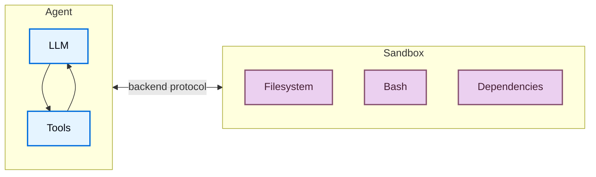
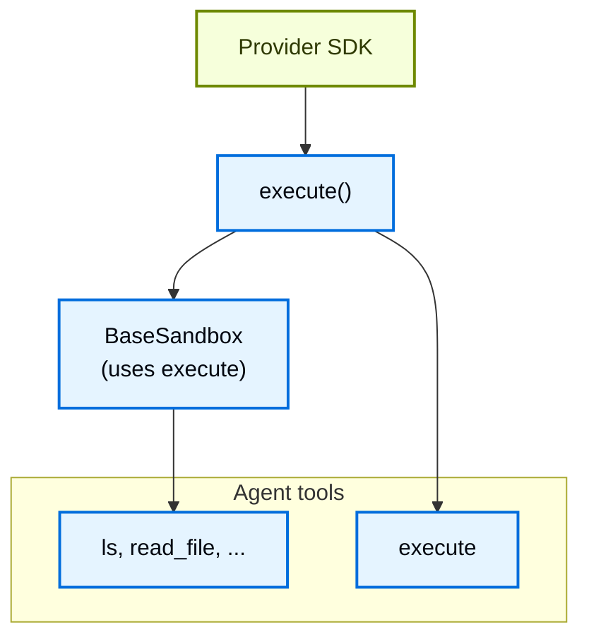
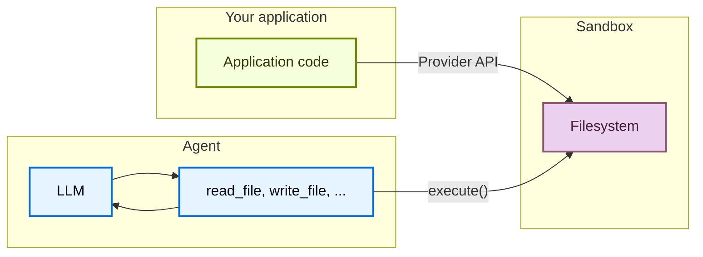

# 沙箱

> 通过沙箱后端在隔离环境中执行代码

Agent 会生成代码、操作文件系统、执行 shell 命令。由于我们无法预知 Agent 可能会做什么，因此将其运行环境隔离至关重要——它不应该能访问你的凭证、文件或网络。沙箱（Sandbox）通过在 Agent 的执行环境和宿主系统之间建立边界来提供这种隔离。

在 Deep Agents 中，**沙箱是一种[后端](/tutorials/DeepAgents/虚拟文件系统后端)**，它定义了 Agent 运行的环境。与其他仅暴露文件操作的后端（State、Filesystem、Store）不同，沙箱后端还为 Agent 提供了一个 `execute` 工具，用于运行 shell 命令。当你配置了沙箱后端后，Agent 将获得：

- 所有标准文件系统工具（`ls`、`read_file`、`write_file`、`edit_file`、`glob`、`grep`）
- 用于在沙箱中运行任意 shell 命令的 `execute` 工具
- 保护宿主系统的安全边界



## 为什么要使用沙箱？

沙箱的核心价值在于安全。

沙箱允许 Agent 执行任意代码、访问文件和使用网络，同时不会危及你的凭证、本地文件或宿主系统。当 Agent 自主运行时，这种隔离是必不可少的。

沙箱在以下场景中特别有用：

- **编程 Agent**：自主运行的 Agent 可以使用 shell、git、克隆仓库（许多提供商提供原生 git API，例如 [Daytona 的 git 操作](https://www.daytona.io/docs/en/git-operations/)），以及运行 Docker-in-Docker 来进行构建和测试流水线
- **数据分析 Agent**：在安全隔离的环境中加载文件、安装数据分析库（pandas、numpy 等）、运行统计计算，并生成 PowerPoint 演示文稿等输出

::: tip 提示
**使用 Deep Agents Code？** Deep Agents Code 内置了沙箱支持，通过 `--sandbox` 标志启用。有关 Deep Agents Code 的具体设置、标志（`--sandbox-id`、`--sandbox-setup`）和示例，请参阅相关文档。
:::

::: tip 提示
**如果你在寻找 LangSmith 沙箱：** LangSmith 提供了第一方托管沙箱，你可以直接从 LangSmith UI 或 SDK 中使用，无需第三方账户。有关托管沙箱资源、快照、服务 URL 和认证代理，请参阅 [LangSmith Sandboxes](https://docs.langchain.com/langsmith/sandboxes)。
:::

## 基本用法

以下示例假设你已经使用提供商的 SDK 创建了一个沙箱/开发环境，并已设置好凭证。有关注册、认证和特定于提供商的生命周期详细信息，请参阅[可用提供商](#可用提供商)。

```typescript
import { createDeepAgent, LangSmithSandbox } from "deepagents";
import { ChatAnthropic } from "@langchain/anthropic";
import { SandboxClient } from "langsmith/sandbox";

const client = new SandboxClient();
const lsSandbox = await client.createSandbox();

try {
  const agent = createDeepAgent({
    model: new ChatAnthropic({ model: "claude-opus-4-8" }),
    systemPrompt: "You are a coding assistant with sandbox access.",
    backend: new LangSmithSandbox({ sandbox: lsSandbox }),
  });

  const result = await agent.invoke({
    messages: [
      {
        role: "user",
        content: "Create a hello world Python script and run it",
      },
    ],
  });
} finally {
  await client.deleteSandbox(lsSandbox.name);
}
```

::: tip 提示
[LangSmith](https://smith.langchain.com?utm_source=docs&utm_medium=cta&utm_campaign=langsmith-signup&utm_content=oss-deepagents-sandboxes) 追踪可以显示沙箱内运行了哪些 shell 命令，以及 Agent 如何使用文件系统工具。按照[可观测性快速入门](https://docs.langchain.com/langsmith/observability-quickstart)进行设置。有关托管沙箱托管服务，请参阅 [LangSmith Sandboxes](https://docs.langchain.com/langsmith/sandboxes)。

我们还建议你设置 [LangSmith Engine](https://docs.langchain.com/langsmith/engine)，它会监控你的追踪记录、检测问题并提出修复建议。
:::

## 可用提供商

::: tip 提示
Skills 需要 `deepagents>=1.7.0`。
:::

- [**LangSmith**](https://docs.langchain.com/langsmith/sandboxes)
- [**Deno**](https://docs.langchain.com/oss/javascript/integrations/providers/deno)
- [**Daytona**](https://docs.langchain.com/oss/javascript/integrations/providers/daytona)
- [**Modal**](https://docs.langchain.com/oss/javascript/integrations/providers/modal)
- [**Node VFS**](https://docs.langchain.com/oss/javascript/integrations/providers/node-vfs)

没有看到你的提供商？你可以实现自己的沙箱后端。请参阅[贡献沙箱集成](https://docs.langchain.com/oss/javascript/contributing/integrations-langchain)。

## 生命周期与作用域

大多数应用程序会选择以下两种方式之一：每个[线程](https://docs.langchain.com/langsmith/use-threads)一个沙箱（线程作用域），或同一个[助手](https://docs.langchain.com/langsmith/assistants)下的所有线程共享一个沙箱（助手作用域）。

沙箱在被关闭之前会持续消耗资源并产生费用。请确保在不再使用时关闭沙箱。

有关完整的生命周期表、异步[图工厂](https://docs.langchain.com/langsmith/graph-rebuild)说明、TTL 行为、LangGraph 部署配置和客户端示例，请参阅[生产环境部署](/tutorials/DeepAgents/生产环境部署)中的沙箱生命周期部分。

### 线程作用域（默认）

每个会话获得自己的沙箱。首次运行时创建沙箱；同一线程的后续轮次复用它。当线程结束或沙箱 TTL 过期时，环境将被销毁。如下例所示，使用沙箱名称或元数据存储映射关系，以便每次运行都能定位到同一个沙箱。

::: tip 提示
当用户可能在空闲后返回时，请为沙箱配置 TTL，以便提供商自动删除或归档空闲环境。
:::

::: code-group

```python [Python] agent.py
from deepagents import create_deep_agent
from deepagents.backends.langsmith import LangSmithSandbox
from langchain_core.runnables import RunnableConfig
from langsmith.sandbox import SandboxClient

client = SandboxClient()


async def agent(config: RunnableConfig):
    thread_id = config["configurable"]["thread_id"]  # [!code highlight]
    sandbox_name = f"thread-{thread_id}"
    existing = [
        sb
        for sb in client.list_sandboxes()
        if getattr(sb, "name", None) == sandbox_name
    ]
    if existing:
        ls_sandbox = existing[0]
    else:
        ls_sandbox = client.create_sandbox(
            name=sandbox_name,
            idle_ttl_seconds=3600,  # TTL: clean up when idle
        )
    return create_deep_agent(
        model="google_genai:gemini-3.5-flash",
        backend=LangSmithSandbox(sandbox=ls_sandbox),
    )
```

```typescript [TypeScript] src/agent.ts
import { createDeepAgent, LangSmithSandbox } from "deepagents";
import { SandboxClient } from "langsmith/sandbox";
import type { LangGraphRunnableConfig } from "@langchain/langgraph";

const client = new SandboxClient();

export async function agent(config: LangGraphRunnableConfig) {
  const threadId = config.configurable?.thread_id as string;  // [!code highlight]
  const sandboxName = `thread-${threadId}`;
  const existing = (await client.listSandboxes()).filter(
    (sb) => sb.name === sandboxName,
  );
  const lsSandbox =
    existing[0] ??
    (await client.createSandbox({
      name: sandboxName,
      idleTtlSeconds: 3600, // TTL: clean up when idle
    }));
  return createDeepAgent({
    model: "google_genai:gemini-3.5-flash",
    backend: new LangSmithSandbox({ sandbox: lsSandbox }),
  });
}
```

:::

### 助手作用域

同一个助手下的所有线程复用一个沙箱。文件、已安装的包和克隆的仓库在会话之间持久存在。

::: warning
助手作用域的沙箱会随着时间推移在沙箱内部积累状态。请通过沙箱提供商配置 TTL、使用快照定期重置，或实现清理逻辑，以防磁盘和内存无限制增长。
:::

::: code-group

```python [Python] agent.py
from deepagents import create_deep_agent
from deepagents.backends.langsmith import LangSmithSandbox
from langchain_core.runnables import RunnableConfig
from langsmith.sandbox import SandboxClient

client = SandboxClient()


async def agent(config: RunnableConfig):
    assistant_id = config["configurable"]["assistant_id"]  # [!code highlight]
    sandbox_name = f"assistant-{assistant_id}"
    existing = [
        sb
        for sb in client.list_sandboxes()
        if getattr(sb, "name", None) == sandbox_name
    ]
    if existing:
        ls_sandbox = existing[0]
    else:
        ls_sandbox = client.create_sandbox(name=sandbox_name)
    return create_deep_agent(
        model="google_genai:gemini-3.5-flash",
        backend=LangSmithSandbox(sandbox=ls_sandbox),
    )
```

```typescript [TypeScript] src/agent.ts
import { createDeepAgent, LangSmithSandbox } from "deepagents";
import { SandboxClient } from "langsmith/sandbox";
import type { LangGraphRunnableConfig } from "@langchain/langgraph";

const client = new SandboxClient();

export async function agent(config: LangGraphRunnableConfig) {
  const assistantId = config.configurable?.assistant_id as string;  // [!code highlight]
  const sandboxName = `assistant-${assistantId}`;
  const existing = (await client.listSandboxes()).filter(
    (sb) => sb.name === sandboxName,
  );
  const lsSandbox =
    existing[0] ??
    (await client.createSandbox({
      name: sandboxName,
    }));
  return createDeepAgent({
    model: "google_genai:gemini-3.5-flash",
    backend: new LangSmithSandbox({ sandbox: lsSandbox }),
  });
}
```

:::

有关在图工厂之外手动创建、执行和销毁沙箱，请参阅[基本用法](#基本用法)和[沙箱集成](https://docs.langchain.com/oss/javascript/integrations/sandboxes)以了解特定于提供商的 API。

## 集成模式

根据 Agent 运行位置的不同，有两种将 Agent 与沙箱集成的架构模式。

### Agent 在沙箱中模式

Agent 运行在沙箱内部，你通过网络与之通信。你需要构建一个预装了 Agent 框架的 Docker 或虚拟机镜像，在沙箱中运行它，然后从外部连接以发送消息。

优势：

- 紧密镜像本地开发体验。
- Agent 与环境紧密耦合。

权衡：

- API 密钥必须存在于沙箱内部（安全风险）。
- 更新需要重新构建镜像。
- 需要通信基础设施（WebSocket 或 HTTP 层）。

要在沙箱中运行 Agent，请构建一个镜像并安装 deepagents。

```dockerfile
FROM python:3.11
RUN pip install deepagents-code
```

然后在沙箱中运行 Agent。要在沙箱内部使用 Agent，你需要添加额外的基础设施来处理应用程序与沙箱内 Agent 之间的通信。

### 沙箱作为工具模式

Agent 运行在你的机器或服务器上。当它需要执行代码时，它会调用沙箱工具（如 `execute`、`read_file` 或 `write_file`），这些工具会调用提供商的 API 在远程沙箱中执行操作。

优势：

- 无需重新构建镜像即可即时更新 Agent 代码。
- Agent 状态和执行之间更清晰的分离。
  - API 密钥保留在沙箱外部。
  - 沙箱故障不会丢失 Agent 状态。
  - 可以选择在多个沙箱中并行运行任务。
- 只为执行时间付费。

权衡：

- 每次执行调用都有网络延迟。

```typescript
import "dotenv/config";
import { createDeepAgent, LangSmithSandbox } from "deepagents";
import { SandboxClient } from "langsmith/sandbox";

// Can also do this with Deno, Daytona, E2B, Modal, or Runloop
const client = new SandboxClient();
const lsSandbox = await client.createSandbox();

const agent = createDeepAgent({
  backend: new LangSmithSandbox({ sandbox: lsSandbox }),
  systemPrompt:
    "You are a coding assistant with sandbox access. You can create and run code in the sandbox.",
});

try {
  const result = await agent.invoke({
    messages: [
      {
        role: "user",
        content: "Create a hello world Python script and run it",
      },
    ],
  });
  const lastMessage = result.messages[result.messages.length - 1];
  console.log(
    typeof lastMessage.content === "string"
      ? lastMessage.content
      : String(lastMessage.content),
  );
} finally {
  await client.deleteSandbox(lsSandbox.name);
}
```

本文档中的示例使用沙箱作为工具模式。当你的提供商 SDK 处理了通信层，并且你希望生产环境镜像本地开发时，选择"Agent 在沙箱中"模式。当你需要快速迭代 Agent 逻辑、将 API 密钥保留在沙箱外部，或更倾向于更清晰的关注点分离时，选择"沙箱作为工具"模式。

## 沙箱的工作原理

### 隔离边界

所有沙箱提供商都会保护你的宿主系统免受 Agent 的文件系统和 shell 操作的影响。Agent 无法读取你的本地文件、访问你机器上的环境变量，或干扰其他进程。然而，沙箱本身**并不能**防范以下威胁：

- **上下文注入**：控制了 Agent 输入一部分的攻击者可以指示 Agent 在沙箱内运行任意命令。沙箱是隔离的，但 Agent 在沙箱内拥有完全控制权。
- **网络外泄**：除非网络访问被阻止，否则被上下文注入的 Agent 可以通过 HTTP 或 DNS 从沙箱向外发送数据。某些提供商支持阻止网络访问（例如 Modal 的 `blockNetwork: true`）。

有关如何处理密钥和缓解这些风险，请参阅[安全注意事项](#安全注意事项)。

### `execute` 方法

沙箱后端有一个简单的架构：提供商只需实现 `execute()` 方法，该方法运行 shell 命令并返回其输出。所有其他文件系统操作（`read`、`write`、`edit`、`ls`、`glob`、`grep`）都由 [`BaseSandbox`](https://reference.langchain.com/javascript/deepagents/backends/BaseSandbox) 基类构建在 `execute()` 之上，该基类通过 `execute()` 在沙箱内构建脚本并运行它们。



这种设计意味着：

- **添加新提供商非常简单。** 只需实现 `execute()`——基类会处理其余一切。
- **`execute` 工具是条件可用的。** 在每次模型调用时，harness 会检查后端是否实现了 [`SandboxBackendProtocol`](https://reference.langchain.com/javascript/deepagents/backends/SandboxBackendProtocol)。如果没有实现，该工具将被过滤掉，Agent 永远不会看到它。

当 Agent 调用 `execute` 工具时，它提供一个 `command` 字符串，并获得合并的 stdout/stderr、退出码，以及如果输出过大时的截断通知。

你也可以在应用程序代码中直接调用后端的 `execute()` 方法。

例如：

```
4
[Command succeeded with exit code 0]
```

```
bash: foobar: command not found
[Command failed with exit code 127]
```

如果命令产生了非常大的输出，结果会自动保存到文件中，并指示 Agent 使用 `read_file` 增量访问它。这可以防止上下文窗口溢出。

### 两种文件访问方式

有两种不同的方式可以将文件移入和移出沙箱，理解何时使用每种方式很重要：

**Agent 文件系统工具**：`read_file`、`write_file`、`edit_file`、`ls`、`glob`、`grep` 和 `execute` 是 LLM 在执行过程中调用的工具。这些工具通过沙箱内部的 `execute()` 运行。Agent 使用它们来读取代码、写入文件和运行命令，作为其任务的一部分。

**文件传输 API**：`uploadFiles()` 和 `downloadFiles()` 方法由你的应用程序代码调用。它们使用提供商的原生文件传输 API（而非 shell 命令），专为在宿主环境和沙箱之间移动文件而设计。使用它们来：

- 在 Agent 运行之前用源代码、配置或数据**初始化沙箱**
- 在 Agent 完成后**检索产物**（生成的代码、构建输出、报告）
- **预装**Agent 所需的依赖



## 文件操作

### 初始化沙箱

在 Agent 运行之前，使用 `uploadFiles()` 来填充沙箱。文件内容以 `Uint8Array` 提供：

```typescript
const encoder = new TextEncoder();
const responses = await sandbox.uploadFiles([
  ["src/index.js", encoder.encode("console.log('Hello')")],
  ["package.json", encoder.encode('{"name": "my-app"}')],
]);

// Each response indicates success or failure
for (const res of responses) {
  if (res.error) {
    console.error(`Failed to upload ${res.path}: ${res.error}`);
  }
}
```

### 检索产物

在 Agent 完成后，使用 `downloadFiles()` 从沙箱中检索文件：

```typescript
const results = await sandbox.downloadFiles(["src/index.js", "output.txt"]);

const decoder = new TextDecoder();
for (const result of results) {
  if (result.content) {
    console.log(`${result.path}: ${decoder.decode(result.content)}`);
  } else {
    console.error(`Failed to download ${result.path}: ${result.error}`);
  }
}
```

::: tip 提示
在沙箱内部，Agent 使用自己的文件系统工具（`read_file`、`write_file`），而不是 `uploadFiles` 或 `downloadFiles`。这两个方法是供你的应用程序代码在宿主和沙箱之间的边界上移动文件使用的。
:::

## 安全注意事项

沙箱将代码执行与你的宿主系统隔离，但它们不能防范**上下文注入**。控制了 Agent 输入一部分的攻击者可以指示它读取文件、运行命令或从沙箱中外泄数据。这使得沙箱内部的凭证特别危险。

::: warning
**永远不要将密钥放入沙箱中。** 通过环境变量、挂载文件或 `secrets` 选项注入到沙箱中的 API 密钥、令牌、数据库凭证和其他密钥，可以被上下文注入的 Agent 读取和外泄。这甚至适用于短期或限定范围的凭证——如果 Agent 能访问它们，攻击者也能。
:::

### 安全处理密钥

如果你的 Agent 需要调用经过认证的 API 或访问受保护的资源，你有两种选择：

1. **将密钥保留在沙箱外部的工具中。** 定义在宿主环境（而非沙箱内部）中运行的工具，并在那里处理认证。Agent 按名称调用这些工具，但永远看不到凭证。这是推荐的方法。

2. **使用注入凭证的网络代理。** 某些沙箱提供商支持代理，这些代理拦截沙箱发出的 HTTP 请求，并在转发前附加凭证（例如 `Authorization` 头）。Agent 永远看不到密钥——它只是向 URL 发送普通请求。这种方法目前尚未在提供商中广泛使用。

::: warning
如果你必须将密钥注入沙箱（不推荐），请采取以下预防措施：

- 为**所有**工具调用启用[人机协作](/tutorials/DeepAgents/人机协作)审批，而不仅仅是敏感工具
- 阻止或限制沙箱的网络访问，以减少外泄路径
- 使用尽可能小的凭证范围和尽可能短的有效期
- 监控沙箱的网络流量，防范意外的出站请求

即使有这些保障措施，这仍然是一种不安全的权宜之计。足够有创造力的上下文注入攻击可以绕过输出过滤和人机协作审查。
:::

### 通用最佳实践

- 在应用程序中对沙箱输出采取行动之前，先审查它们
- 不需要时阻止沙箱的网络访问
- 使用[中间件](https://docs.langchain.com/oss/javascript/langchain/middleware)过滤或编辑工具输出中的敏感模式
- 将沙箱内产生的所有内容视为不受信任的输入

---

> 本文基于 [Deep Agents 官方文档](https://docs.langchain.com/oss/javascript/deepagents/sandboxes) 翻译并二次创作。
