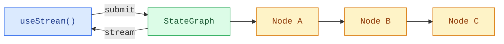

# 前端概览

> 将 LangGraph Agent 渲染到前端。

构建能够实时可视化 LangGraph 管道的前端。这些模式展示了如何渲染带有逐节点状态和自定义 `StateGraph` 工作流流式内容的多步骤图执行过程。

LangGraph 在前端方面的优势在于：UI 可以遵循与图相同的结构。节点、状态键、检查点、中断、子图和流式消息都是可见的运行时概念，因此你可以构建出能解释系统正在做什么的界面，而不是把执行过程隐藏在一条助手消息背后。

::: info 说明
这些模式使用 v1 版前端 SDK 包。如果你使用的是更早的版本，请参阅迁移指南：[React](https://github.com/langchain-ai/langgraphjs/blob/main/libs/sdk-react/docs/v1-migration.md)、[Vue](https://github.com/langchain-ai/langgraphjs/blob/main/libs/sdk-vue/docs/v1-migration.md)、[Svelte](https://github.com/langchain-ai/langgraphjs/blob/main/libs/sdk-svelte/docs/v1-migration.md)、[Angular](https://github.com/langchain-ai/langgraphjs/blob/main/libs/sdk-angular/docs/v1-migration.md)。
:::

## 架构

LangGraph 的图由通过边连接的命名节点组成。每个节点执行一个步骤（分类、研究、分析、综合），并将输出写入特定的状态键。在前端，SDK 的流处理句柄（stream handle）提供了对节点输出、流式 token 和发现的子图的响应式访问，让你可以把每个节点映射到一张 UI 卡片上。



```ts
import { Annotation, MessagesAnnotation, StateGraph, START, END } from "@langchain/langgraph";

const State = Annotation.Root({
  ...MessagesAnnotation.spec,
  classification: Annotation<string>(),
  research: Annotation<string>(),
  analysis: Annotation<string>(),
  synthesis: Annotation<string>(),
});

const graph = new StateGraph(State)
  .addNode("classify", classifyNode)
  .addNode("do_research", researchNode)
  .addNode("analyze", analyzeNode)
  .addNode("synthesize", synthesizeNode)
  .addEdge(START, "classify")
  .addEdge("classify", "do_research")
  .addEdge("do_research", "analyze")
  .addEdge("analyze", "synthesize")
  .addEdge("synthesize", END)
  .compile();
```

在前端，[`useStream`](https://reference.langchain.com/javascript/langchain-react/index/useStream) 通过 `stream.subgraphs` 暴露图节点的发现能力，并提供诸如 `useMessages(stream, node)` 的选择器辅助函数用于节点范围内的流式内容。`stream.values` 仍然持有完整的图状态，当你需要诸如最终 `synthesis` 等字段时可以使用它。Angular 通过 [`injectStream`](https://reference.langchain.com/javascript/langchain-angular/injectStream) 使用相同形态的流 API。

```ts
import { useStream } from "@langchain/react";

function Pipeline() {
  const stream = useStream<typeof graph>({
    apiUrl: "http://localhost:2024",
    assistantId: "pipeline",
  });

  const classification = stream.values?.classification;
  const research = stream.values?.research;
  const analysis = stream.values?.analysis;
  const graphNodes = [...stream.subgraphs.values()];
}
```

## 与普通聊天流的区别

自定义图通常驱动的是产品工作流：研究管道、审批流程、数据处理、数据增强、代码审查、规划和多步骤分析。前端 SDK 让你可以使用图原生的信号来渲染这些工作流：

| 运行时概念         | 前端 UX                                                                                      |
| ------------------ | --------------------------------------------------------------------------------------------- |
| **命名节点**       | 每个图节点对应一张卡片、一个时间线步骤或一个状态徽标。                                        |
| **状态键**         | 为分类结果、来源、分析、最终综合等类型化输出提供独立的 UI 区域。                              |
| **流式元数据**     | 将部分消息路由到产生它们的节点。                                                              |
| **检查点**         | 检查或从先前的图状态恢复，用于调试和可审计性。                                                |
| **中断**           | 为人工输入、审批或修正暂停节点，然后继续执行。                                                |
| **子图**           | 仅在用户需要更多细节时才展示嵌套执行。                                                        |

因为 SDK 直接暴露了这些概念，你可以从简单的聊天面板扩展到完整的工作流调试器，而无需更改后端协议。

## 相关模式

以下两个模式可以进一步探索前端集成：

- [图执行（前端）](/tutorials/LangGraph/图执行（前端）)：可视化多步骤图管道，展示逐节点状态和流式内容。
- [自定义流通道](/tutorials/LangGraph/自定义流通道)：将自定义服务端数据流式传输到前端，并通过 `useExtension` 和 `useChannel` 读取。

此外，[LangChain 前端模式](/tutorials/LangChain/前端集成)——Markdown 消息、工具调用、人机协作、可恢复流和时间旅行——适用于任何 LangGraph 图。无论你使用 `createAgent`、`createDeepAgent` 还是自定义 `StateGraph`，流 API 都提供相同的核心数据模型。

---

> 本文基于 [LangGraph 官方文档](https://docs.langchain.com/oss/javascript/langgraph/frontend/overview) 翻译并二次创作。
