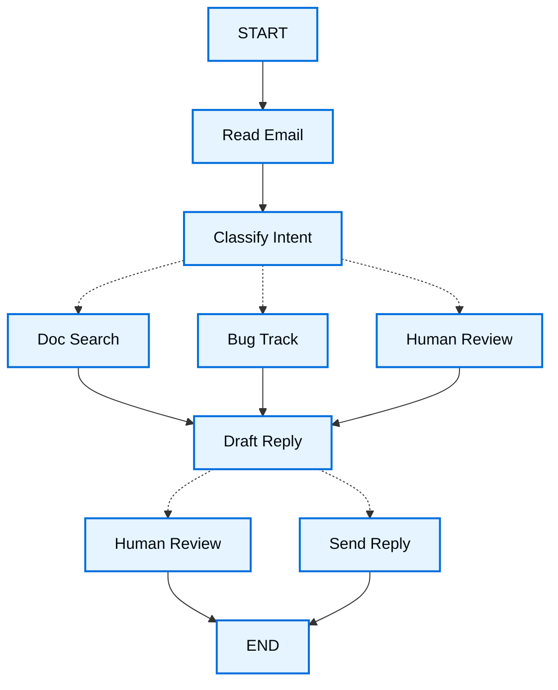

# LangGraph 思维方式

> 学习如何用 LangGraph 的思维来构建 Agent。

当你用 LangGraph 构建 Agent 时，首先要把整个流程拆解为一系列离散的步骤——这些步骤被称为**节点（node）**。然后，你要描述每个节点可以做出的不同决策和跳转。最后，把所有节点通过一个共享的**状态（state）**连接起来，每个节点都可以读取和写入这个状态。

在本教程中，我们将以一个"客服邮件 Agent"为例，带你走完 LangGraph 的完整思维方式。

## 从你想自动化的流程开始

假设你需要构建一个 AI Agent 来处理客户支持邮件。产品团队给了你以下需求：

```txt
The agent should:

- Read incoming customer emails
- Classify them by urgency and topic
- Search relevant documentation to answer questions
- Draft appropriate responses
- Escalate complex issues to human agents
- Schedule follow-ups when needed

Example scenarios to handle:

1. Simple product question: "How do I reset my password?"
2. Bug report: "The export feature crashes when I select PDF format"
3. Urgent billing issue: "I was charged twice for my subscription!"
4. Feature request: "Can you add dark mode to the mobile app?"
5. Complex technical issue: "Our API integration fails intermittently with 504 errors"
```

要用 LangGraph 实现这个 Agent，我们通常遵循同样的五个步骤。

## 步骤一：把工作流映射为离散步骤

首先要做的是识别出流程中的不同步骤。每个步骤将成为一个**节点**——即一个只做一件特定事情的函数。然后，勾勒出这些步骤之间的连接关系。



图中的箭头展示了可能的路径，但具体走哪条路是在每个节点内部决定的。

现在我们已经识别出了工作流中的各个组件，接下来理解每个节点需要做什么：

- `Read Email`：提取并解析邮件内容
- `Classify Intent`：用 LLM 对紧急程度和主题进行分类，然后路由到合适的操作
- `Doc Search`：查询知识库获取相关信息
- `Bug Track`：在问题追踪系统中创建或更新工单
- `Draft Reply`：生成适当的回复
- `Human Review`：转交人工坐席审批或处理
- `Send Reply`：发送邮件回复

::: tip
注意，有些节点需要决定下一步去哪里（`Classify Intent`、`Draft Reply`、`Human Review`），而另一些节点总是走向同一个下一步（`Read Email` 总是到 `Classify Intent`，`Doc Search` 总是到 `Draft Reply`）。
:::

## 步骤二：识别每个步骤需要做什么

对于图中的每个节点，确定它代表什么类型的操作，以及需要什么上下文才能正常工作。

### LLM 步骤

当一个步骤需要理解、分析、生成文本或做出推理决策时：

::: details 分类意图（Classify intent）
- **静态上下文（提示词）**：分类类别、紧急程度定义、响应格式
- **动态上下文（来自状态）**：邮件内容、发件人信息
- **期望产出**：结构化分类结果，用于决定路由
:::

::: details 起草回复（Draft reply）
- **静态上下文（提示词）**：语气指引、公司政策、回复模板
- **动态上下文（来自状态）**：分类结果、搜索结果、客户历史
- **期望产出**：可直接送审的专业邮件回复
:::

### 数据步骤

当一个步骤需要从外部源获取信息时：

::: details 文档搜索（Document search）
- **参数**：基于意图和主题构建的查询
- **重试策略**：有，对临时性故障使用指数退避
- **缓存**：可以缓存常见查询以减少 API 调用
:::

::: details 客户历史查询（Customer history lookup）
- **参数**：来自状态的客户邮箱或 ID
- **重试策略**：有，但获取不到时回退到基本信息
- **缓存**：有，设置合理的 TTL 以平衡新鲜度和性能
:::

### 动作步骤

当一个步骤需要执行外部操作时：

::: details 发送回复（Send reply）
- **执行时机**：审批通过后（人工或自动化）
- **重试策略**：有，对网络问题使用指数退避
- **不应缓存**：每次发送都是独立操作
:::

::: details 缺陷追踪（Bug track）
- **执行时机**：意图为 "bug" 时始终执行
- **重试策略**：有，不丢失 bug 报告至关重要
- **返回值**：工单 ID，需包含在回复中
:::

### 用户输入步骤

当一个步骤需要人工介入时：

::: details 人工审核节点（Human review node）
- **决策上下文**：原始邮件、草稿回复、紧急程度、分类结果
- **期望输入格式**：批准布尔值 + 可选的编辑后回复
- **触发时机**：高紧急程度、复杂问题或质量问题
:::

## 步骤三：设计你的状态

状态是 Agent 中所有节点都能访问的共享[记忆](/oss/javascript/concepts/memory)。你可以把它想象成 Agent 在处理流程中用来记录所学和所做决定的一个笔记本。

### 什么数据应该放进状态？

对每一项数据，问自己以下问题：

- **需要跨步骤持久化吗？** 如果是，就放进状态。
- **可以从其他数据推导出来吗？** 如果是，就在需要时计算，而不是存进状态。

对于我们的邮件 Agent，需要追踪以下内容：

- 原始邮件和发件人信息（之后无法重建）
- 分类结果（下游多个节点需要）
- 搜索结果和客户数据（重新获取代价高昂）
- 草稿回复（需要经过审核环节）
- 执行元数据（用于调试和恢复）

### 保持状态的原始性，按需格式化提示词

::: tip 关键原则：状态应该存储原始数据（raw data），而不是格式化文本。在节点内部按需格式化提示词。
:::

这种分离意味着：

- 不同的节点可以用不同方式格式化同一份数据
- 你可以修改提示词模板而不用改动状态结构
- 调试更清晰——你能确切看到每个节点收到了什么数据
- Agent 可以在不破坏现有状态的前提下演进

让我们定义状态：

```typescript
import { StateSchema } from "@langchain/langgraph";
import * as z from "zod";

// Define the structure for email classification
const EmailClassificationSchema = z.object({
  intent: z.enum(["question", "bug", "billing", "feature", "complex"]),
  urgency: z.enum(["low", "medium", "high", "critical"]),
  topic: z.string(),
  summary: z.string(),
});

const EmailAgentState = new StateSchema({
  // Raw email data
  emailContent: z.string(),
  senderEmail: z.string(),
  emailId: z.string(),

  // Classification result
  classification: EmailClassificationSchema.optional(),

  // Raw search/API results
  searchResults: z.array(z.string()).optional(),  // List of raw document chunks
  customerHistory: z.record(z.string(), z.any()).optional(),  // Raw customer data from CRM

  // Generated content
  responseText: z.string().optional(),
});

type EmailClassificationType = z.infer<typeof EmailClassificationSchema>;
```

注意，状态中只包含原始数据——没有提示词模板、没有格式化字符串、没有指令。分类输出作为一个单一字典存储，直接来自 LLM 的返回。

## 步骤四：构建你的节点

现在我们把每个步骤实现为一个函数。在 LangGraph 中，节点就是一个普通的 JavaScript 函数——接收当前状态，返回对状态的更新。

### 恰当地处理错误

不同的错误需要不同的处理策略：

| 错误类型                                 | 谁来修复         | 策略                          | 适用场景                                     |
| ---------------------------------------- | ---------------- | ----------------------------- | -------------------------------------------- |
| 临时性错误（网络问题、限速）             | 系统（自动）     | 重试策略                      | 重试通常可以解决的临时性故障                 |
| LLM 可恢复错误（工具失败、解析问题）     | LLM              | 将错误存入状态并循环回去      | LLM 能看到错误并调整策略                     |
| 用户可修复错误（信息缺失、指令不清）     | 人工             | 用 `interrupt()` 暂停         | 需要用户输入才能继续                         |
| 重试后的可恢复失败                       | 开发者（声明式） | `error_handler`               | 重试耗尽后运行补偿/恢复分支                  |
| 意外错误                                 | 开发者           | 让它向上抛出                  | 需要调试的未知问题                           |

::: details 临时性错误：添加重试策略
为网络问题和限速自动添加重试策略。

```typescript
import type { RetryPolicy } from "@langchain/langgraph";

workflow.addNode(
  "searchDocumentation",
  searchDocumentation,
  {
    retryPolicy: { maxAttempts: 3, initialInterval: 1.0 },
  },
);
```
:::

::: details LLM 可恢复：存入状态并循环
将错误存入状态并循环回去，让 LLM 看到出了什么问题并重试：

```typescript
import { Command, GraphNode } from "@langchain/langgraph";

const executeTool: GraphNode<typeof State> = async (state, config) => {
  try {
    const result = await runTool(state.toolCall);
    return new Command({
      update: { toolResult: result },
      goto: "agent",
    });
  } catch (error) {
    // Let the LLM see what went wrong and try again
    return new Command({
      update: { toolResult: `Tool error: ${error}` },
      goto: "agent"
    });
  }
}
```
:::

::: details 用户可修复：暂停并收集输入
在需要时（如账户 ID、订单号或澄清信息）暂停并从用户处收集信息：

```typescript
import { Command, GraphNode, interrupt } from "@langchain/langgraph";

const lookupCustomerHistory: GraphNode<typeof State> = async (state, config) => {
  if (!state.customerId) {
    const userInput = interrupt({
      message: "Customer ID needed",
      request: "Please provide the customer's account ID to look up their subscription history",
    });
    return new Command({
      update: { customerId: userInput.customerId },
      goto: "lookupCustomerHistory",
    });
  }
  // Now proceed with the lookup
  const customerData = await fetchCustomerHistory(state.customerId);
  return new Command({
    update: { customerHistory: customerData },
    goto: "draftResponse",
  });
}
```
:::

::: details 意外错误：让它抛出
让意外错误向上冒泡以供调试。不要捕获你无法处理的错误：

```typescript
import { Command, GraphNode } from "@langchain/langgraph";

const sendReply: GraphNode<typeof EmailAgentState> = async (state, config) => {
  try {
    await emailService.send(state.responseText);
  } catch (error) {
    throw error;  // Surface unexpected errors
  }
}
```
:::

::: details Saga / 补偿模式
在重试耗尽后，运行一个恢复函数来更新状态并路由到补偿分支。
:::

### 实现邮件 Agent 的各节点

我们把每个节点实现为一个简单的函数。记住：节点接收状态，做工作，返回更新。

::: details 读取与分类节点
```typescript
import { StateGraph, START, END, GraphNode, Command } from "@langchain/langgraph";
import { HumanMessage } from "@langchain/core/messages";
import { ChatAnthropic } from "@langchain/anthropic";

const llm = new ChatAnthropic({ model: "claude-sonnet-4-6" });

const readEmail: GraphNode<typeof EmailAgentState> = async (state, config) => {
  // Extract and parse email content
  // In production, this would connect to your email service
  console.log(`Processing email: ${state.emailContent}`);
  return {};
}

const classifyIntent: GraphNode<typeof EmailAgentState> = async (state, config) => {
  // Use LLM to classify email intent and urgency, then route accordingly

  // Create structured LLM that returns EmailClassification object
  const structuredLlm = llm.withStructuredOutput(EmailClassificationSchema);

  // Format the prompt on-demand, not stored in state
  const classificationPrompt = `
      Analyze this customer email and classify it:

      Email: ${state.emailContent}
      From: ${state.senderEmail}

      Provide classification including intent, urgency, topic, and summary.
      `;

  // Get structured response directly as object
  const classification = await structuredLlm.invoke(classificationPrompt);

  // Determine next node based on classification
  let nextNode: "searchDocumentation" | "humanReview" | "draftResponse" | "bugTracking";

  if (classification.intent === "billing" || classification.urgency === "critical") {
    nextNode = "humanReview";
  } else if (classification.intent === "question" || classification.intent === "feature") {
    nextNode = "searchDocumentation";
  } else if (classification.intent === "bug") {
    nextNode = "bugTracking";
  } else {
    nextNode = "draftResponse";
  }

  // Store classification as a single object in state
  return new Command({
    update: { classification },
    goto: nextNode,
  });
}
```
:::

::: details 搜索与追踪节点
```typescript
import { Command, GraphNode } from "@langchain/langgraph";

const searchDocumentation: GraphNode<typeof EmailAgentState> = async (state, config) => {
  // Search knowledge base for relevant information

  // Build search query from classification
  const classification = state.classification!;
  const query = `${classification.intent} ${classification.topic}`;

  let searchResults: string[];

  try {
    // Implement your search logic here
    // Store raw search results, not formatted text
    searchResults = [
      "Reset password via Settings > Security > Change Password",
      "Password must be at least 12 characters",
      "Include uppercase, lowercase, numbers, and symbols",
    ];
  } catch (error) {
    // For recoverable search errors, store error and continue
    searchResults = [`Search temporarily unavailable: ${error}`];
  }

  return new Command({
    update: { searchResults },  // Store raw results or error
    goto: "draftResponse",
  });
}

const bugTracking: GraphNode<typeof EmailAgentState> = async (state, config) => {
  // Create or update bug tracking ticket

  // Create ticket in your bug tracking system
  const ticketId = "BUG-12345";  // Would be created via API

  return new Command({
    update: { searchResults: [`Bug ticket ${ticketId} created`] },
    goto: "draftResponse",
  });
}
```
:::

::: details 回复节点
```typescript
import { Command, interrupt } from "@langchain/langgraph";

const draftResponse: GraphNode<typeof EmailAgentState> = async (state, config) => {
  // Generate response using context and route based on quality

  const classification = state.classification!;

  // Format context from raw state data on-demand
  const contextSections: string[] = [];

  if (state.searchResults) {
    // Format search results for the prompt
    const formattedDocs = state.searchResults.map(doc => `- ${doc}`).join("\n");
    contextSections.push(`Relevant documentation:\n${formattedDocs}`);
  }

  if (state.customerHistory) {
    // Format customer data for the prompt
    contextSections.push(`Customer tier: ${state.customerHistory.tier ?? "standard"}`);
  }

  // Build the prompt with formatted context
  const draftPrompt = `
      Draft a response to this customer email:
      ${state.emailContent}

      Email intent: ${classification.intent}
      Urgency level: ${classification.urgency}

      ${contextSections.join("\n\n")}

      Guidelines:
      - Be professional and helpful
      - Address their specific concern
      - Use the provided documentation when relevant
      `;

  const response = await llm.invoke([new HumanMessage(draftPrompt)]);

  // Determine if human review needed based on urgency and intent
  const needsReview = (
    classification.urgency === "high" ||
    classification.urgency === "critical" ||
    classification.intent === "complex"
  );

  // Route to appropriate next node
  const nextNode = needsReview ? "humanReview" : "sendReply";

  return new Command({
    update: { responseText: response.content.toString() },  // Store only the raw response
    goto: nextNode,
  });
}

const humanReview: GraphNode<typeof EmailAgentState> = async (state, config) => {
  // Pause for human review using interrupt and route based on decision
  const classification = state.classification!;

  // interrupt() must come first - any code before it will re-run on resume
  const humanDecision = interrupt({
    emailId: state.emailId,
    originalEmail: state.emailContent,
    draftResponse: state.responseText,
    urgency: classification.urgency,
    intent: classification.intent,
    action: "Please review and approve/edit this response",
  });

  // Now process the human's decision
  if (humanDecision.approved) {
    return new Command({
      update: { responseText: humanDecision.editedResponse || state.responseText },
      goto: "sendReply",
    });
  } else {
    // Rejection means human will handle directly
    return new Command({ update: {}, goto: END });
  }
}

const sendReply: GraphNode<typeof EmailAgentState> = async (state, config) => {
  // Send the email response
  // Integrate with email service
  console.log(`Sending reply: ${state.responseText!.substring(0, 100)}...`);
  return {};
}
```
:::

## 步骤五：组装到一起

现在我们把节点连接成一个可运行的图。由于我们的节点内部处理了路由决策，所以只需要少量必要的边。

为了启用基于 `interrupt()` 的[人机协作](/tutorials/LangGraph/中断)，我们需要在编译时传入一个[检查点](/tutorials/LangGraph/持久化)来在多次运行之间保存状态：

::: details 图编译代码
```typescript
import { MemorySaver, RetryPolicy } from "@langchain/langgraph";

// Create the graph
const workflow = new StateGraph(EmailAgentState)
  // Add nodes with appropriate error handling
  .addNode("readEmail", readEmail)
  .addNode("classifyIntent", classifyIntent)
  // Add retry policy for nodes that might have transient failures
  .addNode(
    "searchDocumentation",
    searchDocumentation,
    { retryPolicy: { maxAttempts: 3 } },
  )
  .addNode("bugTracking", bugTracking)
  .addNode("draftResponse", draftResponse)
  .addNode("humanReview", humanReview)
  .addNode("sendReply", sendReply)
  // Add only the essential edges
  .addEdge(START, "readEmail")
  .addEdge("readEmail", "classifyIntent")
  .addEdge("sendReply", END);

// Compile with checkpointer for persistence
const memory = new MemorySaver();
const app = workflow.compile({ checkpointer: memory });
```
:::

图结构非常精简，因为路由是在节点内部通过 `Command` 对象完成的。每个节点声明了它可以跳转到哪里，使控制流既显式又可追踪。

### 试用你的 Agent

让我们用一个需要人工审核的紧急账单问题来测试 Agent：

::: details 测试 Agent
```typescript
// Test with an urgent billing issue
const initialState: EmailAgentStateType = {
  emailContent: "I was charged twice for my subscription! This is urgent!",
  senderEmail: "customer@example.com",
  emailId: "email_123"
};

// Run with a thread_id for persistence
const config = { configurable: { thread_id: "customer_123" } };
const result = await app.invoke(initialState, config);
// The graph will pause at human_review
console.log(`Draft ready for review: ${result.responseText?.substring(0, 100)}...`);
```

```typescript
import { Command } from "@langchain/langgraph";

// When ready, provide human input to resume
const humanResponse = new Command({
  resume: {
    approved: true,
    editedResponse: "We sincerely apologize for the double charge. I've initiated an immediate refund...",
  }
});

// Resume execution
const finalResult = await app.invoke(humanResponse, config);
console.log("Email sent successfully!");
```
:::

图在遇到 `interrupt()` 时会暂停，把所有状态保存到检查点，然后等待。它可以在几天后恢复，精确地从上次停下的地方继续。`thread_id` 确保了这轮对话的所有状态都被完整保留。

## 总结与下一步

### 关键洞见

构建这个邮件 Agent 让我们看到了 LangGraph 的思维方式：

1. **拆解为离散步骤。** 每个节点做好一件事。这种分解带来了流式进度更新、可暂停恢复的持久化执行，以及清晰的调试能力（你可以在每步之间检查状态）。

2. **状态是共享记忆。** 存储原始数据而非格式化文本，让不同节点能以不同方式使用同一份信息。

3. **节点就是函数。** 它们接收状态、做工作、返回更新。当需要路由决策时，它们同时声明状态更新和下一个目标。

4. **错误是流程的一部分。** 临时性故障获得重试，LLM 可恢复错误带着上下文循环回去，用户可修复的问题暂停等待输入，意外错误则向上抛出供调试。

5. **人工输入是一等公民。** `interrupt()` 函数会无限期暂停执行，保存所有状态，并在你提供输入后从原地精确恢复。当它与其他操作组合在同一个节点中时，必须放在最前面。

6. **图结构自然涌现。** 你只需定义必要的连接，节点各自处理自己的路由逻辑。这让控制流保持显式且可追踪——你始终可以通过查看当前节点来理解 Agent 接下来会做什么。

### 高级考量：节点粒度的权衡

::: details 节点粒度的权衡
大部分应用可以跳过这一节，直接使用上面展示的模式即可。

你可能会想：为什么不把 `Read Email` 和 `Classify Intent` 合并成一个节点？或者为什么要把 `Doc Search` 和 `Draft Reply` 分开？

答案涉及韧性和可观测性之间的权衡。

**韧性考量：** LangGraph 的[持久化层](/tutorials/LangGraph/持久化)在节点边界创建检查点。当工作流在中断或故障后恢复时，它会从停止的节点的开头重新执行。更小的节点意味着更频繁的检查点，意味着出错时需要重做的工作更少。如果把多个操作合并成一个大节点，在接近末尾处的失败意味着要从该节点的开头重新执行所有操作。

我们为邮件 Agent 选择这种拆分的原因：

- **外部服务隔离：** Doc Search 和 Bug Track 是独立节点，因为它们调用外部 API。如果搜索服务慢或失败，我们想把它与 LLM 调用隔离开来，可以给这些特定节点加重试策略而不影响其他节点。
- **中间可见性：** `Classify Intent` 作为独立节点，让我们能在采取行动前检查 LLM 的决策。这对调试和监控很有价值——你能看到 Agent 何时以及为何路由到人工审核。
- **不同的失败模式：** LLM 调用、数据库查询和邮件发送有不同的重试策略。独立节点让你能各自独立配置。
- **可复用性和可测试性：** 更小的节点更容易独立测试和在其它工作流中复用。

另一种有效方案：你也可以把 `Read Email` 和 `Classify Intent` 合并成一个节点。代价是失去了在分类前检查原始邮件的能力，并且该节点中的任何失败都需要重做两个操作。对大多数应用来说，独立节点在可观测性和调试方面的好处值得这个权衡。

性能考量：更多节点并不意味着更慢的执行。LangGraph 默认在后台写入检查点（[异步持久化模式](/tutorials/LangGraph/检查点)），所以你的图不会等待检查点完成就能继续运行。这意味着你能获得频繁的检查点而对性能影响极小。如果需要，你可以调整这个行为——使用 `"exit"` 模式仅在完成时检查点，或使用 `"sync"` 模式阻塞执行直到每个检查点写入完毕。
:::

### 接下来去哪里

本文是对 LangGraph Agent 构建思维的入门介绍。你可以在此基础上继续扩展：

- [人机协作模式](/tutorials/LangGraph/中断)：学习如何在工具执行前添加审批、批量审批等模式
- [子图](/tutorials/LangGraph/使用子图)：为复杂的多步骤操作创建子图
- [流式输出](/tutorials/LangGraph/流式输出)：添加流式传输以向用户展示实时进度
- [可观测性](/tutorials/LangGraph/可观测性)：用 LangSmith 添加可观测性以进行调试和监控
- [工具集成](/tutorials/LangChain/工具)：集成更多工具用于网络搜索、数据库查询和 API 调用
- [重试逻辑](/tutorials/LangGraph/容错)：为失败操作实现指数退避重试逻辑

---

> 本文基于 [LangGraph 官方文档](https://docs.langchain.com/oss/javascript/langgraph/thinking-in-langgraph) 翻译并二次创作。
