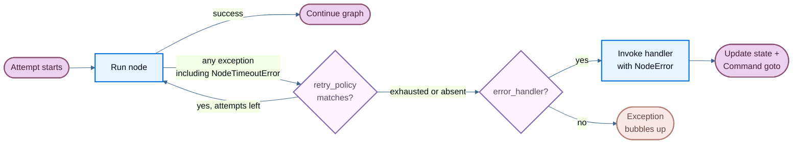

# 容错

> 配置 LangGraph 中每个节点的超时、重试和错误处理器。

当节点因为外部 API 响应缓慢、临时网络错误或未处理的异常而失败时，LangGraph 为你提供三种可组合的应对机制：

- [**重试（Retries）**](#重试-retries) — 根据异常类型和退避策略自动重新运行失败的尝试
- [**超时（Timeouts）**](#超时-timeouts) — 限制单次尝试的最长运行时间
- [**错误处理（Error handling）**](#错误处理-error-handling) — 在所有重试用尽后运行恢复函数

使用 [**`setNodeDefaults`**](#图默认值-graph-defaults) 可以为所有节点统一配置这些机制，无需在每次 `addNode` 调用中重复设置。

这三种机制按固定顺序组合：当节点尝试抛出任何异常（包括来自超时的 [`NodeTimeoutError`](https://reference.langchain.com/javascript/langchain-langgraph/index/NodeTimeoutError)）时，首先由重试策略决定是否重试。只有在重试用尽后，错误处理器才会运行。

如果你需要在超级步（superstep）边界处干净地停止运行并在之后恢复，请参阅[优雅关闭](#优雅关闭-graceful-shutdown)。

::: info
每节点超时和节点级错误处理器需要 `@langchain/langgraph>=1.4.0`。
:::



上图清晰地展示了容错机制的执行流程：节点执行 -> 异常 -> 重试策略判断 -> 重试用尽 -> 错误处理器 -> 恢复或冒泡。接下来我们逐一深入了解每种机制。

## 重试（Retries）

重试策略会根据异常类型和退避设置自动重新运行失败的节点尝试。

在 [`addNode`](https://reference.langchain.com/javascript/classes/_langchain_langgraph.index.StateGraph.html#addNode) 时传入 `retryPolicy`：

```typescript
import { StateGraph } from "@langchain/langgraph";

const graph = new StateGraph(State)
  .addNode("callApi", callApi, { retryPolicy: { maxAttempts: 3 } })
  .compile();
```

### 默认行为

重试是可选的（opt-in）。只有当节点配置了 `retryPolicy`（无论是直接配置还是通过 [`setNodeDefaults`](#图默认值-graph-defaults) 配置图默认值）时，才会进行重试。一个空策略（`{}`）就够了。如果没有配置策略，第一次失败就会结束尝试，LangGraph 不会调用 `retryOn`。

如果策略省略了 `retryOn`，LangGraph 会使用内置处理器，对抛出的错误进行重试，但以下情况除外：

- 中止和取消错误：`error.name === "AbortError"`，或 `error.message` 以 `"Cancel"` 或 `"AbortError"` 开头
- `GraphValueError`，通过 `error.name` 匹配
- 中止的连接：`error.code === "ECONNABORTED"`
- HTTP 客户端错误，状态码为 400、401、402、403、404、405、406、407 或 409，从 `error.response?.status` 或 `error.status` 读取（适用于 `fetch`、Axios 等客户端）
- OpenAI 风格的配额错误：`error.error?.code === "insufficient_quota"`

其他 HTTP 状态码（包括 408 和 5xx 响应）在你不覆盖 `retryOn` 的情况下都是可重试的。[`NodeTimeoutError`](https://reference.langchain.com/javascript/langchain-langgraph/index/NodeTimeoutError) 不在此黑名单中，因此在配置了重试策略时它是可重试的。

> 某些失败会绕过 `retryOn`。图控制流错误（如 `GraphInterrupt` 和 `Command` 路由）会直接冒泡而不进行重试。中止运行信号也会停止重试循环，即使 `retryOn` 会返回 `true`。

### 参数

| 参数 | 类型 | 默认值 | 说明 |
| --- | --- | --- | --- |
| `maxAttempts` | `number` | `3` | 最大尝试次数（包括第一次）。 |
| `initialInterval` | `number` | `500` | 第一次重试前的等待毫秒数。 |
| `backoffFactor` | `number` | `2.0` | 每次重试后应用于间隔的乘数。 |
| `maxInterval` | `number` | `128000` | 重试之间的最大毫秒数。 |
| `jitter` | `boolean` | `true` | 是否为间隔添加随机抖动。 |
| `retryOn` | `(error: unknown) => boolean` | 内置处理器（当设置了策略时） | 返回 `true` 表示可重试的异常的可调用对象。仅在配置了 `retryPolicy` 时使用。 |
| `logWarning` | `boolean` | `true` | 是否在尝试重试时记录警告。 |

### 自定义重试逻辑

向 `retryOn` 传入一个可调用对象。与 Python 不同，JavaScript 中没有导出的 `defaultRetryOn` 辅助函数——你需要自己实现判断逻辑：

```typescript
import { StateGraph } from "@langchain/langgraph";

class MyCustomError extends Error {}

const graph = new StateGraph(State)
  .addNode("callApi", callApi, {
    retryPolicy: {
      maxAttempts: 3,
      retryOn: (error: unknown) => {
        if (error instanceof MyCustomError) return false;
        // 对其他错误进行重试
        return true;
      },
    },
  })
  .compile();
```

### 检查重试状态

在节点内部使用执行信息来检查当前尝试编号。这在主调用持续失败时切换到备用方案非常有用：

```typescript
import { StateGraph, StateSchema, START, END, type Runtime } from "@langchain/langgraph";
import * as z from "zod";

const State = new StateSchema({
  result: z.string(),
});

const myNode = async (state: typeof State.State, runtime: Runtime<typeof State>) => {
  if ((runtime.executionInfo?.nodeAttempt ?? 1) > 1) {  // [!code highlight]
    return { result: await callFallbackApi() };
  }
  return { result: await callPrimaryApi() };
};

const graph = new StateGraph(State)
  .addNode("myNode", myNode, { retryPolicy: { maxAttempts: 3 } })
  .addEdge(START, "myNode")
  .addEdge("myNode", END)
  .compile();
```

`executionInfo` 暴露以下字段：

| 属性 | 类型 | 说明 |
| --- | --- | --- |
| `nodeAttempt` | `number` | 当前尝试编号（从 1 开始）。第一次尝试为 `1`，第一次重试为 `2`，以此类推。 |
| `nodeFirstAttemptTime` | `number \| undefined` | 第一次尝试开始时的 Unix 时间戳（毫秒）。在多次重试中保持不变。 |
| `threadId` | `string \| undefined` | 当前执行的线程 ID。没有检查点器时为 `undefined`。 |
| `runId` | `string \| undefined` | 当前执行的运行 ID。配置中未提供时为 `undefined`。 |
| `checkpointId` | `string` | 当前执行的检查点 ID。 |
| `checkpointNs` | `string` | 当前执行的检查点命名空间。 |
| `taskId` | `string` | 当前执行的任务 ID。 |

> 即使没有配置重试策略，`executionInfo` 也可用——`nodeAttempt` 默认为 `1`。这意味着你可以在节点中安全地读取 `runtime.executionInfo?.nodeAttempt`，无论是否启用了重试。

## 超时（Timeouts）

::: info
需要 `@langchain/langgraph>=1.4.0`。
:::

[`addNode`](https://reference.langchain.com/javascript/classes/_langchain_langgraph.index.StateGraph.html#addNode) 的 `timeout` 参数限制单次节点尝试的最长运行时间。可以传入数字（毫秒）或 [`TimeoutPolicy`](https://reference.langchain.com/javascript/langchain-langgraph/index/TimeoutPolicy) 来分别设置运行超时和空闲超时：

```typescript
import { StateGraph, type TimeoutPolicy } from "@langchain/langgraph";

// 简单的墙钟上限（60 秒）
new StateGraph(State).addNode("callModel", callModel, { timeout: 60_000 });

// 分别设置运行和空闲限制
new StateGraph(State).addNode("callModel", callModel, {
  timeout: { runTimeout: 120_000, idleTimeout: 30_000 },
});
```

### 运行超时（Run timeout）

`runTimeout` 是单次尝试的硬性墙钟上限。无论节点活动如何，它都不会刷新：

```typescript
const graph = new StateGraph(State)
  .addNode("callModel", callModel, {
    timeout: { runTimeout: 120_000 },
  })
  .compile();
```

当超过限制时，LangGraph 会抛出 [`NodeTimeoutError`](https://reference.langchain.com/javascript/langchain-langgraph/index/NodeTimeoutError)，清除失败尝试的所有写入，然后让重试策略决定是否重试。

### 空闲超时（Idle timeout）

`idleTimeout` 是一个可重置进度上限。它仅在节点在指定时长内停止产生可观察进度时触发——与 `runTimeout` 不同，每当节点产生进度信号时，计时器会重置：

```typescript
const graph = new StateGraph(State)
  .addNode("callModel", callModel, {
    timeout: { idleTimeout: 30_000 },
  })
  .compile();
```

你可以同时设置 `runTimeout` 和 `idleTimeout`。哪个先触发就会取消尝试。

#### 进度信号

在默认的 `refreshOn: "auto"` 下，空闲计时器在以下任何情况发生时重置：

- 通过图写入路径进行的状态写入
- 通过 `runtime.writer` 的自定义流输出
- 子任务调度
- 来自节点或其后代任务的任何 LangChain 回调事件（LLM token、工具调用、链开始/结束等）

#### 心跳模式

设置 `refreshOn: "heartbeat"` 可以将刷新源缩小为仅显式的 `runtime.heartbeat()` 调用。当你需要一个严格的空闲定义，不希望被频繁的子任务回调所重置时，这很有用：

```typescript
const graph = new StateGraph(State)
  .addNode("callModel", callModel, {
    timeout: { idleTimeout: 30_000, refreshOn: "heartbeat" },
  })
  .compile();
```

#### 手动心跳

对于不会自然产生进度信号的长时间运行工作，调用 `runtime.heartbeat()` 来手动重置空闲计时器：

```typescript
import {
  StateGraph,
  StateSchema,
  START,
  END,
  type Runtime,
} from "@langchain/langgraph";
import * as z from "zod";

const State = new StateSchema({
  result: z.string(),
});

const longRunningNode = async (
  state: typeof State.State,
  runtime: Runtime<typeof State>
) => {
  for (const batch of fetchBatches()) {
    process(batch);
    runtime.heartbeat?.(); // [!code highlight]
  }
  return { result: "done" };
};

const graph = new StateGraph(State)
  .addNode("longRunningNode", longRunningNode, {
    timeout: { idleTimeout: 30_000, refreshOn: "heartbeat" },
  })
  .addEdge(START, "longRunningNode")
  .addEdge("longRunningNode", END)
  .compile();
```

> `runtime.heartbeat()` 在非空闲超时的尝试中是无操作（no-op），因此你可以无条件调用它，不需要判断当前是否处于空闲超时环境中。

### NodeTimeoutError

当超时触发时，LangGraph 会抛出 [`NodeTimeoutError`](https://reference.langchain.com/javascript/langchain-langgraph/index/NodeTimeoutError)，其中包含关于触发了哪个限制的结构化上下文信息：

| 属性 | 类型 | 说明 |
| --- | --- | --- |
| `node` | `string` | 执行超时的节点名称。 |
| `elapsed` | `number` | 超时触发前经过的毫秒数。 |
| `kind` | `"idle" \| "run"` | 哪个超时触发了。 |
| `timeout` | `number` | 触发的超时值（毫秒）。 |
| `idleTimeout` | `number \| undefined` | 配置的空闲超时（毫秒），如有。 |
| `runTimeout` | `number \| undefined` | 配置的运行超时（毫秒），如有。 |

在 TypeScript 中使用 `isNodeTimeoutError(error)` 来收窄捕获的错误类型。

`NodeTimeoutError` 默认是可重试的。将 `timeout` 与重试策略组合可以直接使用——超时计时器在每次新尝试时重置，且超时尝试的写入会在下一次重试前被清除：

```typescript
const graph = new StateGraph(State)
  .addNode("callModel", callModel, {
    timeout: { idleTimeout: 30_000 },
    retryPolicy: { maxAttempts: 3 },
  })
  .compile();
```

### 使用 Send 的动态超时

当使用 [`Send`](https://reference.langchain.com/javascript/langchain-langgraph/index/Send) 动态调度节点（例如在 map-reduce 模式中）时，你可以直接在 `Send` 上传递超时，以覆盖目标节点在该次推送中的静态超时：

```typescript
import { Send } from "@langchain/langgraph";

const fanOut = (state: typeof State.State) =>
  state.items.map(
    (item) =>
      new Send("processItem", { item }, { timeout: { idleTimeout: 15_000 } })
  );
```

如果在 `Send` 上省略超时，则使用目标节点的超时（在 [`addNode`](https://reference.langchain.com/javascript/classes/_langchain_langgraph.index.StateGraph.html#addNode) 时设置）。这让你可以在节点上设置一个默认超时，然后针对个别调用收紧。

## 错误处理（Error handling）

::: info
需要 `@langchain/langgraph>=1.4.0`。
:::

错误处理器在节点失败且所有重试用尽后运行。它接收当前状态，可以通过 [`Command`](https://reference.langchain.com/javascript/langchain-langgraph/index/Command) 更新状态或路由到不同节点。这对于补偿流程（Saga 模式）非常有用——当你想要优雅恢复而不是中止整个图时。

在 [`StateGraph`](https://reference.langchain.com/javascript/langchain-langgraph/index/StateGraph) 上向 [`addNode`](https://reference.langchain.com/javascript/classes/_langchain_langgraph.index.StateGraph.html#addNode) 传入 `errorHandler`（注意：仅支持 `StateGraph`，不支持基础的 `Graph` 类）：

```typescript
import {
  StateGraph,
  StateSchema,
  START,
  Command,
  NodeError,
} from "@langchain/langgraph";
import * as z from "zod";

class ConnectionError extends Error {}

const State = new StateSchema({
  status: z.string(),
});

const chargePayment = () => {
  throw new Error("payment gateway timeout");
};

const paymentErrorHandler = (
  state: typeof State.State,
  error: NodeError
) =>
  new Command({
    update: { status: `compensated: ${error.error.message}` },
    goto: "finalize",
  });

const finalize = (state: typeof State.State) => state;

const graph = new StateGraph(State)
  .addNode("chargePayment", chargePayment, {
    retryPolicy: {
      maxAttempts: 3,
      retryOn: (err) => err instanceof ConnectionError,
    },
    errorHandler: paymentErrorHandler,
  })
  .addNode("finalize", finalize)
  .addEdge(START, "chargePayment")
  .compile();
```

> 错误处理器仅在重试策略用尽后触发，或者如果没有配置重试策略则立即触发。重试策略和错误处理器保持解耦：你可以独立配置何时重试以及何时补偿。

### NodeError

错误处理器通过类型化的 `error: NodeError` 参数接收失败上下文：

```typescript
import { Command, NodeError } from "@langchain/langgraph";

const myHandler = (state: typeof State.State, error: NodeError) => {
  console.log(`Node ${error.node} failed with: ${error.error.message}`);
  return new Command({
    update: { status: "recovered" },
    goto: "nextStep",
  });
};
```

[`NodeError`](https://reference.langchain.com/javascript/langchain-langgraph/index/NodeError) 是一个包含两个字段的类：

| 属性 | 类型 | 说明 |
| --- | --- | --- |
| `node` | `string` | 执行失败的节点名称。 |
| `error` | `Error` | 失败节点抛出的异常。 |

`error: NodeError` 参数是可选的。不需要失败上下文的处理器可以省略第二个参数，只接受 `state`。

### 使用 Command 路由

错误处理器可以返回 [`Command`](https://reference.langchain.com/javascript/langchain-langgraph/index/Command) 来更新状态并路由到特定节点，从而实现 Saga/补偿模式：

```typescript
import {
  StateGraph,
  StateSchema,
  START,
  Command,
  NodeError,
} from "@langchain/langgraph";
import * as z from "zod";

class ConnectionError extends Error {}

const State = new StateSchema({
  status: z.string(),
});

const reserveInventory = () => ({ status: "reserved" });

const chargePayment = () => {
  throw new Error("payment timeout");
};

const paymentErrorHandler = (
  state: typeof State.State,
  error: NodeError
) =>
  new Command({
    update: {
      status: `compensated_after_${error.node}: ${error.error.message}`,
    },
    goto: "finalize",
  });

const finalize = (state: typeof State.State) => state;

const graph = new StateGraph(State)
  .addNode("reserveInventory", reserveInventory)
  .addNode("chargePayment", chargePayment, {
    retryPolicy: {
      maxAttempts: 3,
      retryOn: (err) => err instanceof ConnectionError,
    },
    errorHandler: paymentErrorHandler,
  })
  .addNode("finalize", finalize)
  .addEdge(START, "reserveInventory")
  .addEdge("reserveInventory", "chargePayment")
  .compile();
```

上面的示例中，`chargePayment` 在遇到 `ConnectionError` 时最多重试 3 次。如果重试用尽（或者错误不是 `ConnectionError`），错误处理器会通过更新状态并路由到 `finalize` 来进行补偿，而不是中止整个图。

> 这就是经典的 Saga 补偿模式：`reserveInventory` -> `chargePayment`（失败）-> 补偿处理器 -> `finalize`。错误处理器让图能够优雅地从故障中恢复。

### 可安全恢复的失败

::: info
失败溯源会被检查点化。如果图在节点失败后、处理器完成前被中断或进程崩溃，当图从检查点恢复时，处理器会看到相同的 `NodeError` 上下文。
:::

### 与 `interrupt()` 的行为

::: warning
在节点内部引发的 `interrupt()` **不会**被路由到错误处理器。中断使用 `GraphBubbleUp` 机制来暂停图执行以支持人机协作工作流，会同时绕过重试策略和错误处理器。图会照常暂停。
:::

### 子图失败

如果一个节点包装了子图，且子图引发了未处理的异常，该异常会冒泡到父节点。如果父节点有错误处理器，处理器会以子图的异常作为 `error.error` 触发。

## 图默认值（Graph defaults）

::: info
需要 `@langchain/langgraph>=1.4.0`。
:::

不必在每次 `addNode` 调用中重复相同的 `retryPolicy`、`errorHandler`、`timeout` 或 `cachePolicy`，使用 [`setNodeDefaults`](https://reference.langchain.com/javascript/langchain-langgraph/index/StateGraph#member-setNodeDefaults) 可以在一个地方配置全图范围的默认值：

```typescript
import { StateGraph, START, NodeError } from "@langchain/langgraph";

const defaultErrorHandler = (
  state: typeof State.State,
  error: NodeError
) => ({ status: `handled: ${error.error.message}` });

const graph = new StateGraph(State)
  .setNodeDefaults({
    retryPolicy: { maxAttempts: 3 },
    errorHandler: defaultErrorHandler,
    timeout: { runTimeout: 30_000 },
    cachePolicy: { ttl: 60 },
  })
  .addNode("stepA", stepA)
  .addNode("stepB", stepB)
  .addEdge(START, "stepA")
  .compile();
```

现在 `stepA` 和 `stepB` 共享相同的重试策略、错误处理器、超时和缓存策略，无需任何重复代码。

### 优先级

直接传递给 `addNode()` 的每节点值始终覆盖 `setNodeDefaults()` 设置的默认值。默认值在 `compile()` 时解析，因此你可以在 `addNode()` 之前或之后以任何顺序调用 `setNodeDefaults()`：

```typescript
import { StateGraph, START } from "@langchain/langgraph";

const graph = new StateGraph(State)
  .setNodeDefaults({ errorHandler: defaultErrorHandler })
  .addNode("stepA", stepA) // 使用 defaultErrorHandler
  .addNode("stepB", stepB, { errorHandler: customErrorHandler }) // 覆盖默认值
  .addEdge(START, "stepA")
  .compile();
```

### 适用性矩阵

并非所有默认值都适用于所有节点类型。错误处理器节点（通过 `addNode(..., { errorHandler })` 注册的节点）被排除在某些默认值之外，以防止不安全的行为：

| `setNodeDefaults` 参数 | 适用于普通节点 | 适用于错误处理器节点 | 原因 |
| --- | --- | --- | --- |
| `retryPolicy` | 是 | 是 | 处理器在遇到临时故障时应该被重试 |
| `timeout` | 是 | 是 | 卡住的处理器应该像卡住的普通节点一样被取消 |
| `errorHandler` | 是 | 否 | 处理器绝不能捕获自身的错误 |
| `cachePolicy` | 是 | 否 | 缓存处理器结果是不安全的 |

> 注意：错误处理器节点本身不会再有错误处理器——这是为了防止无限递归。如果错误处理器自身抛出异常，该异常会直接冒泡。

### 作用范围

在父图上设置的默认值**不会**被子图继承。每个图维护自己的默认值。

## Functional API

`timeout` 选项可用于 `task` 和 `entrypoint`；`task` 还接受 `retry` 选项（注意不是 `retryPolicy`）：

```typescript
import { entrypoint, task } from "@langchain/langgraph";

const callApi = task(
  {
    name: "callApi",
    timeout: { idleTimeout: 30_000 },
    retry: { maxAttempts: 3 },
  },
  async (url: string) => {
    const response = await fetch(url);
    return response.text();
  }
);

const myWorkflow = entrypoint(
  { name: "myWorkflow", timeout: 60_000 },
  async (inputs: { url: string }) => {
    return await callApi(inputs.url);
  }
);
```

其行为与 `addNode` 一致：超时时抛出 `NodeTimeoutError`，缓冲的写入被清除，重试策略决定是否重试。错误处理器在 JavaScript/TypeScript SDK 的 `task`/`entrypoint` 上不可用——请改用 `StateGraph.addNode(..., { errorHandler })`。

> 注意 Functional API 中参数名的差异：`task` 使用 `retry` 而非 `retryPolicy`，且配置以对象形式作为第一个参数传入，函数体作为第二个参数。

## 优雅关闭（Graceful shutdown）

协作式关闭允许你在当前超级步完成后停止正在进行的图运行，并保存一个可恢复的检查点。这对于处理 SIGTERM 信号或任何需要回收资源而不丢失工作的外部监督器非常有用。

::: info
需要 `@langchain/langgraph>=1.4.0`。
:::

创建一个 [`RunControl`](https://reference.langchain.com/javascript/langchain-langgraph/index/RunControl) 并将其作为 `control` 传递给 `invoke` 或 `stream`。从任何上下文调用 `requestDrain()` 来发出运行应该停止的信号：

```typescript
import { RunControl, GraphDrained } from "@langchain/langgraph";

const control = new RunControl();

// 在信号处理器或监督器中：
// control.requestDrain("sigterm");

try {
  const result = await graph.invoke(inputs, { ...config, control });
} catch (e) {
  if (e instanceof GraphDrained) {
    // 图提前停止并保存了检查点。
    // 之后使用相同的 config 恢复。
    console.log(`Drained: ${e.reason}`);
  } else {
    throw e;
  }
}
```

### 语义

Drain 是协作式的，在超级步之间操作，从不会抢占正在运行的工作：

| 场景 | 行为 |
| --- | --- |
| 节点正在执行中 | 运行至完成。Drain 在下一个超级步生效。 |
| 节点有重试策略正在重试 | 重试循环运行至耗尽或成功。Drain 之后生效。 |
| 图在 drain 同一 tick 自然完成 | 正常返回。检查 `control.drainRequested` 以区分正常运行。 |
| 还有更多超级步剩余 | 抛出 `GraphDrained(reason)`。检查点已保存且可恢复。 |
| 子图请求 drain | `GraphDrained` 通过父图冒泡，在其自身的下一个超级步边界停止。 |

### Drain 后恢复

使用相同的 `thread_id` 调用 `invoke(null, config)` 来恢复已 drain 的运行：

```typescript
const result = await graph.invoke(null, config);
```

### 在节点内读取 drain 状态

通过 `runtime` 参数访问 drain 状态，以便在超级步边界到达之前调整节点行为：

```typescript
import { type Runtime } from "@langchain/langgraph";

const myNode = async (state: typeof State.State, runtime: Runtime<typeof State>) => {
  if (runtime.control?.drainRequested) {
    // 跳过昂贵的工作并返回最小结果
    return { status: "skipped", reason: runtime.control.drainReason };
  }
  return { status: await doWork() };
};
```

### SIGTERM 钩子模式

处理进程关闭的推荐模式：

```typescript
import process from "node:process";
import { RunControl, GraphDrained } from "@langchain/langgraph";

const control = new RunControl();
process.on("SIGTERM", () => control.requestDrain("sigterm"));

try {
  const result = await graph.invoke(inputs, { ...config, control });
} catch (e) {
  if (e instanceof GraphDrained) {
    console.log(`graph drained: ${e.reason}`);
    // 下次启动时使用相同的 config 恢复
  } else {
    throw e;
  }
}
```

::: info
`requestDrain()` 不会取消正在进行的异步工作。如果需要硬性上限，请将 drain 与优雅超时和 `AbortSignal` 配合使用。
:::

> 这个 SIGTERM 模式特别适合 Kubernetes 等容器编排环境中的优雅停机场景：当 Pod 被驱逐时，SIGTERM 信号触发 drain，当前超级步完成后图暂停并保存检查点，新 Pod 启动后从检查点恢复执行。

## 限制

- **`setNodeDefaults` 不被子图继承**：每个图独立管理自己的默认值。
- **错误处理器仅限 `StateGraph`**：向 `StateGraph.addNode` 传递 `errorHandler`，而非基础 `Graph` 类。错误处理器在 `task`/`entrypoint` 上不可用。
- **每个节点最多一个处理器**：每个节点最多只能有一个 `errorHandler`。
- **处理器失败会冒泡**：如果错误处理器自身抛出异常，该异常会像节点没有处理器一样传播。

---

> 本文基于 [LangGraph 官方文档](https://docs.langchain.com/oss/javascript/langgraph/fault-tolerance) 翻译并二次创作。
